# TexFlow — AI-Driven Development Playbook
## A Reusable Methodology for Building ERP & SaaS Systems with AI

---

**Version:** 1.0.0  
**Status:** Foundational Reference  
**Created:** 2026-07-16  
**Applicable To:** Any ERP, MES, SaaS, or complex data platform project  

---

> **What is TexFlow?**  
> TexFlow is a structured, phase-by-phase development methodology designed for teams building complex software products using AI assistance. It was extracted from the TexERP project — a multi-tenant textile ERP — and generalized for reuse.
>
> The core insight: **AI writes better code when it has better documentation to read.**  
> The inverse is also true: **AI produces inconsistent, error-prone code when documentation is missing or vague.**  
> TexFlow solves this by front-loading documentation quality.

---

## Table of Contents

1. [Philosophy](#1-philosophy)
2. [The Playbook Roles](#2-the-playbook-roles)
3. [The 15-Phase Roadmap](#3-the-15-phase-roadmap)
4. [Phase-by-Phase Guide](#4-phase-by-phase-guide)
5. [Standard Prompt Templates](#5-standard-prompt-templates)
6. [Document Templates](#6-document-templates)
7. [Audit Process](#7-audit-process)
8. [Quality Gates](#8-quality-gates)
9. [AI Collaboration Rules](#9-ai-collaboration-rules)
10. [Reuse Guide — Adapting TexFlow to New Projects](#10-reuse-guide)

---

## 1. Philosophy

### The Four Laws of TexFlow

**Law 1: Document Before You Build**  
No code is written before the domain is fully understood, the database is designed, and the architecture is agreed upon. The cost of changing a document is near zero. The cost of changing code is not.

**Law 2: AI Does Not Design — It Executes**  
AI is used to produce output conforming to decisions already made by humans. The AI's job is precision execution, not design creativity. Design is done in document phases; execution happens in code phases.

**Law 3: Every Document Is Audited**  
Every major document goes through a structured critical review before it is considered approved. The audit format: 📄 Design → 🔍 Critical Analysis → 🛠 Recommendation → ✅ Decision. No document bypasses audit.

**Law 4: Consistency Is the Goal**  
All AI sessions reference the same documentation. A backend engineer's AI session and a frontend engineer's AI session should produce consistent output because they both read the same specs. Consistency beats individual brilliance.

---

### The Inverted Triangle

Most teams fail because they code too early:

```
Common approach (WRONG):
┌─────────────────────────────────────────────────────────┐
│                  CODE CODE CODE CODE                    │  ← Most effort
├─────────────────────────────────────────────────────────┤
│              Database (afterthought)                    │
├─────────────────────────────────────────────────────────┤
│            Architecture (not documented)                │
├─────────────────────────────────────────────────────────┤
│          Requirements (vague, incomplete)               │  ← Least effort
└─────────────────────────────────────────────────────────┘

TexFlow approach (CORRECT):
┌─────────────────────────────────────────────────────────┐
│        Requirements → Analysis → Architecture           │  ← Most effort
├─────────────────────────────────────────────────────────┤
│          Database Design → API Contract                 │
├─────────────────────────────────────────────────────────┤
│             UI/UX Specification                         │
├─────────────────────────────────────────────────────────┤
│                   CODE                                  │  ← Executes fast
└─────────────────────────────────────────────────────────┘

When documentation is complete, code writes itself.
```

---

## 2. The Playbook Roles

Each phase assigns a specific AI "role" — a persona with a defined expertise, responsibility, and output. The role is set via the system prompt or the opening of the prompt.

| Role ID | Role Title | Expertise | Does NOT Do |
|---------|-----------|-----------|------------|
| R-01 | **Product Manager** | Requirements, user stories, PRD | No architecture, no code |
| R-02 | **Business Analyst** | Domain rules, workflows, edge cases | No UI design, no code |
| R-03 | **Domain Architect / DBA** | Domain model, ER diagram, database design | No APIs, no code |
| R-04 | **Software Architect** | System architecture, patterns, ADRs | No database design, no code |
| R-05 | **UX Analyst** | Screen flows, component states, interactions | No visual design, no code |
| R-06 | **API Designer** | REST contracts, schemas, error codes | No implementation |
| R-07 | **Security Architect** | Threat model, controls, compliance | No code |
| R-08 | **Flutter Lead** | Flutter architecture, patterns, folder structure | No backend |
| R-09 | **NestJS Backend Lead** | NestJS architecture, modules, services | No frontend |
| R-10 | **QA Engineer** | Test plans, test cases, automation strategy | No production code |
| R-11 | **DevOps Engineer** | Docker, CI/CD, monitoring, deployment | No application code |
| R-12 | **Technical Writer** | Changelog, README, user documentation | No code |

---

## 3. The 15-Phase Roadmap

```mermaid
graph LR
    P01["001\nProduct\nRequirements"] -->
    P02["002\nBusiness\nAnalysis"] -->
    P03["003\nDomain Model\n& Database"] -->
    P04["004\nArchitecture\nBlueprint"] -->
    P05["005\nMVP\nDefinition"] -->
    P055["005.5\nFactory\nDiscovery"] -->
    P06["006 ⭐\nCore\nSpecification"] -->
    P07["007\nDesign\nSystem"] -->
    P08["008\nUX\nSpecification"] -->
    P09["009\nAPI\nContract"] -->
    P10["010\nFlutter\nArchitecture"] -->
    P11["011\nBackend\nArchitecture"] -->
    P12["012\nDev Standards\n& Sprint Plan"] -->
    P13["013\nBackend Dev"] -->
    P14["014\nFlutter Dev"] -->
    P15["015\nQA &\nDeployment"]

    style P06 fill:#1a0a2e,color:#c084fc,stroke:#9333ea,stroke-width:2px
    style P055 fill:#2d1b00,color:#ffb347,stroke:#ff8c00
```



### Phase Gate System

Each phase has an **Entry Condition** and an **Exit Gate**. You cannot enter a phase until the previous phase's exit gate is cleared.

| Phase | Entry Condition | Exit Gate |
|-------|----------------|-----------|
| 001 | Project idea defined | PRD approved by stakeholder |
| 002 | PRD approved | Business Analysis Document complete + audited |
| 003 | BAD complete | Domain model + ER diagram approved |
| 004 | Database design approved | Architecture Blueprint approved |
| 005 | Architecture approved | MVP scope agreed; sprint plan drafted |
| **005.5** | **MVP defined** | **Real factory interviewed; FactoryDiscovery.md complete; contradictions resolved** |
| **006 ⭐** | **Factory Discovery complete** | **Core Specification approved** |
| 007 | Core Spec approved | Design System document approved |
| 008 | Design System approved | All screens + states documented |
| 009 | UX spec complete | API contracts reviewed by both teams |
| 010 | Core Spec + UX spec | Flutter architecture approved |
| 011 | Core Spec + API contract | NestJS architecture approved |
| 012 | 010 + 011 approved | Dev standards + sprint plan finalized |
| 013 | Sprint plan ready | Backend code reviewed + tested |
| 014 | API contract + 013 | Flutter code reviewed + tested |
| 015 | 013 + 014 merged | QA sign-off; production deployed |
| 013 | API contract + 012 | Frontend code reviewed + tested |
| 014 | 012 + 013 merged | QA sign-off; deployment runbook executed |
| 015 | Live in production | Metrics reviewed; optimization items in backlog |


---

## 4. Phase-by-Phase Guide

### Phase 001 — Product Requirements

**Role:** Product Manager (R-01)  
**Output:** `01_Product/PRD.md`, `01_Product/Vision.md`  
**Format:** Document → Audit → Approval

**What it contains:**
- Problem statement (AS-IS process)
- Solution overview (TO-BE)
- User personas (who uses the system)
- Feature list by module
- Non-functional requirements
- Success metrics (KPIs)
- Out of scope (explicit)
- Technology constraints

**Key trap to avoid:** Writing features without understanding the current manual process. The AI must ask: "What does the user do TODAY without the system?"

---

### Phase 002 — Business Analysis

**Role:** Business Analyst (R-02)  
**Output:** `01_Product/BusinessAnalysis.md`  
**Format:** Document → Audit → Approval

**What it contains:**
- Complete workflow analysis per role (inputs, outputs, preconditions, postconditions)
- 150+ business rules with IDs (BR-001, BR-002...)
- 100+ edge cases with IDs (EC-W-001...)
- Process diagrams (BPMN-style Mermaid)
- State transition diagrams
- Domain glossary

**Key trap to avoid:** Only happy-path analysis. The most valuable content is the edge cases — the 5% scenarios that crash systems and destroy trust.

---

### Phase 003 — Domain Model & Database

**Role:** Domain Architect + DBA (R-03)  
**Output:** `02_Architecture/DatabaseArchitecture.md`, ADRs  
**Format:** Document → Audit → Approval

**What it contains:**
- DDD: Aggregates, Entities, Value Objects, Domain Services, Bounded Contexts
- Complete entity catalog (every table, every column, every constraint)
- ER diagram (Mermaid)
- Multi-tenant strategy
- Normalization + deliberate denormalization (with justification)
- Audit and soft-delete strategy
- Scalability estimates
- Naming conventions
- ADRs for key decisions

**Key trap to avoid:** Designing tables for features that exist today without thinking about V2 modules. Always ask: "What columns would the Orders module need from this table?"

---

### Phase 004 — Architecture Blueprint

**Role:** Software Architect (R-04)  
**Output:** `02_Architecture/ArchitectureBlueprint.md`  
**Format:** Document → Audit → Approval

**What it contains:**
- All 30 sections from the TexERP Architecture Blueprint template
- This document is the constitution — all future code must conform to it

**Key trap to avoid:** Choosing microservices for a V1 product. Start modular monolith, extract when the pain is real.

---

### Phase 005 — UI/UX Specification

**Role:** UX Analyst (R-05)  
**Output:** `03_UISpec/UIUXSpecification.md` + per-feature screen specs  
**Format:** Document → Review → Approval

**What it contains:**
For EVERY screen:
- Purpose
- Entry conditions (who can see this screen)
- Components list (every widget named and described)
- States: Loading / Empty / Offline / Error / Success / Partial / Syncing
- User actions (every tap, swipe, long-press)
- Form validations (per field)
- Navigation (where does tapping X go?)
- Toast/snackbar messages
- Dialog content (every confirmation, every warning)
- Loading skeleton design
- Empty state design
- Error state design

**Why this phase exists:**  
Without a UI/UX spec, the Flutter developer makes hundreds of small decisions — what does the empty state look like? What's the error message when the server is down? What happens if there are 0 operations? Each of these micro-decisions accumulates into a product that feels inconsistent. The spec eliminates all of these micro-decisions upfront.

---

### Phase 006 — API Contract

**Role:** API Designer (R-06) + Backend Lead (R-09)  
**Output:** `04_API/APIContract.md` or OpenAPI YAML files  
**Format:** Document → Backend review → Frontend review → Approval

**What it contains:**
For EVERY endpoint:
- HTTP method + URL
- Request body schema (with types, required/optional, constraints)
- Response schema (success and all error cases)
- Authentication requirements
- Authorization (which roles can call this)
- Rate limiting
- Pagination format
- Example request + response (real data, not "string" placeholders)

**Why before code:**  
Frontend and backend can be developed in parallel when the API contract is agreed upon. Without it, either frontend waits for backend, or they integrate later with mismatches.

---

### Phase 007 — Security Specification

**Role:** Security Architect (R-07)  
**Output:** `05_Security/SecuritySpec.md`  
**Format:** Document → Audit → Approval

**What it contains:**
- Threat model (who are the attackers? what do they want?)
- Attack surface analysis
- Authentication mechanisms (JWT, OTP, 2FA)
- Authorization matrix (role × operation × condition)
- Input validation spec (per endpoint)
- OWASP Top 10 mitigation for each item
- PII classification and handling
- Encryption requirements (in transit, at rest, field-level)
- Security test cases (automated + manual)
- Incident response plan

---

### Phase 008 — Flutter Architecture

**Role:** Flutter Lead (R-08)  
**Output:** `06_Flutter/FlutterArchitecture.md`  
**Format:** Document → Review → Approval

**What it contains:**
- State management pattern (BLoC — why, how, examples)
- Repository pattern implementation
- Dependency injection setup (get_it)
- Navigation structure (GoRouter — routes, guards, deep links)
- Error handling patterns (Result type vs exceptions)
- Offline queue implementation
- Sync architecture
- Testing strategy (unit BLoC, widget, golden, integration)
- Performance guidelines (lazy loading, image caching)
- Localization architecture

---

### Phase 009 — NestJS Architecture

**Role:** NestJS Backend Lead (R-09)  
**Output:** `07_Backend/NestJSArchitecture.md`  
**Format:** Document → Review → Approval

**What it contains:**
- Module structure (implementation of the blueprint)
- Use Case pattern (detailed implementation guide)
- Repository pattern (TypeORM entity → Domain entity mapping)
- Event bus setup and usage
- Guard chain implementation
- RLS middleware implementation
- BullMQ job definitions
- Testing strategy (unit use-case, integration with real DB, E2E)

---

### Phase 010 — Development Standards & Sprint Planning

**Role:** Tech Lead (all roles)  
**Output:** `08_Dev/CodingStandards.md`, `08_Dev/SprintPlan.md`  
**Format:** Team agreement → Approval

**What it contains:**
- Final coding standards (from Architecture Blueprint Section 26)
- Linting rules (ESLint config, dart analysis_options)
- Git workflow (branching, PR process, commit message format)
- Code review checklist
- Sprint 1–3 plan (which features in which sprint)
- Definition of Done

---

### Phases 011–015

These are **execution phases** where AI assists with:
- Writing individual use cases (given the spec)
- Writing repository implementations (given the schema)
- Writing BLoC events/states (given the UI spec)
- Writing test cases (given the business rules)
- Writing CI/CD configuration (given the deployment strategy)

At this stage, AI is given: the business rules, the API contract, the UI spec, and the architecture spec. With all four documents present, the AI can generate consistent, correct code without making architectural decisions.

---

## 5. Standard Prompt Templates

### Template: Role Assignment Opening

```
You are a [ROLE TITLE] with [N]+ years of experience in [DOMAIN].

Your task is [CLEAR TASK STATEMENT].

You are NOT to [THINGS TO AVOID].

Context:
- [Document references: PRD.md, BusinessAnalysis.md, etc.]
- [Key constraints: multi-tenant, mobile-first, etc.]
- [Stack: Flutter, NestJS, PostgreSQL, etc.]

Output:
- [What to produce]
- [Format: Markdown / Mermaid / structured]
- [Length: comprehensive / concise]
```

### Template: Audit Prompt

```
You are a Senior [DOMAIN] Auditor.

The following [document type] has been produced.
Apply a critical audit to every major design decision.

For each audit item, follow this format:
📄 Design — what was decided
🔍 Critical Analysis — potential problems, alternatives, trade-offs
🛠 Recommendation — what you recommend instead (or confirm if correct)
✅ Decision — final decision with justification

Reference documents:
[List of previous phase documents]

Document to audit:
[Paste or reference the document]
```

### Template: Code Generation (Post-Documentation)

```
You are a Senior [ROLE] implementing a feature for [PROJECT NAME].

You MUST conform to:
- Architecture: [ArchitectureBlueprint.md reference]
- API Contract: [APIContract.md reference, specific endpoint]
- Business Rules: [BusinessAnalysis.md, relevant BR-XXX rules]
- UI Spec: [UIUXSpecification.md, specific screen]
- Database Schema: [DatabaseArchitecture.md, relevant tables]

Task: Implement [specific use case or feature]

Constraints:
- Do NOT deviate from the folder structure in ArchitectureBlueprint.md Section 6
- Do NOT add business logic to controllers
- Do NOT add direct DB access to services
- All errors must follow the error hierarchy in ArchitectureBlueprint.md Section 18

Generate: [specific files / classes / tests]
```

### Template: Edge Case Exploration

```
You are a Senior QA Engineer / Business Analyst.

You have access to the Business Analysis Document (BAD).

For the following feature: [FEATURE NAME]

1. List all edge cases not already covered in the BAD
2. For each edge case: describe the scenario, the expected behavior, and whether
   it should be a blocking test (cannot release without it) or a non-blocking test
3. Group edge cases by risk level: CRITICAL / HIGH / MEDIUM / LOW

Reference:
- Business Rules: [relevant BR-XXX rules]
- Existing edge cases: [existing EC-XXX items]
```

---

## 6. Document Templates

### Template: Business Rule

```markdown
| Rule ID | Rule | Severity |
|---------|------|----------|
| BR-XXX  | [Rule statement, written as a declarative fact] | Critical / High / Medium / Low |
```

**Severity definitions:**
- **Critical:** System cannot function correctly without this rule; data corruption or security risk
- **High:** Business logic error without this rule; incorrect payroll, wrong approvals
- **Medium:** UX degradation or operational inefficiency; no data integrity risk
- **Low:** Nice-to-have; minor UX improvement

### Template: Edge Case

```markdown
| ID | Edge Case | Expected Behavior |
|----|-----------|-------------------|
| EC-[Module]-XXX | [Specific scenario description] | [What the system must do] |
```

### Template: ADR

```markdown
# ADR-XXX: [Title]

---
**Status:** PROPOSED / ACCEPTED / DEPRECATED / SUPERSEDED
**Date:** YYYY-MM-DD
**Deciders:** [Who agreed]
**Category:** [Domain / Database / Architecture / Security]

---

## Context
[Why was this decision needed? What problem does it solve?]

## Decision
[What was decided, in one clear sentence]

## Rationale
[Comparison table or bullet points; why this over alternatives]

## Consequences
**Positive:**
- ...

**Negative:**
- ...

**Risks mitigated:**
- ...

## Alternatives Rejected
| Alternative | Reason Rejected |
|-------------|----------------|
| ... | ... |
```

### Template: Screen Specification (UI/UX)

```markdown
## Screen: [Screen Name]

**Route:** /[route-path]  
**Role access:** Worker / Foreman / Accountant / Director / All  
**Entry from:** [Which screen(s) lead here]  
**Exits to:** [Which screen(s) this leads to]

### Purpose
[One paragraph: what does the user accomplish on this screen?]

### Components

| Component | Type | Content | Notes |
|-----------|------|---------|-------|
| [Name] | AppBar / Card / Button / List / etc. | [What it shows] | [Behavior notes] |

### States

| State | Trigger | Display |
|-------|---------|---------|
| Loading | Initial load / refresh | Skeleton loader |
| Empty | No data returned | [Empty state description + illustration] |
| Error | Network/server error | [Error message + retry button] |
| Offline | No connectivity | Offline banner + cached data / empty |
| Success | Data loaded | Normal UI |

### User Actions

| Action | Trigger | Outcome |
|--------|---------|---------|
| [Action name] | [How triggered] | [What happens] |

### Validations

| Field | Rule | Error Message |
|-------|------|--------------|
| [Field] | [Rule] | [Exact error text in Uzbek and Russian] |

### Toasts & Dialogs

| Event | Type | Message (uz) | Message (ru) |
|-------|------|-------------|-------------|
| [Event] | Toast / Dialog / BottomSheet | [Text] | [Text] |
```

---

## 7. Audit Process

### The Audit Cycle

Every document produced by AI goes through this cycle before it is approved:

```
Step 1: PRODUCE
  AI generates the document (following the phase prompt template)

Step 2: REVIEW
  Human reads the document (10–30 minutes)
  Identifies concerns, gaps, and questions

Step 3: AUDIT
  Human (or AI in auditor role) performs structured audit
  Format: 📄 Design → 🔍 Critical Analysis → 🛠 Recommendation → ✅ Decision

Step 4: REVISE
  Document updated based on audit decisions
  New content adds a "Revised: v1.1" note in the section

Step 5: APPROVE
  Tech Lead marks document as APPROVED in the header
  Document enters version control as the canonical reference
```

### When to Skip Audit

Audit can be skipped for:
- Minor updates to existing documents (typos, adding a new business rule that doesn't change existing ones)
- Phase 010 (sprint planning) — this is a team agreement, not an AI-generated design

Audit is NEVER skipped for:
- Database design
- Architecture decisions
- Security specification
- API contract

---

## 8. Quality Gates

### Gate: Phase Complete

A phase is complete when all of the following are true:
- [ ] All required documents are created
- [ ] Audit has been performed
- [ ] All audit recommendations have been resolved (not necessarily accepted — but addressed)
- [ ] Document header shows Status: APPROVED
- [ ] Document committed to version control (git)
- [ ] Team has been notified (next phase can begin)

### Gate: Code Ready

Code is ready to write when:
- [ ] Phase 001–007 complete and approved
- [ ] API contract for the feature is approved
- [ ] UI spec for the feature is approved
- [ ] Business rules for the feature are documented
- [ ] Tech Lead has assigned the feature to a sprint

### Gate: Release Ready

A release is ready when:
- [ ] All sprint features implemented
- [ ] All tests passing (unit, integration, E2E)
- [ ] Cross-tenant isolation test passing
- [ ] Security checklist complete
- [ ] Performance targets met (or documented exception with approval)
- [ ] QA sign-off received
- [ ] Deployment runbook updated
- [ ] CHANGELOG.md updated

---

## 9. AI Collaboration Rules

### Rules for Working with AI

**Rule 1: Always provide context.**  
The more context given, the better the output. Always reference the relevant documents at the start of a session. "You are working on TexERP. Read these documents before generating output: [PRD, BAD, Architecture, API Contract for this feature]."

**Rule 2: One role per session.**  
Do not ask a Business Analyst to also write code. Do not ask an Architect to also write test cases. Role clarity produces better output.

**Rule 3: Validate AI output against the specs.**  
AI will occasionally deviate from the documented specs. Always check: "Does this output conform to Business Rule BR-XXX?" and "Does this match the API Contract for this endpoint?"

**Rule 4: Never accept the first draft.**  
Always request at least one round of self-criticism: "Now audit your own output. What did you miss? What trade-offs did you make?"

**Rule 5: Document AI decisions.**  
If AI proposes an approach not covered in the existing documentation, create a new ADR before implementing it. Do not let AI make silent architectural decisions.

**Rule 6: AI does not know your business.**  
AI knows general patterns, not your specific domain. The Business Analysis Document exists specifically to give AI the domain knowledge it needs. Without the BAD, AI will generate generic solutions.

**Rule 7: Iterative refinement over one-shot generation.**  
For complex documents (like the Architecture Blueprint), generate section by section, audit, then continue. One-shot generation of 50-page documents produces lower quality than incremental generation.

---

### Signs That AI Is Drifting

Watch for these signals that AI is making unsupported assumptions:

| Signal | What It Means | Action |
|--------|--------------|--------|
| "I assume..." | AI is guessing | Stop. Provide the relevant specification. |
| Folder structure changes without notice | AI is ignoring the architecture blueprint | Explicitly reference the folder structure document |
| New business rules not in the BAD | AI is inventing rules | Accept if correct; document in BAD |
| Error messages not in the UI spec | AI is inventing UX decisions | Reference the UI spec; specify the exact message |
| API response shape changes | API contract drift | Reject; reference the API contract |
| New dependencies added | AI chose a library | Review the choice; consider an ADR |

---

## 10. Reuse Guide

### Adapting TexFlow to a New Project

TexFlow was built for a manufacturing ERP but is domain-agnostic. Here's how to adapt it:

**Step 1: Clone the phase structure**
- Keep all 15 phases
- Adapt the document templates to your domain

**Step 2: Replace domain-specific glossary**
- The Manufacturing Glossary in Phase 002 should be replaced with your domain's glossary
- Examples: Healthcare (Patient, Encounter, Claim), Logistics (Shipment, Route, Carrier), Finance (Account, Transaction, Journal)

**Step 3: Adapt the role matrix**
- Keep all roles; add domain-specific expertise
- Example for Healthcare: R-02 Business Analyst → R-02 Clinical Workflow Analyst

**Step 4: Adapt business rule categories**
- Keep the category-based rule system (BR-001 to BR-NNN)
- Adapt categories: Production → Clinical, Payroll → Billing, Warehouse → Inventory

**Step 5: Adapt the security spec**
- Healthcare: HIPAA compliance layer replaces labor law compliance
- Finance: PCI-DSS compliance
- General SaaS: GDPR compliance (already in TexERP)

**Step 6: Keep the ADR process**
- ADRs are universal. Any project benefits from documenting "why this decision."
- Start with ADR-001 (language/framework choice) and grow from there.

### Projects Where TexFlow Applies Well

- ERP systems (manufacturing, healthcare, education)
- Multi-tenant SaaS platforms
- Marketplace platforms
- Financial systems (accounting, payroll, billing)
- Logistics & supply chain platforms
- Clinic / hospital management systems
- E-commerce with complex back-office operations

### Projects Where TexFlow May Be Overkill

- Landing pages
- Simple CRUD apps with 1–2 entities
- Proof-of-concept projects
- Hackathon projects (use a simplified 3-phase version: Requirements → Architecture → Code)

---

## Appendix A: Document Registry

| Document | Path | Phase | Status | Approved By |
|----------|------|-------|--------|-------------|
| PRD | `01_Product/PRD.md` | 001 | APPROVED | Product Owner |
| Vision | `01_Product/Vision.md` | 001 | APPROVED | Product Owner |
| BusinessRules | `01_Product/BusinessRules.md` | 002 | APPROVED | Tech Lead |
| BusinessAnalysis | `01_Product/BusinessAnalysis.md` | 002 | APPROVED | Tech Lead |
| DatabaseArchitecture | `02_Architecture/DatabaseArchitecture.md` | 003 | APPROVED | Architect |
| ArchitecturalAudit-v1 | `02_Architecture/ArchitecturalAudit-v1.md` | 003 | APPROVED | Architect |
| ArchitectureBlueprint | `02_Architecture/ArchitectureBlueprint.md` | 004 | APPROVED | Tech Lead |
| ADR-001 | `02_Architecture/ADR/ADR-001-*.md` | 003–004 | ACCEPTED | Tech Lead |
| ADR-002 through ADR-008 | `02_Architecture/ADR/` | 003–004 | ACCEPTED | Tech Lead |
| UIUXSpecification | `03_UISpec/UIUXSpecification.md` | 005 | PENDING | — |
| APIContract | `04_API/APIContract.md` | 006 | PENDING | — |
| SecuritySpec | `05_Security/SecuritySpec.md` | 007 | PENDING | — |

---

## Appendix B: The 15-Phase Checklist

```
PHASE 001 — Product Requirements
  [ ] PRD.md created
  [ ] Vision.md created
  [ ] Stakeholder review done
  [ ] Status: APPROVED

PHASE 002 — Business Analysis
  [ ] BusinessAnalysis.md created
  [ ] 150+ business rules documented
  [ ] 100+ edge cases documented
  [ ] Process diagrams created
  [ ] Manufacturing glossary complete
  [ ] Audit performed
  [ ] Status: APPROVED

PHASE 003 — Domain Model & Database
  [ ] DatabaseArchitecture.md created
  [ ] All entities documented
  [ ] ER diagram created
  [ ] Multi-tenant strategy decided
  [ ] ADR-001 through ADR-008 created
  [ ] Architectural audit performed
  [ ] Status: APPROVED

PHASE 004 — Architecture Blueprint
  [ ] ArchitectureBlueprint.md created
  [ ] All 30 sections complete
  [ ] Modular monolith decision made
  [ ] Folder structures defined
  [ ] Performance targets defined
  [ ] Status: APPROVED

PHASE 005 — UI/UX Specification
  [ ] All screens documented
  [ ] All states documented
  [ ] All validations documented
  [ ] All messages (Uz/Ru) documented
  [ ] Status: APPROVED

PHASE 006 — API Contract
  [ ] All endpoints documented
  [ ] Request/response schemas defined
  [ ] Error codes defined
  [ ] Examples provided
  [ ] Status: APPROVED

PHASE 007 — Security Specification
  [ ] Threat model created
  [ ] OWASP Top 10 addressed
  [ ] Authorization matrix complete
  [ ] Encryption requirements defined
  [ ] Status: APPROVED

PHASE 008 — Flutter Architecture
  [ ] State management pattern documented
  [ ] Folder structure confirmed
  [ ] Offline strategy documented
  [ ] Testing strategy defined
  [ ] Status: APPROVED

PHASE 009 — NestJS Architecture
  [ ] Module structure finalized
  [ ] Use case pattern documented
  [ ] RLS middleware spec
  [ ] Testing strategy defined
  [ ] Status: APPROVED

PHASE 010 — Standards & Sprint Planning
  [ ] Coding standards agreed
  [ ] Git workflow defined
  [ ] Sprint 1 plan ready
  [ ] Definition of Done agreed
  [ ] Status: APPROVED

PHASES 011–015 — Development & Delivery
  [ ] Backend code → reviewed → tested
  [ ] Frontend code → reviewed → tested
  [ ] QA complete → sign-off
  [ ] Deployed → monitored
  [ ] Post-launch review complete
```

---

*End of TexFlow AI Development Playbook — Version 1.0.0*  
*This playbook is a living document. Update it when you discover better patterns.*  
*Share it across projects. The investment in methodology pays compound interest.*
