# Business Analysis Document (BAD)
# TexERP — Textile & Garment Factory Management System

---

**Document Version:** 1.0.0  
**Status:** Draft — Pending Review  
**Created:** 2026-07-16  
**Author:** Business Analysis Team  
**Audience:** Software Architects, Backend Engineers, QA Engineers, Product Team  
**Reference Document:** `01_Product/PRD.md v1.0.0`

---

## Table of Contents

1. [Domain Overview](#1-domain-overview)
2. [Workflow Analysis](#2-workflow-analysis)
   - 2.1 [Worker Workflow](#21-worker-workflow)
   - 2.2 [Foreman Workflow](#22-foreman-workflow)
   - 2.3 [Accountant Workflow](#23-accountant-workflow)
   - 2.4 [Warehouse Workflow](#24-warehouse-workflow)
   - 2.5 [Director Workflow](#25-director-workflow)
   - 2.6 [Super Admin Workflow](#26-super-admin-workflow)
3. [Business Rules](#3-business-rules)
4. [Edge Cases](#4-edge-cases)
5. [Process Diagrams](#5-process-diagrams)
6. [State Transition Diagrams](#6-state-transition-diagrams)
7. [Manufacturing Glossary](#7-manufacturing-glossary)

---

## 1. Domain Overview

### 1.1 How a Garment Factory Works

A garment factory converts raw fabric into finished garments through a series of sequential operations. Understanding this domain is essential before building any system.

**Physical Flow:**

```
Raw Materials (Fabric, Thread, Buttons)
        ↓
  Cutting Section
        ↓
  Bundle Creation (Bundles of cut pieces, tagged with Bundle Number)
        ↓
  Sewing Lines (Workers perform individual operations on each bundle)
        ↓
  Quality Inspection
        ↓
  Finishing (Ironing, Folding, Tagging)
        ↓
  Packaging & Shipment
```

### 1.2 Key Manufacturing Concepts

**Operations (Amaliyotlar):**
Each garment requires dozens of individual sewing operations. Each operation is:
- Done by one worker (usually)
- Has a defined piece rate (e.g., 450 UZS per piece)
- Belongs to a specific section of the assembly line
- Can be timed (standard minutes) or measured by count

**Bundles (Bundllar):**
- Cut fabric pieces are grouped into bundles (typically 10–50 pieces per bundle)
- Each bundle has a tag with: bundle number, style, color, size, quantity
- Workers receive a bundle, complete their operation on all pieces, and pass it forward
- Bundle tracking prevents piece loss and enables traceability

**Production Lines / Sections:**
- A factory floor is organized into lines (e.g., Line 1, Line 2)
- Each line is supervised by a Foreman
- Lines may specialize (e.g., Line 1 = collar operations, Line 2 = sleeve assembly)

**Piece Rate System (Akkord to'lov):**
- Workers are paid per operation completed (not per hour)
- Daily earnings = Σ (quantity completed × operation rate)
- Monthly payroll = Σ (daily earnings) + bonuses − deductions − advances

**Shift System:**
- Factories typically operate 1–3 shifts (e.g., 08:00–17:00, 17:00–02:00)
- Production records must be attributed to the correct shift date

### 1.3 Document Hierarchy in the Factory

```
Order (Buyurtma)
  └── Style/Model (Model)
        └── Color (Rang)
              └── Size (O'lcham)
                    └── Bundle (Partiya)
                          └── Operation Record (Operatsiya Yozuvi)
```

---

## 2. Workflow Analysis

### 2.1 Worker Workflow

#### 2.1.1 Overview

The Worker is the primary data producer in the system. Every unit of production passes through a Worker's submission. This workflow must be designed for maximum simplicity — a sewing machine operator should complete their submission in under 30 seconds.

#### 2.1.2 Primary Workflow: Daily Production Submission

**Inputs:**
| Input | Source | Required | Notes |
|-------|--------|----------|-------|
| Phone number | Worker types | Yes | Registered number only |
| PIN (4–6 digits) | Worker types | Yes | Auto-locked after 5 failures |
| Operation selection | Dropdown from catalog | Yes | Only ACTIVE operations shown |
| Quantity (adet) | Worker types | Yes | Positive integer, 1–9999 |
| Date | Auto-filled (today) | Yes | Worker may back-date within allowed window |
| Note (optional) | Worker types | No | Max 280 characters |

**Preconditions:**
- Worker is ACTIVE in the system
- Worker is assigned to a Foreman
- Worker's tenant subscription is ACTIVE
- At least one ACTIVE operation exists in the tenant's operation catalog
- Worker's device has internet OR offline mode is enabled

**Process Steps:**
1. Worker opens app → PIN screen
2. Worker enters phone + PIN → authenticated
3. Home screen shows today's summary (submitted today, approved today, pending count)
4. Worker taps "Submit Production"
5. Worker selects operation from list (searchable, recently used shown first)
6. Worker enters quantity
7. System runs duplicate check (same operation + same date)
   - If duplicate found → warning shown → Worker confirms or cancels
8. Worker taps Submit
9. System validates all fields (server-side)
10. Record created: status = PENDING
11. Push notification sent to Foreman (within 5 seconds)
12. Worker sees confirmation + updated daily total

**Outputs:**
| Output | Destination | Format |
|--------|-------------|--------|
| Production record (PENDING) | Database | Structured record |
| Push notification | Foreman's device | FCM push |
| Updated home screen stats | Worker's app | Real-time |
| Audit log entry (CREATED) | Audit table | Append-only |

**Postconditions:**
- Record exists in database with status = PENDING
- Record is visible in Worker's history list
- Record is visible in Foreman's pending approval queue
- Foreman has received push notification
- Worker's running total is updated

**Validation Rules:**
| Rule | Error Message |
|------|--------------|
| Quantity must be >= 1 | "Miqdor kamida 1 bo'lishi kerak" |
| Quantity must be integer | "Miqdor butun son bo'lishi kerak" |
| Quantity must be <= 9999 | "Miqdor 9999 dan oshmasligi kerak" |
| Operation must be ACTIVE | "Bu operatsiya faol emas" |
| Date must not be in future | "Kelajak sanasi uchun yozib bo'lmaydi" |
| Date must be within back-date window | "Ushbu sana uchun muddati o'tgan" |
| Worker must be ACTIVE | Auth blocked before reaching this point |

**Exceptions:**
| Exception | System Behavior |
|-----------|----------------|
| No internet connection | Record stored locally (SQLite), synced on reconnect |
| Operation deleted mid-session | Operation disappears from list; submitted records unaffected |
| Session expired mid-submission | User prompted to re-login; form data preserved in memory |
| Duplicate confirmed by worker | Record created with `is_duplicate_confirmed = true` flag |
| Server error on submission | Retry 3 times; if still fails → store offline with error flag |

**Notifications Triggered:**
- TO Foreman: "Yangi yozuv: [Worker Name] — [Operation] — [Qty] dona"
- TO Worker (after approval): "Tasdiqlandi: [Operation] — [Qty] dona"
- TO Worker (after rejection): "Rad etildi: [Operation] — Sabab: [Reason]"

**Audit Logs Generated:**
- `RECORD_CREATED`: worker_id, operation_id, quantity, date, timestamp, device_id
- `RECORD_CREATED_OFFLINE`: same + `offline_created_at` timestamp

**Permissions Required:**
- `production.submit` (Worker role)

---

#### 2.1.3 Secondary Workflow: View Own Payroll

**Inputs:**
- Authentication (already logged in)
- Selected payroll period (or defaults to most recent finalized)

**Preconditions:**
- At least one FINALIZED payroll period exists for the tenant
- Worker has approved production records in the selected period

**Process Steps:**
1. Worker taps "My Payroll"
2. System lists all finalized payroll periods (most recent first)
3. Worker selects a period
4. System displays:
   - Total earned amount
   - Breakdown: operation name, approved qty, rate, subtotal
   - Adjustments: bonuses, deductions, advances
   - Final payable amount

**Validation Rules:**
- Worker can only see their OWN payroll records
- PENDING periods are not shown (only FINALIZED)

**Exceptions:**
| Exception | Behavior |
|-----------|---------|
| No finalized periods | "Hali hisoblangan ish haqi yo'q" message |
| Worker has no records in a period | Period shows 0 earnings |
| Payroll period reopened | Worker sees "Qayta ko'rib chiqilmoqda" status |

---

#### 2.1.4 Secondary Workflow: View Production History

**Inputs:**
- Date range filter (default: current month)
- Status filter (All / Pending / Approved / Rejected)

**Outputs:**
- List of records with: date, operation, qty submitted, qty approved, status, note
- Daily total summary per day
- Period total

**Validation Rules:**
- Maximum date range for history view: 12 months
- Worker sees only their own records

---

### 2.2 Foreman Workflow

#### 2.2.1 Overview

The Foreman is the quality gate of the system. No production record enters payroll without Foreman approval. The Foreman must be able to work fast — approving 50–200 records per day on a mobile phone while walking the production floor.

#### 2.2.2 Primary Workflow: Production Approval

**Inputs:**
| Input | Source | Required | Notes |
|-------|--------|----------|-------|
| Pending record list | System (real-time) | Auto-loaded | Filtered to Foreman's workers only |
| Approval decision | Foreman taps | Yes | Approve / Reject / Correct & Approve |
| Rejection reason | Foreman selects | Conditional | Required on Reject |
| Quantity correction | Foreman types | Conditional | Required on Correct & Approve |
| Correction comment | Foreman types | Conditional | Required on Correct & Approve (min 5 chars) |

**Preconditions:**
- Foreman is ACTIVE and assigned to at least one Worker
- Pending records exist from Foreman's assigned workers
- Foreman's tenant subscription is ACTIVE

**Process Steps — Single Approval:**
1. Foreman opens app → sees Home with pending count badge
2. Foreman taps "Pending Approvals"
3. System lists all PENDING records from Foreman's workers (sorted: newest first)
4. Foreman reviews each record: Worker name, Operation, Quantity, Date, Note
5. Foreman chooses action:
   a. **Approve:** One-tap → status = APPROVED
   b. **Reject:** Opens rejection modal → Foreman selects reason → Confirm → status = REJECTED
   c. **Correct & Approve:** Opens correction modal → Foreman enters corrected qty + mandatory comment → Confirm → status = APPROVED, quantity_approved = corrected value

**Process Steps — Bulk Approval:**
1. Foreman long-presses a record → multi-select mode activates
2. Foreman selects 1–50 records
3. Foreman taps "Approve Selected"
4. Confirmation dialog: "50 ta yozuvni tasdiqlaysizmi?"
5. All selected records → status = APPROVED atomically
6. Audit log entry created for each record

**Postconditions:**
- APPROVED records: locked, included in payroll calculation basis
- REJECTED records: Worker notified with reason; record excluded from payroll
- All decisions logged in audit trail
- Foreman's pending count reduced accordingly

**Validation Rules:**
| Rule | Error |
|------|-------|
| Rejection reason is mandatory | "Rad etish sababini kiriting" |
| Correction quantity must be >= 1 | "To'g'rilangan miqdor kamida 1 bo'lishi kerak" |
| Correction comment is mandatory | "Izoh kiriting (kamida 5 ta belgi)" |
| Foreman cannot approve their own submitted records | N/A (Foremen cannot submit worker records directly) |
| Bulk approve max 50 records per action | Client-side limit enforced |
| Cannot approve records from non-assigned workers | API returns 403 |

**Exceptions:**
| Exception | Behavior |
|-----------|---------|
| Worker reassigned mid-review | Foreman sees records submitted before reassignment; can still approve |
| Record already approved (race condition in bulk) | System skips already-approved records; notifies Foreman |
| Operation deactivated after record submitted | Record still approvable; operation shown as "(deactivated)" |
| Network lost during bulk approval | Completed approvals are committed; failed ones remain PENDING |
| Worker deactivated | Foreman still sees and can approve their PENDING records |

**Notifications Triggered:**
- FROM Worker submission: Foreman receives push notification
- AFTER approval: Worker receives push notification
- AFTER rejection: Worker receives push notification with reason

**Audit Logs Generated:**
- `RECORD_APPROVED`: foreman_id, record_id, quantity_approved, timestamp
- `RECORD_REJECTED`: foreman_id, record_id, reason_code, reason_text, timestamp
- `RECORD_QUANTITY_CORRECTED`: foreman_id, record_id, qty_submitted, qty_approved, comment, timestamp
- `BULK_APPROVAL`: foreman_id, record_ids[], count, timestamp

**Permissions Required:**
- `production.approve` (Foreman role)
- `production.reject` (Foreman role)
- `production.correct` (Foreman role)

---

#### 2.2.3 Secondary Workflow: Monitor Team Performance

**Inputs:**
- Date filter (today / this week / this month)
- Worker filter (all or specific)

**Outputs:**
- Per-worker: total submitted, total approved, total rejected, total earned (approved only)
- Team total production today vs. previous day
- Workers with no submissions today (alert)
- Pending count per worker

**Preconditions:**
- Foreman has at least one assigned worker

**Exceptions:**
| Exception | Behavior |
|-----------|---------|
| Foreman has no workers assigned | "Sizga hech qanday ishchi biriktirilmagan" |
| All workers absent (no submissions) | Dashboard shows all zeros; no error |

---

#### 2.2.4 Secondary Workflow: View Worker Detail

**Inputs:**
- Worker selection from team list

**Outputs:**
- Worker's full production history for the selected period
- Per-operation breakdown
- Approval/rejection rate
- Trend chart (last 7 days)

**Validation Rules:**
- Foreman can only view workers currently or historically assigned to them

---

### 2.3 Accountant Workflow

#### 2.3.1 Overview

The Accountant is the financial processor. They do not approve production — that is the Foreman's job. The Accountant's role begins when the Foreman's job is done: they take the pool of APPROVED records and convert them into a verified, finalized payroll.

#### 2.3.2 Primary Workflow: Payroll Period Management

**Inputs:**
| Input | Source | Required | Notes |
|-------|--------|----------|-------|
| Period name | Accountant types | Yes | e.g., "July 2026 — 1st Half" |
| Start date | Date picker | Yes | Cannot overlap existing periods |
| End date | Date picker | Yes | Must be after start date |

**Preconditions:**
- No existing payroll period overlaps with the proposed dates
- Accountant role is active

**Process Steps:**
1. Accountant taps "Payroll Periods" → "Create New Period"
2. Enters name, start date, end date
3. System validates: no overlap, start < end, dates not in future (unless planning ahead)
4. Period created with status = DRAFT
5. System shows count of APPROVED records within the date range (preview)

**Postconditions:**
- Period exists in DRAFT status
- Period is ready for calculation

**Validation Rules:**
| Rule | Error |
|------|-------|
| Start date must be before end date | "Boshlanish sanasi tugash sanasidan oldin bo'lishi kerak" |
| Period must not overlap existing periods | "Bu sana oralig'i mavjud davr bilan kesishmoqda" |
| Period name must be unique within tenant | "Bu nom allaqachon mavjud" |

**Exceptions:**
| Exception | Behavior |
|-----------|---------|
| All records in date range are PENDING | System shows warning: "X ta yozuv hali tasdiqlanmagan" |
| No records exist in date range | Period created but calculation shows 0 for all workers |

---

#### 2.3.3 Primary Workflow: Payroll Calculation

**Inputs:**
| Input | Source | Required | Notes |
|-------|--------|----------|-------|
| Payroll period selection | Accountant selects | Yes | Must be in DRAFT or CALCULATED status |

**Preconditions:**
- Selected period is in DRAFT or CALCULATED status (not FINALIZED)
- Period contains at least one worker with APPROVED records

**Process Steps:**
1. Accountant selects period → taps "Calculate Payroll"
2. System shows PENDING records warning (count of still-pending records in date range)
3. Accountant confirms (PENDING records will be excluded)
4. Background job starts
5. System fetches all APPROVED records in period date range for all workers
6. For each worker:
   - earnings = Σ (quantity_approved × operation_unit_price_at_submission)
   - adjustments (bonuses - deductions - advances already recorded) applied
   - final_pay computed
7. Calculation results stored as CALCULATED draft
8. Status = CALCULATED
9. Accountant receives in-app notification: "Hisob-kitob tayyor. Ko'rib chiqing."

**Outputs:**
- Calculated payroll per worker (earnings, adjustments, final_pay)
- Summary: total payroll amount, worker count, period

**Postconditions:**
- Period status = CALCULATED
- Draft payroll amounts visible for review
- Calculation is NOT yet finalized — can be recalculated

**Validation Rules:**
| Rule | Error |
|------|-------|
| Period must not be FINALIZED | "Yakunlangan davrni qayta hisoblash mumkin emas" |
| At least one APPROVED record must exist | "Tasdiqlangan yozuvlar yo'q — hisoblash mumkin emas" |
| All active operations must have a unit price | "Narxi yo'q operatsiyalar: [list]. Avval narxlarni belgilang." |

**Exceptions:**
| Exception | Behavior |
|-----------|---------|
| Calculation job fails mid-run | Job marked FAILED; Accountant notified; previous CALCULATED draft preserved |
| Operation price is NULL | Calculation halted; error lists affected operations |
| Worker has only PENDING records | Worker's payroll = 0 in draft |
| Network drops during calculation | Background job continues server-side; Accountant refreshes to see status |

---

#### 2.3.4 Primary Workflow: Payroll Review & Adjustments

**Inputs:**
| Input | Source | Required | Notes |
|-------|--------|----------|-------|
| Worker selection | Accountant selects | — | From calculated payroll list |
| Bonus amount | Accountant types | No | Positive decimal |
| Deduction amount | Accountant types | No | Positive decimal |
| Deduction/bonus reason | Accountant types | Yes (if amount entered) | Min 5 characters |
| Advance amount | Accountant types | No | Recorded separately |

**Process Steps:**
1. Accountant views calculated payroll list (all workers, sorted by name or earnings)
2. Accountant taps a worker to view detail:
   - Operations list: name, qty_approved, rate, subtotal
   - Adjustments section: existing bonuses, deductions, advances
   - Final amount
3. Accountant adds/edits/removes adjustments
4. System recalculates final amount in real-time on screen
5. Accountant saves changes (each save is audited)

**Validation Rules:**
| Rule | Error |
|------|-------|
| Bonus/deduction reason is mandatory | "Sabab kiriting" |
| Amount must be positive decimal | "Miqdor musbat bo'lishi kerak" |
| Cannot edit adjustments after FINALIZATION | "Yakunlangan davr tahrirlanmaydi" |
| Advance deduction cannot exceed final_pay (result cannot go negative) | System warns; allows Accountant to proceed (carry forward logic) |

---

#### 2.3.5 Primary Workflow: Payroll Finalization

**Inputs:**
- Period selection (must be in CALCULATED status)
- Finalization confirmation

**Preconditions:**
- Period is in CALCULATED status
- Accountant has reviewed all workers
- No unapproved adjustments

**Process Steps:**
1. Accountant taps "Finalize Payroll" on a CALCULATED period
2. System shows summary: X workers, total amount, pending record count warning
3. If PENDING records exist in period: warning "X ta yozuv hali tasdiqlanmagan — ular kiritilmaydi"
4. Accountant confirms
5. Period status = FINALIZED
6. All payroll amounts LOCKED
7. Push notifications sent to ALL workers in the period: "Ish haqingiz hisoblandi: [amount] so'm"
8. Accountant sees "Finalized" badge on period

**Postconditions:**
- Period is FINALIZED and immutable
- Workers can view their payroll
- Excel and PDF export become available

**Validation Rules:**
| Rule | Error |
|------|-------|
| Period must be in CALCULATED status | "Avval hisob-kitob qiling" |
| Only the Accountant (or Director) can finalize | 403 for other roles |

**Exceptions:**
| Exception | Behavior |
|-----------|---------|
| Push notification delivery fails for some workers | Notification queued for retry; finalization proceeds |
| Accountant loses connection mid-finalization | Server processes finalization; client shows status on reconnect |

---

#### 2.3.6 Workflow: Excel/PDF Export

**Inputs:**
- Period selection (must be FINALIZED)
- Export format selection (Excel / PDF)
- PDF type: all-in-one vs. per-worker

**Process Steps:**
1. Accountant taps "Export" on a finalized period
2. Selects format
3. Background job generates file
4. File saved to S3; download link sent to Accountant (in-app notification + visible in export history)
5. Accountant downloads file

**Validation Rules:**
- Only FINALIZED periods can be exported
- Export file must be generated within 30 seconds (for up to 500 workers)

**Excel Output Columns:**
```
Worker Code | Full Name | Period | Operation | Qty Approved | Rate (UZS) | 
Subtotal | Bonuses | Deductions | Advances | Final Pay (UZS)
```

---

#### 2.3.7 Workflow: Advance Recording

**Inputs:**
| Input | Source | Required |
|-------|--------|----------|
| Worker selection | Accountant selects | Yes |
| Advance amount | Accountant types | Yes |
| Advance date | Date picker | Yes |
| Note | Accountant types | No |

**Business Logic:**
- Advance is recorded in the current or specified payroll period
- On payroll calculation, advance is deducted: `final_pay = earnings + bonuses - deductions - advances`
- If advance > earnings in period: final_pay = 0; remaining advance balance carries to next period
- Worker can view their outstanding advance balance at any time

---

### 2.4 Warehouse Workflow

#### 2.4.1 Overview

The Warehouse manages the physical flow of materials into the factory (receipts) and out to production (issuances). It must maintain an accurate real-time inventory balance to prevent production stoppage due to material shortage.

#### 2.4.2 Primary Workflow: Material Receipt

**Inputs:**
| Input | Source | Required | Notes |
|-------|--------|----------|-------|
| Material selection | Dropdown from catalog | Yes | ACTIVE materials only |
| Quantity | Types | Yes | Positive decimal (fabric measured in meters or kg) |
| Unit of measure | Auto from material | Auto | Set in material catalog |
| Supplier name | Types | No | Free text |
| Receipt date | Date picker | Yes | Defaults to today |
| Notes | Types | No | Max 500 chars |
| Photo | Camera / Gallery | No | Optional attachment |

**Preconditions:**
- Material exists in ACTIVE material catalog
- Warehouse role is active

**Process Steps:**
1. Warehouse user taps "Receive Materials"
2. Selects material from catalog (searchable)
3. Enters quantity received
4. Optionally: supplier name, receipt date, notes, photo
5. Taps "Save Receipt"
6. System creates a POSITIVE stock movement record
7. Inventory balance for this material increases immediately
8. Confirmation shown: "Qabul qilindi: [Material] — [Qty] [Unit]"

**Postconditions:**
- Stock movement record created (type = RECEIPT)
- Inventory balance updated
- Movement traceable in audit

**Validation Rules:**
| Rule | Error |
|------|-------|
| Quantity must be positive | "Miqdor musbat bo'lishi kerak" |
| Material must be ACTIVE | "Bu material katalogda faol emas" |
| Receipt date cannot be in future | "Kelajak sanasi uchun qabul yozib bo'lmaydi" |

---

#### 2.4.3 Primary Workflow: Material Issuance

**Inputs:**
| Input | Source | Required | Notes |
|-------|--------|----------|-------|
| Material | Dropdown | Yes | ACTIVE only |
| Quantity | Types | Yes | Cannot exceed available stock (in hard-block mode) |
| Destination | Types/Dropdown | No | Section name or line number |
| Issue date | Date picker | Yes | Defaults to today |
| Notes | Types | No | |

**Preconditions:**
- Material exists and has sufficient stock (in hard-block mode)
- Warehouse role is active

**Process Steps:**
1. Warehouse user taps "Issue Materials"
2. Selects material → system shows current available balance
3. Enters quantity to issue
4. System checks: quantity <= available balance
   - Hard-block mode: if insufficient → error shown, issuance blocked
   - Warning mode: if insufficient → warning shown, issuance allowed, flagged
5. Enters destination, notes
6. Taps "Issue"
7. System creates NEGATIVE stock movement record
8. Inventory balance decreases

**Postconditions:**
- Stock movement record created (type = ISSUANCE)
- Inventory balance decreased
- If balance drops below minimum threshold → push notification to Warehouse + Director

**Validation Rules:**
| Rule | Error |
|------|-------|
| Quantity > 0 | "Miqdor musbat bo'lishi kerak" |
| Quantity <= available stock (hard-block) | "Omborda yetarli material yo'q. Mavjud: [X] [Unit]" |
| Material must be ACTIVE | "Bu material faol emas" |

**Exceptions:**
| Exception | Behavior |
|-----------|---------|
| Stock goes to zero after issuance | Balance = 0, low-stock alert triggered |
| Material deactivated mid-session | Error: material not found; Warehouse must select different material |

---

#### 2.4.4 Workflow: Inventory View

**Outputs:**
- Current balance per material (sorted by category)
- Color coding: green = above threshold, yellow = near threshold, red = below threshold
- Quick view: last receipt date, last issuance date

---

#### 2.4.5 Workflow: Inventory Report

**Inputs:**
- Date range filter
- Material filter
- Movement type filter (All / Receipts / Issuances)

**Outputs:**
- Movement list: date, type, material, qty, balance after, recorded_by
- Total received in period per material
- Total issued in period per material
- Net change in period
- Exportable as Excel

---

### 2.5 Director Workflow

#### 2.5.1 Overview

The Director (factory owner or general manager) needs real-time visibility without operational burden. They do not approve daily production — that is the Foreman's job. The Director intervenes in exceptions and makes strategic decisions based on dashboard data.

#### 2.5.2 Primary Workflow: Real-Time Dashboard

**Inputs:**
- Today's date (auto)
- Factory selection (if multi-factory, V2)

**Outputs:**
| Widget | Data Shown |
|--------|-----------|
| Today's Production | Total units (approved records today) |
| Today's Value | Total UZS value of approved records today |
| Pending Approvals | Count of all PENDING records across all foremen |
| Top Performers | Top 5 workers by quantity approved today |
| Bottom Performers | Bottom 5 workers (who have submitted but low approval) |
| Production Trend | Bar chart: last 7 or 30 days total approved |
| Payroll Period Status | Current period: DRAFT / CALCULATED / FINALIZED + total amount |
| Warehouse Alerts | Count of materials below minimum threshold |

**Refresh:** Real-time (WebSocket or long-poll, max 60-second lag)

**Preconditions:**
- Director role is active
- Tenant subscription is active

---

#### 2.5.3 Workflow: Director Override (Production Record)

**Inputs:**
| Input | Source | Required |
|-------|--------|----------|
| Record selection | Director finds in search/filter | Yes |
| Override action | Approve / Reject | Yes |
| Override reason | Director types | Yes (min 10 characters) |

**Preconditions:**
- Director is authenticated
- Record exists (any status)

**Process Steps:**
1. Director navigates to Production Records
2. Searches for specific record (by worker name, date, operation)
3. Taps record → Detail view
4. Taps "Override"
5. System shows current status + warning: "Bu amal audit jurnalida yoziladi"
6. Director selects action (Approve / Reject) + enters mandatory reason
7. System creates audit log BEFORE applying change
8. Record status updated
9. Worker notified: "Direktör tomonidan o'zgartirilib tasdiqlandi/rad etildi"

**Postconditions:**
- Record status changed
- Immutable audit log entry created BEFORE the change
- Worker notified

**Audit Log Entry:**
```
actor: director_id
action: DIRECTOR_OVERRIDE
record_id: ...
old_status: APPROVED
new_status: REJECTED
reason: "..."
timestamp: ...
```

---

#### 2.5.4 Workflow: Payroll Period Re-Opening Authorization

**Inputs:**
- Period selection (must be FINALIZED)
- Re-opening reason (mandatory, min 10 characters)

**Process Steps:**
1. Director navigates to Payroll → selects FINALIZED period
2. Taps "Reopen Period"
3. System warns: "Bu amal ish haqini qayta hisoblashni talab qiladi"
4. Director enters reason
5. Audit log created
6. Period status = DRAFT (returns to start of calculation workflow)
7. Accountant notified: "Direktor [period] davrini qayta ochdi"
8. Workers notified: "Ish haqingiz qayta ko'rib chiqilmoqda"

---

#### 2.5.5 Workflow: Worker & Team Management

**Inputs for Worker Creation:**
| Input | Required | Validation |
|-------|----------|-----------|
| Full name | Yes | Min 3 chars |
| Phone number | Yes | Unique within tenant, E.164 format |
| Role | Yes | Worker / Foreman / Accountant / Warehouse |
| Assigned Foreman (if Worker) | Yes (for Worker role) | Must be active Foreman |
| Date of birth | No | |
| Job title | No | |

**Process Steps:**
1. Director taps "Team" → "Add User"
2. Fills in form
3. System validates uniqueness of phone number
4. User account created; initial PIN auto-generated
5. PIN shown once on screen (Director communicates to worker verbally or via SMS)
6. Worker can log in immediately

---

### 2.6 Super Admin Workflow

#### 2.6.1 Overview

Super Admin operates exclusively on the **web panel**. They never interact with factory production data directly. Their job is to manage the platform: create tenants, manage subscriptions, monitor system health, and handle exceptional situations.

#### 2.6.2 Primary Workflow: Tenant Onboarding

**Inputs:**
| Input | Required | Notes |
|-------|----------|-------|
| Company name | Yes | |
| Legal name | Yes | |
| Address | No | |
| Contact email | Yes | Director's initial login email |
| Contact phone | Yes | |
| Country | Yes | |
| Timezone | Yes | |
| Language preference | Yes | uz / ru |
| Subscription plan | Yes | Starter / Professional / Enterprise |

**Process Steps:**
1. Super Admin opens web panel → Tenants → "New Tenant"
2. Fills in form
3. System creates: tenant record, Director user account, default feature flags per plan
4. Director receives email with temporary password
5. Director logs in → forced to change password on first login
6. Tenant is ACTIVE and ready to use

**Postconditions:**
- Tenant exists with ACTIVE status
- Director account exists with temporary credentials
- Feature flags set per plan defaults
- Tenant appears in Super Admin's tenant list

---

#### 2.6.3 Workflow: Subscription Management

**Process Steps — Suspend:**
1. Super Admin opens tenant → "Suspend Subscription"
2. Enters reason (internal note)
3. System: invalidates all tenant JWT tokens within 60 seconds; users see suspension message

**Process Steps — Terminate:**
1. Super Admin opens tenant → "Terminate Subscription"
2. Confirmation dialog
3. System: tenant enters 30-day grace period
4. Director receives email: "Hisobingiz 30 kundan so'ng o'chiriladi. Ma'lumotlarni eksport qiling."
5. After 30 days: data deletion job runs

---

#### 2.6.4 Workflow: Feature Flag Management

**Inputs:**
- Tenant selection
- Module selection (Production, Payroll, Warehouse, Reports, etc.)
- Enable / Disable toggle

**Process Steps:**
1. Super Admin selects tenant
2. Opens "Feature Flags" tab
3. Toggles module on/off
4. Change takes effect immediately (server-side; app reads from server on each session start)
5. If app is open: change takes effect on next API call that checks the flag

---

#### 2.6.5 Workflow: System Health Monitoring

**Dashboard Shows:**
| Metric | Source | Alert Threshold |
|--------|--------|----------------|
| API P95 response time | APM tool | > 500ms |
| API error rate | Logs | > 1% |
| Database connections | DB monitor | > 80% pool |
| Background job queue depth | Queue monitor | > 100 jobs |
| Failed jobs last hour | Queue monitor | > 5 |
| Storage usage per tenant | S3 metrics | > 80% plan quota |
| Active sessions | Redis | Informational |

---

#### 2.6.6 Workflow: Read-Only Tenant Impersonation (Support)

**Process Steps:**
1. Super Admin opens tenant → "View As Tenant (Read-Only)"
2. System creates an impersonation session token (read-only, expires in 1 hour)
3. Super Admin views tenant data — all data visible, NO mutations possible
4. All impersonation session actions logged: action attempted, data accessed
5. Session ends on logout or after 1 hour

**Restrictions:**
- No create, update, or delete actions possible in impersonation mode
- Impersonation sessions cannot generate exports (prevent data exfiltration)
- All impersonation sessions are logged with: super_admin_id, tenant_id, start_time, end_time, actions_accessed

---

## 3. Business Rules

> This section extends `BusinessRules.md` with the full 150+ rule set.  
> Rules BR-001 to BR-037 are already defined in `BusinessRules.md`.  
> This document adds BR-038 onwards and reorganizes for completeness.

---

### Category A: Production Record Rules (BR-001 to BR-040)

| Rule ID | Rule | Severity |
|---------|------|----------|
| BR-001 | A worker cannot submit a record for a date more than N days in the past (default N=3, max N=7, configurable per tenant) | Critical |
| BR-002 | A worker cannot submit a record for a future date | Critical |
| BR-003 | Quantity submitted must be a positive integer (>= 1, <= 9999) | Critical |
| BR-004 | Decimal quantities are not permitted | High |
| BR-005 | A worker can only submit records for operations with status = ACTIVE | High |
| BR-006 | Duplicate detection: same worker + same operation + same date triggers a warning | Medium |
| BR-007 | A worker cannot edit a submitted record — regardless of status | Critical |
| BR-008 | A worker cannot delete a submitted record | Critical |
| BR-009 | Only APPROVED records are included in payroll calculation | Critical |
| BR-010 | PENDING and REJECTED records are excluded from payroll | Critical |
| BR-011 | A foreman can only approve/reject records from their currently or historically assigned workers | High |
| BR-012 | Rejection reason is mandatory — free text and/or predefined reason code required | High |
| BR-013 | On foreman quantity correction, quantity_submitted is never modified | Critical |
| BR-014 | On foreman quantity correction, a mandatory comment must be provided | High |
| BR-015 | Quantity_approved = corrected value; payroll always uses quantity_approved | Critical |
| BR-016 | Once APPROVED, a record is immutable for the Foreman | Critical |
| BR-017 | Only a Director can modify an APPROVED record | Critical |
| BR-018 | Every Director modification creates an immutable audit log entry before the change | Critical |
| BR-019 | A REJECTED record cannot be resubmitted by the worker | High |
| BR-020 | A foreman may create a correction record on behalf of a rejected worker submission | Medium |
| BR-021 | Correction records reference the original rejected record_id | Medium |
| BR-022 | The unit price used in payroll is the snapshot taken at time of record creation | Critical |
| BR-023 | Price changes to an operation do not retroactively affect existing records | Critical |
| BR-024 | Bulk approval max: 50 records per single action | Medium |
| BR-025 | A record must be in PENDING status to be approved or rejected | High |
| BR-026 | An already-REJECTED record cannot be approved by the foreman — a new record must be created | High |
| BR-027 | Records submitted offline are marked with offline_created_at (device time) and synced_at (server receipt time) | Medium |
| BR-028 | If a record conflicts on sync (exact duplicate exists), it is rejected server-side and the worker is notified | High |
| BR-029 | Production records are retained for a minimum of 5 years | Legal |
| BR-030 | A worker's submitted note cannot contain profanity (basic content filter applied) | Low |
| BR-031 | If a worker submits more than 3 records in under 60 seconds, the system rate-limits and flags for review | Medium |
| BR-032 | Records flagged by rate-limiting are placed in a SUSPICIOUS sub-status visible to the Foreman | Medium |
| BR-033 | A foreman must acknowledge SUSPICIOUS records before approving them | Medium |
| BR-034 | A foreman's approval time is recorded (time between submission and approval) | Audit |
| BR-035 | Approval time < 30 seconds for a full batch is flagged as a potential rubber-stamp event | Audit |
| BR-036 | Workers can see the full audit trail of their own records (read-only) | Medium |
| BR-037 | Accountants and Directors can see the full audit trail of any record within their tenant | High |
| BR-038 | Super Admin can view audit logs but cannot modify them | Critical |
| BR-039 | Audit logs for a terminated tenant are preserved for 7 years after termination | Legal |
| BR-040 | A production record must always reference a valid, non-deleted operation in the catalog | High |

---

### Category B: Payroll Rules (BR-041 to BR-080)

| Rule ID | Rule | Severity |
|---------|------|----------|
| BR-041 | Payroll periods cannot overlap in date range for the same tenant | Critical |
| BR-042 | A payroll period start date must be before its end date | High |
| BR-043 | A payroll period can be created for future dates (planning ahead) | Medium |
| BR-044 | A payroll period in DRAFT status can be deleted (only by Accountant/Director) | Medium |
| BR-045 | A payroll period in CALCULATED or FINALIZED status cannot be deleted | Critical |
| BR-046 | Payroll calculation only processes records with status = APPROVED | Critical |
| BR-047 | PENDING records in a period are excluded from calculation with a visible warning | High |
| BR-048 | Payroll calculation uses operation_unit_price_at_submission (not current price) | Critical |
| BR-049 | Payroll formula: final_pay = Σ(qty_approved × price_at_submission) + bonuses - deductions - advances | Critical |
| BR-050 | final_pay cannot be negative; minimum final_pay = 0 | High |
| BR-051 | If advances exceed earnings, the shortfall carries forward to the next period as a balance | High |
| BR-052 | Carry-forward advance balance is displayed to the worker and accountant at all times | Medium |
| BR-053 | Bonuses and deductions require a mandatory reason | High |
| BR-054 | Bonuses and deductions can be edited before finalization | High |
| BR-055 | Bonuses and deductions cannot be edited after finalization | Critical |
| BR-056 | Advances are recorded per-worker per-period; multiple advances in one period are summed | High |
| BR-057 | Advance amount must be positive | High |
| BR-058 | A payroll period can be recalculated as many times as needed before finalization | Medium |
| BR-059 | Each recalculation overwrites the previous CALCULATED draft (not a new version) | High |
| BR-060 | When finalized, period status = FINALIZED; all amounts locked | Critical |
| BR-061 | Only Director can authorize re-opening of a FINALIZED period | Critical |
| BR-062 | Re-opening requires a mandatory reason (min 10 chars) | High |
| BR-063 | After re-opening, period returns to DRAFT status; Accountant must recalculate | High |
| BR-064 | Workers receive push notification on payroll finalization | High |
| BR-065 | Workers receive push notification if their payroll is revised (period reopened and re-finalized) | High |
| BR-066 | Workers can only see their own payroll — never other workers' amounts | Critical |
| BR-067 | Payroll export (Excel/PDF) is only available for FINALIZED periods | High |
| BR-068 | Excel export includes: worker code, name, operations, quantities, rates, subtotals, adjustments, final_pay | High |
| BR-069 | PDF payslip includes: worker name, period, operation breakdown, deductions, final amount, generated date | High |
| BR-070 | Export generation must complete within 30 seconds for up to 500 workers | Performance |
| BR-071 | Export files are stored in S3 with a secure time-limited download link (1-hour expiry) | Security |
| BR-072 | Payroll records are retained for a minimum of 7 years | Legal |
| BR-073 | A worker's payroll for a finalized period is immutable from the worker's perspective | Critical |
| BR-074 | If a FINALIZED period is reopened and re-finalized with different amounts, the change is audited | Critical |
| BR-075 | A period cannot be finalized if it has zero workers with approved records (without director override) | Medium |
| BR-076 | Each payroll period belongs to exactly one tenant | Critical |
| BR-077 | The payroll calculation background job must be idempotent (safe to retry without duplication) | Architecture |
| BR-078 | Payroll calculation must handle up to 500 workers and 50,000 records per period | Performance |
| BR-079 | Multiple payroll periods can exist simultaneously in different statuses (one FINALIZED, one DRAFT) | Medium |
| BR-080 | A tenant can have a maximum of 24 payroll periods per calendar year (enforced per plan) | Business |

---

### Category C: User & Access Rules (BR-081 to BR-105)

| Rule ID | Rule | Severity |
|---------|------|----------|
| BR-081 | A worker can only see their own records — no other worker's data is accessible | Critical |
| BR-082 | A foreman can see records from their currently and historically assigned workers | High |
| BR-083 | A foreman cannot see records from workers assigned to other foremen | Critical |
| BR-084 | An accountant can see all production records within their tenant | High |
| BR-085 | A director can see all data within their tenant | High |
| BR-086 | No role (except Super Admin in read-only impersonation) can see another tenant's data | Critical |
| BR-087 | Phone number must be unique within a tenant | High |
| BR-088 | Phone number format must be validated as E.164 international format | High |
| BR-089 | Changing a phone number requires OTP verification to the new number | High |
| BR-090 | A user can have only one role per tenant | High |
| BR-091 | Role changes must be performed by the Director only | High |
| BR-092 | Role change is logged in the audit trail | High |
| BR-093 | A deactivated user cannot log in; their active JWT is invalidated immediately | Critical |
| BR-094 | Historical data of deactivated users is preserved indefinitely | Legal |
| BR-095 | A deactivated Foreman's pending approvals remain visible to Directors and Accountants | High |
| BR-096 | Workers of a deactivated Foreman must be reassigned before new records can be submitted and approved | High |
| BR-097 | Login is locked for 15 minutes after 5 consecutive incorrect PIN entries | Security |
| BR-098 | PIN must be 4–6 numeric digits | Medium |
| BR-099 | PIN change requires OTP verification to the registered phone number | High |
| BR-100 | Initial PIN is auto-generated by the system; Director communicates to worker | Medium |
| BR-101 | Super Admin 2FA (TOTP) is mandatory — no exceptions | Security |
| BR-102 | Super Admin web session expires after 8 hours of inactivity | Security |
| BR-103 | Worker mobile session expires after 24 hours; refresh token valid for 30 days | Security |
| BR-104 | All sessions for a tenant are invalidated within 60 seconds of tenant suspension | Security |
| BR-105 | A worker must be assigned to exactly one Foreman at all times | High |

---

### Category D: Tenant & Platform Rules (BR-106 to BR-125)

| Rule ID | Rule | Severity |
|---------|------|----------|
| BR-106 | Every tenant has a unique UUID (tenant_id) | Critical |
| BR-107 | All tenant-scoped database tables include a tenant_id column | Critical |
| BR-108 | PostgreSQL RLS enforces tenant isolation at the database layer | Critical |
| BR-109 | No application code path can return data for a different tenant than the authenticated user's tenant | Critical |
| BR-110 | A tenant is assigned exactly one active subscription plan at a time | High |
| BR-111 | Subscription plan changes apply to new billing cycles; existing cycle uses original plan | Business |
| BR-112 | A suspended tenant's data is preserved for 30 days | Business |
| BR-113 | After 30-day grace period, a terminated tenant's data is permanently deleted | Business |
| BR-114 | Deletion is cascaded: users, records, payroll, inventory, notifications (but not audit logs — see BR-039) | Legal |
| BR-115 | Feature flags are per-tenant; one tenant's flags don't affect any other tenant | Critical |
| BR-116 | Feature flags take effect server-side within 60 seconds; no app restart required | Architecture |
| BR-117 | User count limits per plan are enforced at user creation time | Business |
| BR-118 | Exceeding plan user limit blocks new user creation and returns a clear error | Business |
| BR-119 | Storage quota limits per plan are monitored; alerts at 80% usage | Business |
| BR-120 | Super Admin can view any tenant's data in read-only impersonation mode | Operations |
| BR-121 | Impersonation sessions are logged with all data access events | Security |
| BR-122 | Impersonation sessions cannot perform write operations | Security |
| BR-123 | Super Admin can create/edit/delete subscription plans at any time | Operations |
| BR-124 | Plan price changes do not retroactively affect active subscriptions | Business |
| BR-125 | Tenant creation automatically creates one Director account | Operations |

---

### Category E: Warehouse Rules (BR-126 to BR-145)

| Rule ID | Rule | Severity |
|---------|------|----------|
| BR-126 | Material codes must be unique within a tenant (case-insensitive) | High |
| BR-127 | Materials have a defined unit of measure that cannot be changed after first stock movement | High |
| BR-128 | Stock balance = Σ(receipts) - Σ(issuances) calculated in real-time | Critical |
| BR-129 | In hard-block mode, issuance beyond available stock is blocked | High |
| BR-130 | In warning mode, issuance beyond available stock is allowed but flagged | Medium |
| BR-131 | Low-stock threshold is configurable per material | Medium |
| BR-132 | When stock drops below threshold, Director and Warehouse are notified | Medium |
| BR-133 | Stock movements are immutable once created (no edit or delete) | Critical |
| BR-134 | Stock corrections must be made via a CORRECTION-type movement with a mandatory reason | High |
| BR-135 | A CORRECTION movement references the original movement it corrects | High |
| BR-136 | Inventory report must show running balance per movement (not just final) | Medium |
| BR-137 | Photo attachments for receipts are stored in S3; max 5 photos per receipt | Medium |
| BR-138 | Photo size limit: 10 MB per photo | Medium |
| BR-139 | Warehouse module can be disabled per tenant by Super Admin via feature flag | High |
| BR-140 | Material deactivation does not affect existing stock movements | High |
| BR-141 | A deactivated material cannot receive new receipts or issuances | High |
| BR-142 | Inventory reports are available to Warehouse, Accountant, and Director roles | Medium |
| BR-143 | Only Warehouse role can create stock receipts and issuances | High |
| BR-144 | Stock movement date cannot be in the future | Medium |
| BR-145 | Warehouse data is tenant-scoped; no cross-tenant inventory access | Critical |

---

### Category F: Notification Rules (BR-146 to BR-155)

| Rule ID | Rule | Severity |
|---------|------|----------|
| BR-146 | Push notifications use FCM; delivery SLA is within 5 seconds of trigger | High |
| BR-147 | If FCM delivery fails, retry up to 3 times with exponential backoff | Medium |
| BR-148 | Failed notifications after retries are logged but not re-queued indefinitely | Medium |
| BR-149 | In-app notifications are retained for 90 days in active storage | Medium |
| BR-150 | Notifications older than 90 days are archived, not deleted | Low |
| BR-151 | Users can opt out of non-critical notification types | Medium |
| BR-152 | Critical notifications (payroll finalized, account suspended, security events) cannot be opted out of | High |
| BR-153 | All notification templates must exist in both Uzbek and Russian | High |
| BR-154 | Notification locale is determined by the recipient user's language preference | Medium |
| BR-155 | Notification count badge on app icon is updated when a notification is marked read | Low |

---

## 4. Edge Cases

### 4.1 Worker Edge Cases

| ID | Edge Case | Expected Behavior |
|----|-----------|-------------------|
| EC-W-001 | Worker submits the same operation + same date twice | Warning shown on second submission; worker must confirm; second record flagged as duplicate_confirmed |
| EC-W-002 | Worker submits while offline | Record stored in SQLite; synced when online; server checks for conflicts on sync |
| EC-W-003 | Worker goes offline mid-submission (after tapping Submit) | If server already received → confirmed; if not → stored offline |
| EC-W-004 | Worker submits records offline; then internet restored but server is down | Records remain in local queue; sync attempted periodically until server responds |
| EC-W-005 | Worker's offline records conflict with records synced from another device | Server rejects duplicates; worker notified per record |
| EC-W-006 | Worker submits 0 quantity | Validation error; record not created |
| EC-W-007 | Worker types "999999" quantity | Error: "Miqdor 9999 dan oshmasligi kerak" |
| EC-W-008 | Worker types decimal quantity (e.g., 12.5) | Error: "Miqdor butun son bo'lishi kerak" |
| EC-W-009 | Worker submits for a date 10 days ago | Blocked; error showing allowed back-date window |
| EC-W-010 | Worker submits for tomorrow's date | Blocked; future date error |
| EC-W-011 | Worker changes phone number | OTP sent to new number; must verify; old sessions remain valid until next login |
| EC-W-012 | Worker forgets PIN | OTP sent to registered phone → worker sets new PIN |
| EC-W-013 | Worker enters wrong PIN 5 times | Account locked 15 minutes |
| EC-W-014 | Worker's phone is lost/stolen | Director must immediately deactivate account; worker cannot access until new account created |
| EC-W-015 | Worker shares PIN with another worker | System cannot detect directly; rate-limiting and anomaly detection help; audit trail shows single source |
| EC-W-016 | Worker is deactivated while they have PENDING records | PENDING records remain; foreman can still approve; deactivated worker cannot log in |
| EC-W-017 | Worker is deactivated while they have a running payroll period | Worker's approved records are included in payroll; deactivated worker still receives finalization notification via stored FCM token |
| EC-W-018 | Worker is deleted (hard delete — NOT in MVP, all deletes are soft) | N/A — system only supports soft deactivation |
| EC-W-019 | Worker submits a record for an operation that is deactivated after submission | Record remains PENDING; foreman can still approve; operation shown as "(deactivated)" |
| EC-W-020 | Worker submits a record for an operation whose price was changed after submission | Payroll uses price at time of submission (snapshot), not current price |
| EC-W-021 | Worker has no operations available (all deactivated) | Submission screen shows "Hech qanday faol operatsiya topilmadi" |
| EC-W-022 | Worker is not assigned to any foreman | Worker cannot submit; error: "Brigadiringiz belgilanmagan. Direktorga murojaat qiling." |
| EC-W-023 | Worker submits records successfully but FCM notification to foreman fails | Record is created; foreman will see it on next app open; retry logic sends notification |
| EC-W-024 | Worker's device clock is wrong (e.g., set to year 2020) | Server uses server-side timestamp for record_created_at; record_date is the date selected by worker; validation uses server time |
| EC-W-025 | Worker submits 50 records in one session (max batch) | Allowed; each record independently validated and created |

---

### 4.2 Foreman Edge Cases

| ID | Edge Case | Expected Behavior |
|----|-----------|-------------------|
| EC-F-001 | Foreman approves a record that was simultaneously approved by Director (race condition) | Second approval attempt returns "Yozuv allaqachon tasdiqlangan"; no error — idempotent |
| EC-F-002 | Foreman approves a batch of 50 records; 3 are already approved | Already-approved records skipped; 47 approved; summary shown |
| EC-F-003 | Foreman is transferred to a different line/team | New foreman assignment created; old foreman retains read access to records submitted during their tenure |
| EC-F-004 | Foreman is deactivated | Their PENDING approvals become visible to Director/Accountant; workers cannot submit new records until reassigned |
| EC-F-005 | Foreman's worker is reassigned mid-period | New foreman approves records submitted after reassignment date; old foreman approves records before that date |
| EC-F-006 | Foreman rejects a record without selecting a reason code | API returns 422; rejection not saved; error shown |
| EC-F-007 | Foreman corrects a quantity to the same value as submitted | System warns: "Kiritilgan miqdor o'zgarmadi. Tasdiqlashni xohlaysizmi?" |
| EC-F-008 | Foreman tries to approve a record from a non-assigned worker (API attack) | API returns 403; logged as privilege escalation attempt |
| EC-F-009 | Foreman has 500+ pending records (worker flood) | Pagination applied; bulk approval UI shows 50 at a time; foreman can page through |
| EC-F-010 | Foreman approves a record after payroll for that period is already FINALIZED | Record is approved but a warning shown: "Bu yozuv allaqachon yakunlangan davr ichida. Direktor ruxsati bilan davr qayta ochilishi kerak." |
| EC-F-011 | Foreman loses internet during bulk approval | Transactions already committed server-side are saved; uncommitted ones remain PENDING |
| EC-F-012 | Foreman rejects a record; worker complains it was wrong rejection | Director can override the rejected record; or foreman creates a correction record manually |
| EC-F-013 | Foreman is the only foreman in the factory and resigns | Director must be assigned as interim approver or new foreman created; pending records freeze until new foreman assigned |
| EC-F-014 | Foreman rubber-stamps 200 records in 10 seconds | All records approved (system allows it); but the event is flagged in the anomaly log for Director review |
| EC-F-015 | Foreman corrects quantity from 100 to 1 (suspicious correction) | System allows it; anomaly detection flags it; Director notified |

---

### 4.3 Accountant Edge Cases

| ID | Edge Case | Expected Behavior |
|----|-----------|-------------------|
| EC-A-001 | Payroll calculation started; accountant closes app mid-calculation | Background job continues server-side; accountant sees result on next app open |
| EC-A-002 | Accountant tries to create a period that overlaps with existing period | API returns 422 with overlap details |
| EC-A-003 | Accountant calculates payroll; then foreman approves more records before finalization | Re-calculation captures the newly approved records |
| EC-A-004 | Accountant finalizes payroll; director requests changes immediately after | Director must authorize re-opening; accountant re-calculates and re-finalizes |
| EC-A-005 | A worker has no approved records in the period | Worker's payroll = 0; they are still included in the list (not excluded) |
| EC-A-006 | Advance exceeds worker's earnings in a period | final_pay = 0; shortfall recorded as carry-forward balance for next period |
| EC-A-007 | Accountant exports Excel for 500 workers; server times out | Export job is asynchronous; accountant receives in-app link when ready (max 30 seconds) |
| EC-A-008 | Operation unit price is NULL during payroll calculation | Calculation fails; error lists all affected operations; accountant must fix prices in operation catalog |
| EC-A-009 | Accountant deletes a DRAFT period | Allowed; all draft payroll data deleted; production records unaffected |
| EC-A-010 | Two accountants (if two exist) try to finalize the same period simultaneously | First to submit wins; second gets "Bu davr allaqachon yakunlangan" |
| EC-A-011 | Worker is deactivated mid-period | Deactivated worker's approved records are still included in payroll |
| EC-A-012 | Payroll period covers a date range with no APPROVED records at all | Calculation completes with all workers at 0; accountant warned before finalization |
| EC-A-013 | PENDING records exist at finalization time | Warning shown: "X ta yozuv hali tasdiqlanmagan va kiritilmaydi." Accountant must confirm to proceed. |

---

### 4.4 Warehouse Edge Cases

| ID | Edge Case | Expected Behavior |
|----|-----------|-------------------|
| EC-WH-001 | Issuance quantity exceeds available stock (hard-block mode) | API returns 422; issuance blocked; available stock shown |
| EC-WH-002 | Issuance quantity exceeds available stock (warning mode) | Issuance allowed; movement flagged; Director notified |
| EC-WH-003 | Warehouse user enters wrong quantity (too many zeros) | No business-level block beyond positive integer; warehouse must create a correction movement |
| EC-WH-004 | Material deleted from catalog after stock movements recorded | Material deactivated (soft); existing movements and balance preserved; no new movements allowed |
| EC-WH-005 | Same material received twice from same supplier on same day | Both receipts created as separate movements; system does not deduplicate receipts |
| EC-WH-006 | Stock balance calculation mismatch (data integrity issue) | Real-time calculation from movements should always be authoritative; discrepancy triggers a reconciliation alert |
| EC-WH-007 | Warehouse user creates a receipt for a material with wrong unit of measure | No automatic detection; warehouse must create a correction movement |
| EC-WH-008 | Photo attachment upload fails during receipt creation | Receipt saved without photo; warning shown; photo can be added later via edit |
| EC-WH-009 | Warehouse module disabled by Super Admin mid-operation | User sees "Bu modul faolsizlantirilgan" on next app navigation; no data lost |

---

### 4.5 Director Edge Cases

| ID | Edge Case | Expected Behavior |
|----|-----------|-------------------|
| EC-D-001 | Director overrides an APPROVED record that is already in a FINALIZED payroll | System warns: "Bu yozuv yakunlangan ish haqi ichida. O'zgartirish uchun avval davrni qayta oching." Override blocked unless period is reopened first. |
| EC-D-002 | Director tries to reopen a payroll period that is already being calculated | API returns conflict error; calculation must complete before reopen |
| EC-D-003 | Director deactivates a foreman who has 50 pending approvals | Foreman deactivated; pending approvals frozen; Director sees them in a "Unattended Approvals" view |
| EC-D-004 | Director creates a worker with a phone number already used in the tenant | API returns 422: "Bu telefon raqami allaqachon ro'yxatdan o'tgan" |
| EC-D-005 | Director views dashboard with no data (new tenant, no records yet) | Dashboard shows empty state with onboarding hints |
| EC-D-006 | Director's account phone number changes | OTP verification to new number required; audit logged |
| EC-D-007 | Factory temporarily closes for a week | No records submitted; dashboard shows gap in production trend; payroll periods can be adjusted |

---

### 4.6 System & Platform Edge Cases

| ID | Edge Case | Expected Behavior |
|----|-----------|-------------------|
| EC-SYS-001 | Server goes down during payroll finalization | Background job is durable; on restart, job resumes from last checkpoint; idempotent design ensures no double-finalization |
| EC-SYS-002 | Database failover during peak hours | Connection pool retries; reads served from replica; writes queue until primary restored |
| EC-SYS-003 | FCM token expired or invalid for a worker | Push notification delivery fails; in-app notification still created; FCM token refreshed on next app open |
| EC-SYS-004 | Tenant reaches user plan limit | New user creation blocked; Director shown upgrade prompt |
| EC-SYS-005 | Tenant reaches storage limit | Photo uploads blocked; exports blocked; Director shown upgrade prompt |
| EC-SYS-006 | Subscription expires (non-payment) | System sends 7-day warning notification; on expiry: tenant suspended; 30-day grace period begins |
| EC-SYS-007 | Time zone misconfiguration for a tenant | record_date is stored in UTC; displayed in tenant's timezone; back-date window calculated in tenant timezone |
| EC-SYS-008 | Daylight Saving Time transition (DST) | All dates stored as UTC; converted to local timezone on display; no DST-related data issues |
| EC-SYS-009 | Two foremen assigned to the same worker simultaneously (data integrity bug) | System enforces single-assignment constraint at DB level (unique index); API returns 422 on second assignment |
| EC-SYS-010 | Operation catalog is completely empty (new tenant) | Workers cannot submit records; warning shown; Director guided to create operations first |
| EC-SYS-011 | Background job queue backs up (server under load) | Jobs remain in queue; processed FIFO; monitoring alert fires at >100 queue depth |
| EC-SYS-012 | S3 storage unavailable during export | Export job fails gracefully; accountant notified; retry scheduled automatically |
| EC-SYS-013 | SMS gateway (OTP provider) is down | OTP for PIN reset fails; user shown "SMS yuborib bo'lmadi, keyinroq urinib ko'ring"; support contact shown |
| EC-SYS-014 | Super Admin impersonates a tenant and accidentally attempts a write | API enforces read-only on impersonation tokens; write returns 403 |
| EC-SYS-015 | A production record references an operation deleted from the catalog | Operation is soft-deleted only; record retains snapshot of price; operation name displayed as "[Operatsiya o'chirilgan]" |
| EC-SYS-016 | Two tenants attempt to create accounts with the same phone number for their Director | Allowed — phone uniqueness is per-tenant, not global |
| EC-SYS-017 | The app receives a push notification while in the background | Standard FCM background handling; notification shown in OS notification tray; tapping opens relevant screen |
| EC-SYS-018 | App version is outdated and makes API call with deprecated endpoint | API returns version mismatch response; app shown "Ilovangizni yangilang" dialog |
| EC-SYS-019 | Worker submits records from two devices simultaneously | Server processes both; if identical content → duplicate detection triggers warning; both stored independently |
| EC-SYS-020 | Entire factory loses power mid-shift | Workers' offline records preserved in device SQLite; sync on power/internet restoration |
| EC-SYS-021 | Database migration fails during deployment | Rollback procedure triggered; previous version remains active; on-call engineer alerted |
| EC-SYS-022 | PENDING records exist in a period that was just finalized (race condition — approval completed 1 second after finalization) | The just-approved record is not included in finalized payroll; it appears as "unattached" to any period; accountant must address in next period or reopen current |
| EC-SYS-023 | Tenant has 0 workers (only Director and Accountant) | Payroll calculation returns empty result; no error; dashboard shows zeros |
| EC-SYS-024 | An admin-level user (Accountant/Director) attempts to submit a production record | API returns 403; role doesn't have `production.submit` permission |
| EC-SYS-025 | Network connectivity is intermittent (packet loss 30%) | App uses Dio retry logic; operations that complete partially are rolled back server-side (atomic transactions) |

---

## 5. Process Diagrams

### 5.1 Overall System Flow (BPMN-Style)

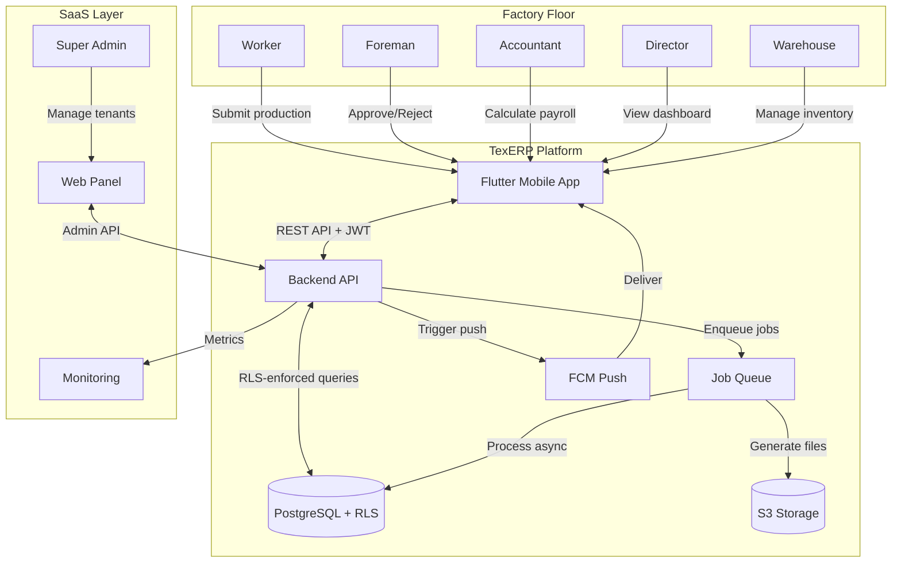

---

### 5.2 Production Record Lifecycle

```mermaid
stateDiagram-v2
    [*] --> PENDING : Worker submits record
    PENDING --> APPROVED : Foreman approves
    PENDING --> REJECTED : Foreman rejects
    PENDING --> APPROVED : Director override (approve)
    PENDING --> REJECTED : Director override (reject)
    APPROVED --> APPROVED : Foreman corrects quantity (stays APPROVED)
    APPROVED --> REJECTED : Director override (with audit log)
    REJECTED --> APPROVED : Director override (with audit log)
    APPROVED --> [*] : Included in payroll calculation
    REJECTED --> [*] : Excluded from payroll; archived

    note right of PENDING
        Foreman has notification
        Visible in approval queue
        Excluded from payroll
    end note

    note right of APPROVED
        Locked for Foreman
        Used in payroll calculation
        Immutable (except Director override)
    end note

    note right of REJECTED
        Worker notified with reason
        Excluded from payroll
        Foreman can create correction record
    end note
```

---

### 5.3 Payroll Period Lifecycle

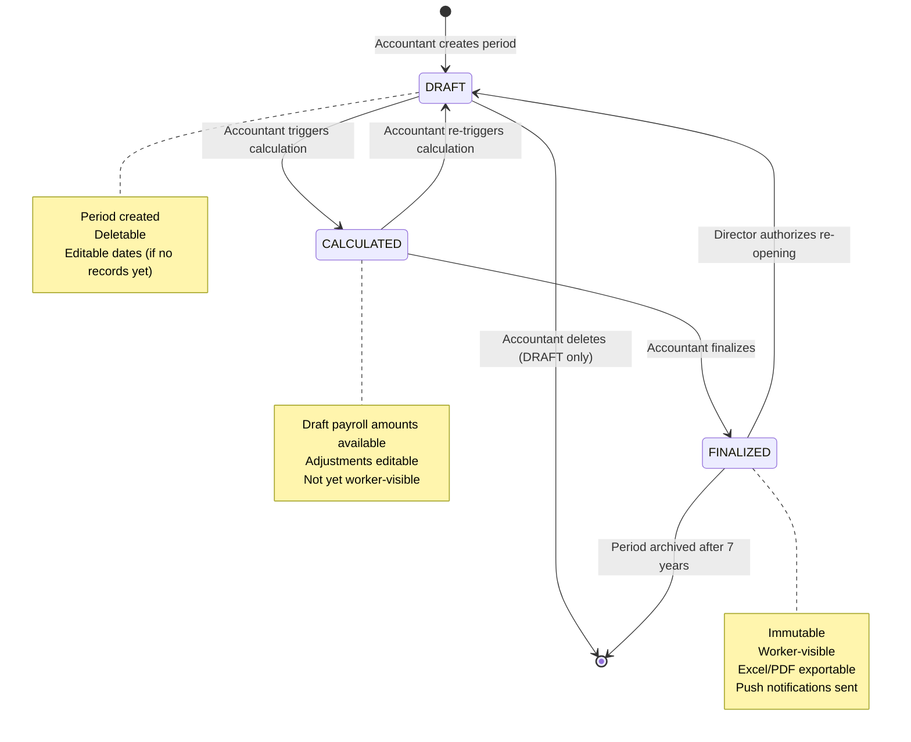

---

### 5.4 Worker Production Submission Flow

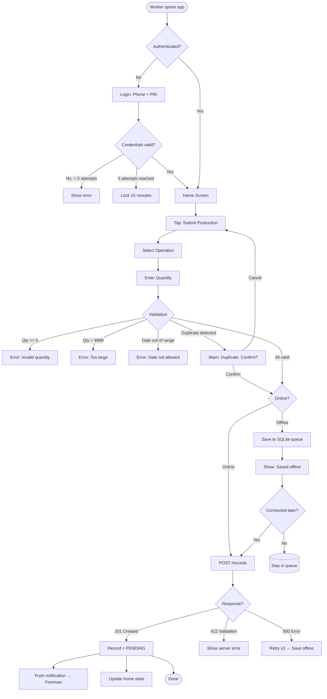

---

### 5.5 Foreman Approval Flow

```mermaid
flowchart TD
    START([Foreman receives push notification]) --> OPEN[Open Pending Approvals]
    OPEN --> LIST[View pending records list]
    LIST --> SELECT{Select record(s)}

    SELECT -->|Single record| DETAIL[View record detail]
    SELECT -->|Multi-select| BULKCHECK{Action?}

    DETAIL --> ACTION{Choose action}

    ACTION -->|Approve| APPROVE_SINGLE[status = APPROVED]
    ACTION -->|Reject| REJECT_FORM[Select/enter reason]
    ACTION -->|Correct & Approve| CORRECT_FORM[Enter corrected qty + comment]

    REJECT_FORM --> REASON_CHECK{Reason provided?}
    REASON_CHECK -->|No| REASON_ERR[Error: Reason required]
    REASON_CHECK -->|Yes| REJECT_SAVE[status = REJECTED]

    CORRECT_FORM --> CORRECT_CHECK{Comment provided?}
    CORRECT_CHECK -->|No| COMMENT_ERR[Error: Comment required]
    CORRECT_CHECK -->|Yes| CORRECT_SAVE[qty_approved = corrected; status = APPROVED]

    APPROVE_SINGLE --> AUDIT1[Create audit log: APPROVED]
    REJECT_SAVE --> AUDIT2[Create audit log: REJECTED + reason]
    CORRECT_SAVE --> AUDIT3[Create audit log: CORRECTED + old/new qty]

    AUDIT1 & AUDIT2 & AUDIT3 --> NOTIF_WORKER[Push notification → Worker]

    BULKCHECK -->|Approve all| BULK_APPROVE[All selected → APPROVED]
    BULK_APPROVE --> BULK_AUDIT[Create audit log per record]
    BULK_AUDIT --> BULK_NOTIF[Push notifications → Workers]
```

---

### 5.6 Payroll Calculation Flow

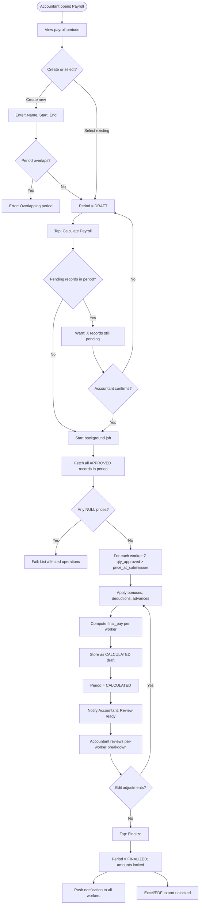

---

### 5.7 Worker Lifecycle

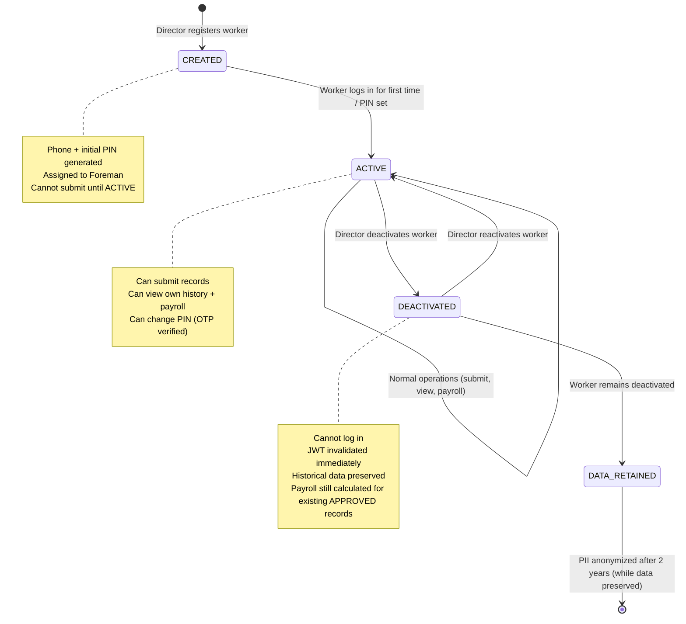

---

### 5.8 Tenant Lifecycle

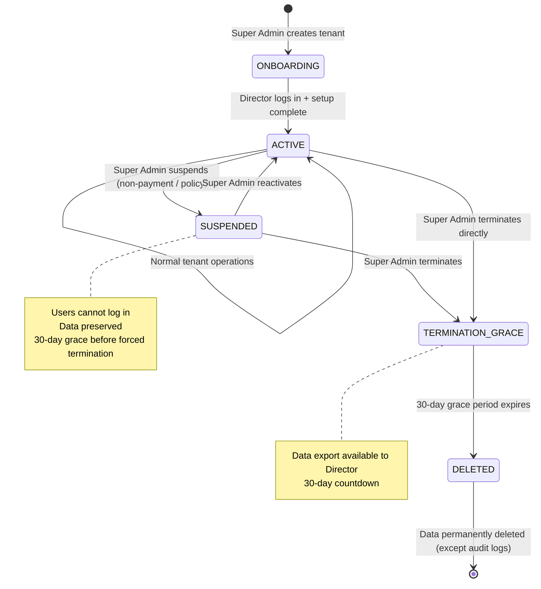

---

### 5.9 Exception Flow: Offline Sync Conflict

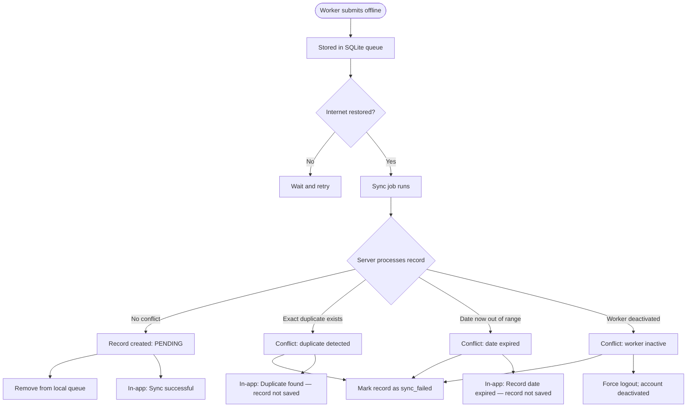

---

### 5.10 Approval Escalation Flow (Exception: No Foreman)

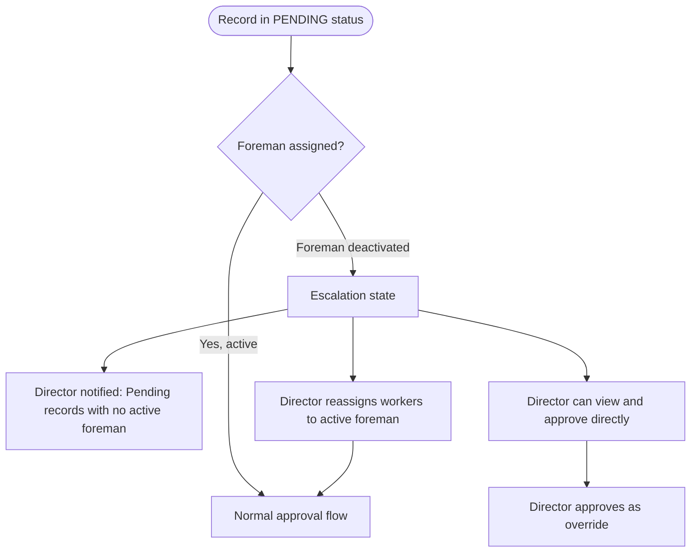

---

## 6. State Transition Diagrams

### 6.1 Production Record — Complete State Machine

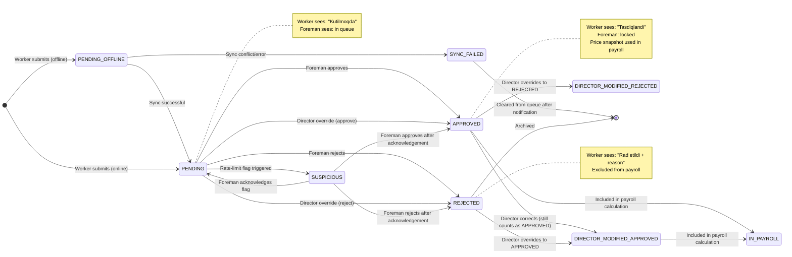

---

### 6.2 Document Lifecycle

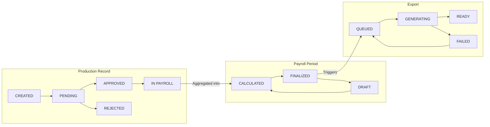

---

## 7. Manufacturing Glossary

> Definitions tailored to the Central Asian garment manufacturing context.

| Term (English) | Term (Uzbek) | Definition |
|----------------|-------------|------------|
| **Garment Factory** | Tikuvchilik korxonasi | A manufacturing facility that produces clothing from fabric |
| **Production Line** | Ishlab chiqarish liniyasi | A sequence of workstations performing successive operations to assemble a garment |
| **Sewing Line** | Tikuv liniyasi | A specific type of production line focused on sewing operations |
| **Section** | Bo'lim / Uchastkа | A subdivision of the factory floor, typically managed by one Foreman |
| **Operation** | Operatsiya / Amaliyot | A single, defined manufacturing step (e.g., "Attach collar to body") |
| **Piece Rate** | Akkord narxi | A payment rate per unit of work completed (e.g., 450 UZS per piece) |
| **Piece Rate System** | Akkord to'lov tizimi | A compensation model where workers are paid based on quantity produced, not time spent |
| **Bundle** | Partiya / Bundle | A group of cut fabric pieces (typically 10–50 pieces) tied together and tagged, passed through operations as a unit |
| **Bundle Tag** | Partiya belgisi | A paper or barcode tag attached to a bundle, showing: style, color, size, quantity, bundle number |
| **Cut-Make-Trim (CMT)** | Kesish-Tikish-Bezash | A factory model where the factory receives pre-purchased fabric and delivers finished garments; the most common model in Uzbekistan |
| **Style** | Model / Stil | A specific garment design (e.g., "Polo Shirt #PS-2026") |
| **SKU** | SKU (Tovar birligi kodi) | Stock Keeping Unit — a unique identifier for each style-color-size combination |
| **Order** | Buyurtma | A customer order specifying style, quantity, delivery date, and specifications |
| **Cutting** | Kesish | The process of cutting fabric layers into garment parts according to patterns |
| **Spreading** | Yoyish | Laying out multiple layers of fabric before cutting |
| **Marker** | Marker / Belgilash | A pattern layout drawn on fabric to minimize waste before cutting |
| **Lay** | Qatlamlar | Multiple fabric layers stacked for cutting in one pass |
| **Sewing** | Tikish | The operation of joining fabric pieces using a sewing machine |
| **Seam** | Chok | The line where two pieces of fabric are joined |
| **Hem** | Qirra tikuv | A folded and stitched edge of fabric |
| **Overlock** | Overlock tikuv | A stitch that simultaneously trims the seam allowance and encases the edge (prevents fraying) |
| **Bartack** | Mustahkamlovchi tikuv | A short, dense stitching used to reinforce high-stress areas (pockets, belt loops) |
| **Button Hole** | Tugmacha teshigi | A reinforced opening for a button |
| **Button Sewing** | Tugma tikish | Attaching buttons to the garment |
| **Ironing / Pressing** | Dazmollash | Using heat and steam to remove wrinkles and shape the garment |
| **Finishing** | Tugatish / Bezash | Final operations: thread trimming, ironing, tagging, folding, quality check |
| **Quality Control (QC)** | Sifat nazorati | Inspection of garments at various stages to identify defects |
| **Defect** | Nuqson / Brak | Any deviation from the required standard: stitch skipping, wrong color, measurement error |
| **AQL (Acceptable Quality Level)** | Qabul qilinadigan sifat darajasi | A statistical sampling standard defining the maximum acceptable defect rate |
| **Inline QC** | Jarayon davomida sifat nazorati | Quality checking performed during production, not only at the end |
| **Final QC** | Yakuniy sifat nazorati | Quality inspection of fully finished garments before packing |
| **Rework** | Qayta ishlash / Tuzatish | Correcting a defective garment so it meets quality standards |
| **Rejection (Brak)** | Brak / Rad etish | A garment or piece that fails QC and cannot be reworked (waste) |
| **Packing** | Qadoqlash | Folding, tagging, and placing garments into polybags and cartons for shipping |
| **Output** | Chiqish / Ishlab chiqarish | The quantity of garments or operations completed in a given time period |
| **Throughput** | O'tkazuvchanlik | The rate at which a production line completes operations per unit time |
| **Standard Minute Value (SMV)** | Standart minut qiymati | The time a qualified worker should take to complete one operation under standard conditions |
| **Efficiency** | Samaradorlik | Actual output / Expected output × 100%; a measure of line or worker performance |
| **Target** | Maqsad / Plan | The planned quantity to be produced in a shift or day |
| **Actual** | Haqiqiy / Fakt | The actual quantity produced |
| **Variance** | Farq | The difference between target and actual production |
| **Shift** | Smena | A defined work period (e.g., 08:00–17:00) |
| **Overtime** | Qo'shimcha vaqt / Ish haqi | Work performed beyond the standard shift hours, often at a premium rate |
| **Payroll** | Ish haqi hisob-kitobi | The process of calculating and distributing worker wages |
| **Payroll Period** | Ish haqi davri | The date range for which payroll is calculated (e.g., 1–15 of the month) |
| **Advance (Avans)** | Avans | A partial salary payment made before the payroll period ends |
| **Deduction** | Ushlab qolish | An amount subtracted from a worker's payroll (e.g., advance repayment, fine) |
| **Bonus** | Mukofot | An additional amount added to a worker's payroll as a reward |
| **Gross Pay** | Yalpi ish haqi | Total earnings before deductions |
| **Net Pay** | Sof ish haqi | Take-home pay after all deductions |
| **Foreman (Brigadir)** | Brigadir | A production supervisor responsible for a team of workers; verifies production counts |
| **Shift Supervisor** | Smena boshlig'i | Manages all production during a single shift; may oversee multiple foremen |
| **Production Manager** | Ishlab chiqarish menedjeri | Manages the entire production process at a higher level than foremen |
| **Mechanic** | Mexanik | Maintains and repairs sewing machines and equipment |
| **Fabric (Mato)** | Mato / Gazlama | The raw textile material used to make garments |
| **Thread (Ip)** | Ip | Sewing thread used in stitching operations |
| **Trim** | Furnitura | Accessories and trimmings: buttons, zippers, labels, elastic, rivets |
| **Lining** | Astar | Inner fabric layer in a garment |
| **Interlining** | Belbog' matosi | A stiffening layer attached to fabric in collars, cuffs, etc. |
| **Fabric Roll** | Mato rulon | Fabric wound onto a roll — the standard form in which fabric arrives from the supplier |
| **Yardage / Meterage** | Metr hisobi | The measurement of fabric length (in meters) |
| **Bill of Materials (BOM)** | Material specifikatsiyasi | A list of all materials required to produce one unit of a garment style |
| **Consumption** | Sarflanish | The actual amount of material used per garment |
| **Warehouse** | Ombor | A storage facility for raw materials and finished goods |
| **Stock** | Zaxira | The current inventory quantity of a specific material |
| **Stock Movement** | Harakatlanish | A record of materials entering (receipt) or leaving (issuance) the warehouse |
| **Lead Time** | Yetkazib berish vaqti | The time between placing a material order and receiving it |
| **WIP (Work in Progress)** | Jarayondagi ish | Partially completed garments or bundles currently on the production floor |
| **Finished Goods** | Tayyor mahsulot | Completed garments ready for shipment |
| **Capacity** | Sig'im / Quvvat | The maximum output a factory or line can achieve in a given time |
| **Bottleneck** | Tor joy | The operation or workstation that limits the overall throughput of the line |
| **Takt Time** | Takt vaqti | The maximum time per unit to meet customer demand; calculated as available time / required output |
| **Downtime** | To'xtash vaqti | Period when a machine or line is not producing due to breakdown, maintenance, or shortage |
| **SaaS (Software as a Service)** | Dastur-xizmat sifatida | A software delivery model where the application is hosted in the cloud and accessed via internet |
| **Tenant** | Ijarachi / Foydalanuvchi kompaniya | In a multi-tenant SaaS, a single factory or company using the platform as an isolated customer |
| **Multi-Tenancy** | Ko'p ijarachilik | A single software instance serving multiple customers, each with isolated data |
| **Audit Trail** | Audit izi | An immutable, chronological log of all changes to data: who changed what, when, and why |
| **Approval Workflow** | Tasdiqlash jarayoni | The sequence of steps and actors required to approve a piece of work or a document |

---

*End of Business Analysis Document — Version 1.0.0*  
*Reference: PRD.md v1.0.0 | BusinessRules.md v1.0.0*  
*Next Document: 02_Architecture / SystemOverview.md*
