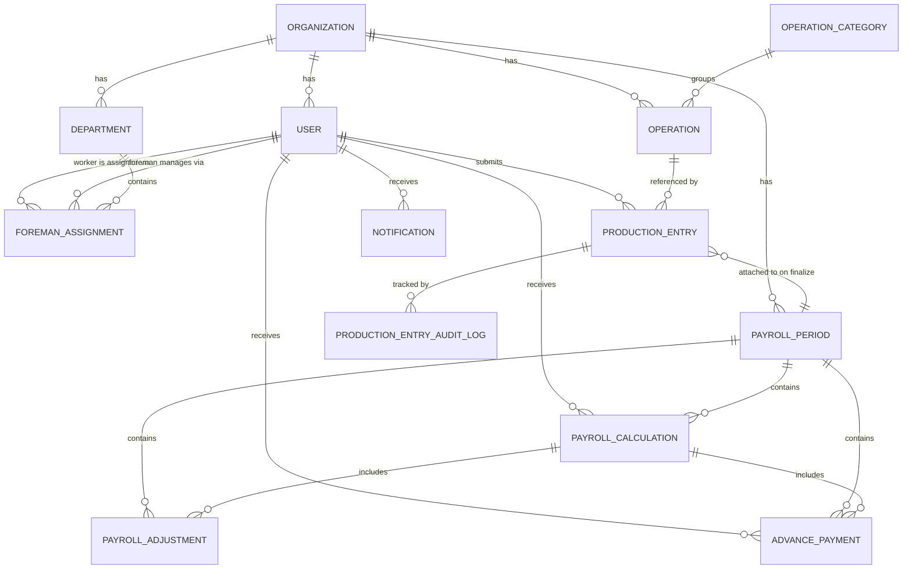
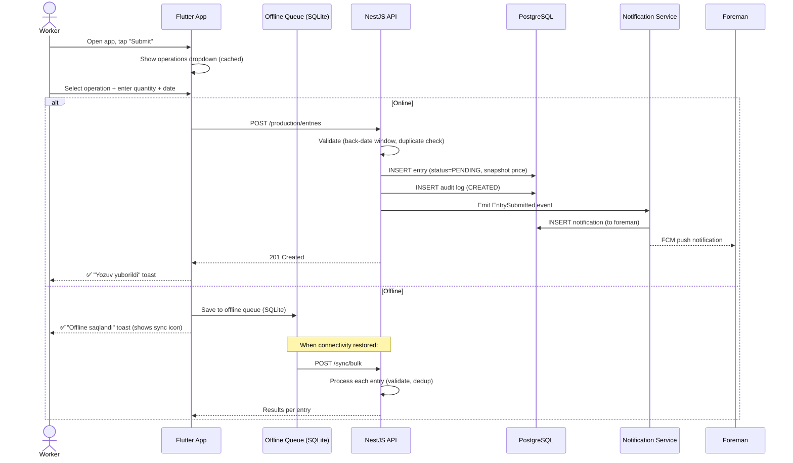
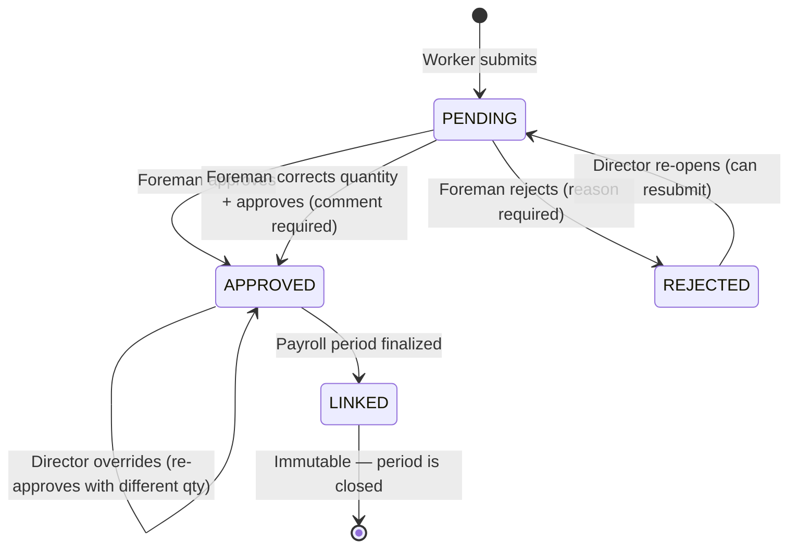
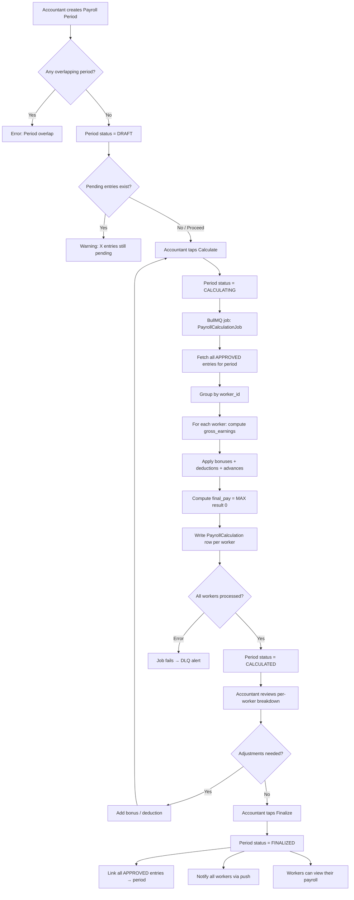
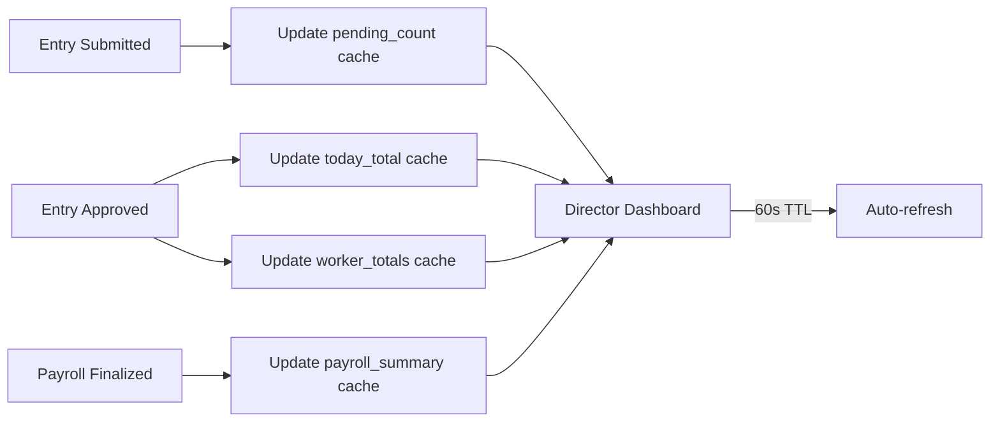

# Core Specification ⭐
# TexERP — The Heart of the System

---

**Document Version:** 1.0.0  
**Status:** Approved  
**Created:** 2026-07-16  
**Depends On:** PRD, Business Analysis, Domain Model, Architecture Blueprint, MVP Definition, Factory Discovery  
**Consumed By:** Design System, UX Specification, API Contract, Flutter Architecture, Backend Architecture  

---

> **Purpose of this document:**  
> Every developer, designer, and QA engineer reads this document before touching any code or screen.  
> It defines **what** the system is. Not how it is built (Architecture Blueprint). Not how it looks (UX Spec). Not what endpoints exist (API Contract).  
> Just: what entities exist, what they do, how they relate, how they flow, who can do what.  
>
> **Rule:** If something is not in this document, it does not exist in the system yet.

---

## Table of Contents

1. [Core Entities](#1-core-entities)
2. [Core Relationships](#2-core-relationships)
3. [Core Workflows](#3-core-workflows)
4. [Core Modules](#4-core-modules)
5. [Core Settings](#5-core-settings)
6. [Core Permissions (RBAC)](#6-core-permissions-rbac)
7. [Core States](#7-core-states)
8. [Core Rules Summary](#8-core-rules-summary)

---

## 1. Core Entities

### 1.1 Organization (Tenant)

**What it is:** A single textile factory registered as a customer of TexERP.  
**One Organization = One Factory = One isolated data space.**

| Attribute | Type | Description |
|-----------|------|-------------|
| `id` | UUIDv7 | Unique identifier |
| `name` | string | Factory name ("Bahor Textile LLC") |
| `slug` | string | URL-safe identifier ("bahor-textile") |
| `status` | enum | `ACTIVE` · `SUSPENDED` · `TERMINATED` |
| `timezone` | string | Default: `Asia/Tashkent` |
| `language` | enum | `uz` · `ru` · `uz_ru` (bilingual) |
| `currency` | string | Default: `UZS` |
| `back_date_window_days` | integer | Max days back a worker can submit (default: 3) |
| `subscription_plan` | enum | `STARTER` · `PROFESSIONAL` · `ENTERPRISE` |
| `created_at` | timestamp | Registration date |

**Key rules:**
- All data in the system is scoped to an Organization via `tenant_id`
- Suspended organizations: users cannot log in; data is preserved
- Terminated organizations: 30-day grace period, then full data deletion

---

### 1.2 User

**What it is:** Any person who has an account in the system. Every person in a factory — worker, foreman, accountant, director — is a User.

| Attribute | Type | Description |
|-----------|------|-------------|
| `id` | UUIDv7 | Unique identifier |
| `tenant_id` | UUIDv7 | Organization this user belongs to |
| `phone` | string | Login identifier (Uzbekistan format: +998XXXXXXXXX) |
| `pin_hash` | string | bcrypt hash of 4-digit PIN |
| `full_name` | string | Worker's full name in native language |
| `worker_code` | string | Short factory code ("W-0042") — human readable ID |
| `role` | enum | `WORKER` · `FOREMAN` · `ACCOUNTANT` · `DIRECTOR` |
| `status` | enum | `ACTIVE` · `DEACTIVATED` |
| `language` | enum | `uz` · `ru` (user preference; overrides org default) |
| `avatar_url` | string | Optional profile photo URL |
| `fcm_token` | string | Firebase push notification token (updated on login) |
| `deactivated_at` | timestamp | When deactivated (null if active) |
| `deactivated_by` | UUIDv7 | Who deactivated (Director's user ID) |

**Key rules:**
- Phone number is globally unique in MVP; one User belongs to exactly one Tenant
- PIN is 4 digits; minimum security for factory floor use
- A deactivated user cannot log in; their historical records are preserved
- One user = one role; no multi-role users in MVP
- A user's `worker_code` is set by the Director at creation and is immutable

---

### 1.3 Department

**What it is:** A named section of the factory floor (e.g., "Sewing Line 1", "Finishing Section"). Workers are assigned to departments. Foremen manage departments.

| Attribute | Type | Description |
|-----------|------|-------------|
| `id` | UUIDv7 | Unique identifier |
| `tenant_id` | UUIDv7 | Organization |
| `name` | string | "Tikarish Line 1" / "Finishing" |
| `code` | string | Short code ("L1", "FIN") |
| `foreman_id` | UUIDv7 | Primary foreman for this department |
| `is_active` | boolean | Inactive departments hidden from new assignments |

**Key rules:**
- A department has exactly one primary foreman (MVP)
- Workers are assigned to a department via `worker_assignments`
- A worker can be in only one department at a time (MVP)

---

### 1.4 Foreman Assignment

**What it is:** The record that connects a Worker to a Foreman at a specific point in time. This is a temporal record — it tracks historical assignments.

| Attribute | Type | Description |
|-----------|------|-------------|
| `id` | UUIDv7 | Unique identifier |
| `tenant_id` | UUIDv7 | Organization |
| `worker_id` | UUIDv7 | The worker |
| `foreman_id` | UUIDv7 | The foreman |
| `department_id` | UUIDv7 | The department |
| `assigned_at` | timestamp | When this assignment started |
| `unassigned_at` | timestamp | When this assignment ended (null if current) |
| `assigned_by` | UUIDv7 | Director who made this assignment |

**Key rules:**
- A worker has at most one ACTIVE assignment at any time
- When reassigned, the old assignment gets `unassigned_at = now()`
- `foreman_id` on a Production Entry is the foreman at the time of submission (snapshot)

---

### 1.5 Operation

**What it is:** A specific piece of work a worker can perform and be paid for. The atomic unit of production in the system.  
Examples: "Yoqa tikish" (Collar Sewing), "Qo'l tikish" (Sleeve Attachment), "Tugma qadash" (Button Sewing).

| Attribute | Type | Description |
|-----------|------|-------------|
| `id` | UUIDv7 | Unique identifier |
| `tenant_id` | UUIDv7 | Organization |
| `category_id` | UUIDv7 | Operation category (optional grouping) |
| `name` | string | Human-readable name ("Yoqa tikish") |
| `code` | string | Factory code ("OP-001") — optional |
| `unit` | enum | `PIECE` · `METER` · `PAIR` (default: PIECE) |
| `unit_price` | decimal | Current piece rate (e.g., 450.00 UZS) |
| `currency` | string | Currency code (default: UZS) |
| `is_active` | boolean | Inactive = hidden from submission form |
| `sort_order` | integer | Display order in dropdowns |

**Key rules:**
- Price changes take effect ONLY for future submissions (never retroactive)
- When a price changes, the old price is written to `operation_price_history`
- An operation with pending records can be deactivated (existing records still process)
- Maximum quantity per submission is validated at application layer (not DB constraint)

---

### 1.6 Operation Category

**What it is:** A grouping label for operations. Used to organize the operations dropdown. Not required.  
Examples: "Yoqa operatsiyalari", "Yeng operatsiyalari", "Tugmalar".

| Attribute | Type | Description |
|-----------|------|-------------|
| `id` | UUIDv7 | Unique identifier |
| `tenant_id` | UUIDv7 | Organization |
| `name` | string | Category name |
| `sort_order` | integer | Display order |

---

### 1.7 Production Entry

**What it is:** The core transaction of the system. A worker's record stating: "I performed THIS operation, THIS many times, on THIS date."  
This is the financial source document — every payroll calculation derives from Production Entries.

| Attribute | Type | Description |
|-----------|------|-------------|
| `id` | UUIDv7 | Unique identifier |
| `tenant_id` | UUIDv7 | Organization |
| `worker_id` | UUIDv7 | Who submitted |
| `foreman_id` | UUIDv7 | **Snapshot** — foreman at submission time |
| `operation_id` | UUIDv7 | Which operation |
| `record_date` | date | The date the work was performed |
| `quantity_submitted` | integer | Worker's original quantity |
| `quantity_approved` | integer | Foreman's verified quantity (may differ) |
| `status` | enum | See [Production Entry States](#production-entry) |
| `unit_price_snapshot` | decimal | **Snapshot** — price at submission time |
| `currency_snapshot` | string | **Snapshot** — currency at submission time |
| `operation_name_snapshot` | string | **Snapshot** — operation name at submission time |
| `bundle_code` | string | Optional bundle reference (free text, MVP) |
| `submitted_at` | timestamp | Server receipt time |
| `offline_created_at` | timestamp | Device creation time (offline submissions) |
| `approved_at` | timestamp | When approved/corrected |
| `approved_by` | UUIDv7 | Foreman or Director who approved |
| `rejected_at` | timestamp | When rejected |
| `rejected_by` | UUIDv7 | Who rejected |
| `rejection_reason` | string | Mandatory reason for rejection |
| `corrected_by` | UUIDv7 | Who corrected (if quantity changed) |
| `correction_comment` | string | Mandatory when quantity is changed |
| `payroll_period_id` | UUIDv7 | Linked when payroll is finalized |
| `is_suspicious` | boolean | Flagged by anomaly detection |
| `sync_source` | enum | `ONLINE` · `OFFLINE_SYNC` |

**Key rules:**
- `quantity_approved` is set ONLY upon approval (null when PENDING)
- `unit_price_snapshot` is captured at server receipt time — immutable forever
- A worker cannot submit the same operation for the same date twice (duplicate check)
- A submitted entry can only move forward in status (no rollback from APPROVED to PENDING)
- The `record_date` must be within `[today - back_date_window, today]`

---

### 1.8 Production Entry Audit Log

**What it is:** An immutable, append-only log of every state change on a Production Entry. Enables dispute resolution and trust.

| Attribute | Type | Description |
|-----------|------|-------------|
| `id` | UUIDv7 | Unique identifier |
| `tenant_id` | UUIDv7 | Organization |
| `entry_id` | UUIDv7 | The Production Entry |
| `action` | enum | `CREATED` · `APPROVED` · `REJECTED` · `CORRECTED` · `OVERRIDDEN` |
| `actor_id` | UUIDv7 | Who performed the action |
| `actor_role` | enum | Their role at action time |
| `old_status` | enum | Status before action |
| `new_status` | enum | Status after action |
| `old_quantity` | integer | Quantity before (null for CREATED) |
| `new_quantity` | integer | Quantity after |
| `reason` | string | Rejection reason or correction comment |
| `occurred_at` | timestamp | When it happened |

---

### 1.9 Payroll Period

**What it is:** A defined time window for which payroll is calculated. Typically 1st–15th or 16th–31st of a month. The container for one payroll cycle.

| Attribute | Type | Description |
|-----------|------|-------------|
| `id` | UUIDv7 | Unique identifier |
| `tenant_id` | UUIDv7 | Organization |
| `name` | string | "Iyul 2026 — 1-yarm" |
| `start_date` | date | Period start (inclusive) |
| `end_date` | date | Period end (inclusive) |
| `status` | enum | `DRAFT` · `CALCULATING` · `CALCULATED` · `FINALIZED` · `CANCELLED` |
| `calculated_at` | timestamp | When last calculation ran |
| `calculated_by` | UUIDv7 | Who triggered calculation |
| `finalized_at` | timestamp | When finalized |
| `finalized_by` | UUIDv7 | Who finalized |
| `total_gross` | decimal | Sum of all workers' gross (snapshot on finalization) |
| `total_final` | decimal | Sum of all workers' final pay (snapshot on finalization) |
| `worker_count` | integer | Number of workers included |

**Key rules:**
- Periods cannot overlap for the same tenant
- Only ONE period can be in CALCULATING status at a time
- FINALIZED periods are immutable — records and calculations cannot change
- CANCELLED is only possible from DRAFT status
- Approved Production Entries from the period are linked to `payroll_period_id` on finalization

---

### 1.10 Payroll Calculation (Per Worker)

**What it is:** The calculated payroll result for ONE worker for ONE payroll period. Contains the final numbers the accountant reviews before finalization.

| Attribute | Type | Description |
|-----------|------|-------------|
| `id` | UUIDv7 | Unique identifier |
| `tenant_id` | UUIDv7 | Organization |
| `payroll_period_id` | UUIDv7 | The period |
| `worker_id` | UUIDv7 | The worker |
| `total_pieces` | integer | Total approved quantity across all operations |
| `gross_earnings` | decimal | Σ (quantity_approved × unit_price_snapshot) |
| `total_bonuses` | decimal | Sum of all bonuses this period |
| `total_deductions` | decimal | Sum of all deductions this period |
| `total_advances` | decimal | Sum of all advances given this period |
| `advance_carryforward` | decimal | Unpaid advance balance from previous periods |
| `final_pay` | decimal | gross + bonuses − deductions − advances − carryforward (min 0) |
| `calculation_version` | integer | Increments on each recalculation |
| `status` | enum | `DRAFT` · `FINALIZED` |

**Payroll Formula:**
```
gross_earnings = Σ (quantity_approved × unit_price_snapshot)
                 for all APPROVED entries in period for this worker

final_pay = gross_earnings
            + total_bonuses
            − total_deductions
            − total_advances
            − advance_carryforward

final_pay = MAX(final_pay, 0)   ← Cannot be negative
```

---

### 1.11 Payroll Adjustment

**What it is:** A bonus or deduction applied to a specific worker within a specific payroll period. Added manually by the Accountant.

| Attribute | Type | Description |
|-----------|------|-------------|
| `id` | UUIDv7 | Unique identifier |
| `tenant_id` | UUIDv7 | Organization |
| `payroll_period_id` | UUIDv7 | The period |
| `worker_id` | UUIDv7 | Target worker |
| `type` | enum | `BONUS` · `DEDUCTION` |
| `amount` | decimal | Always positive; type determines sign in formula |
| `reason` | string | Mandatory explanation ("Rejim uchun bonus") |
| `created_by` | UUIDv7 | Accountant who added it |
| `created_at` | timestamp | When added |

---

### 1.12 Advance Payment

**What it is:** Cash given to a worker before the payroll period ends. Recorded as a debt against their payroll.

| Attribute | Type | Description |
|-----------|------|-------------|
| `id` | UUIDv7 | Unique identifier |
| `tenant_id` | UUIDv7 | Organization |
| `worker_id` | UUIDv7 | Worker who received advance |
| `payroll_period_id` | UUIDv7 | Period in which it's deducted |
| `amount` | decimal | Amount given |
| `given_date` | date | When the cash was given |
| `reason` | string | Optional note ("Medical need") |
| `created_by` | UUIDv7 | Accountant who recorded it |
| `is_carried_forward` | boolean | True if not fully deducted this period |

**Key rule:** If `final_pay < total_advances`, the deficit becomes `advance_carryforward` on the NEXT period.

---

### 1.13 Notification

**What it is:** An in-app and/or push notification sent to a user in response to a system event.

| Attribute | Type | Description |
|-----------|------|-------------|
| `id` | UUIDv7 | Unique identifier |
| `tenant_id` | UUIDv7 | Organization |
| `recipient_id` | UUIDv7 | Target user |
| `type` | enum | See Notification Types below |
| `title` | string | Short title (in user's language) |
| `body` | string | Notification body text |
| `data` | JSONB | Contextual data (entry_id, period_id, etc.) |
| `is_read` | boolean | Marked read when user taps it |
| `push_sent` | boolean | Whether FCM push was sent |
| `push_delivered` | boolean | FCM delivery confirmation |
| `created_at` | timestamp | When created |
| `read_at` | timestamp | When marked read |

**Notification Types:**

| Type | Recipient | Trigger |
|------|-----------|---------|
| `ENTRY_SUBMITTED` | Foreman | Worker submits a production entry |
| `ENTRY_APPROVED` | Worker | Foreman approves their entry |
| `ENTRY_REJECTED` | Worker | Foreman rejects their entry |
| `ENTRY_CORRECTED` | Worker | Foreman corrects & approves their entry |
| `PAYROLL_CALCULATED` | Accountant | Calculation job completes |
| `PAYROLL_FINALIZED` | Worker | Payroll period finalized; their pay is visible |
| `PAYROLL_FINALIZED_SUMMARY` | Director | Payroll period finalized; summary view |
| `SUSPICIOUS_ENTRY` | Foreman, Director | Entry flagged as suspicious |

---

## 2. Core Relationships



---

## 3. Core Workflows

### 3.1 Worker Production Submission



---

### 3.2 Foreman Approval Workflow



**State transition rules:**

| From | To | Who Can | Conditions |
|------|----|:-------:|------------|
| `PENDING` | `APPROVED` | Foreman, Director | Worker in foreman's team |
| `PENDING` | `REJECTED` | Foreman, Director | Reason mandatory |
| `PENDING` | `APPROVED` (corrected) | Foreman, Director | Comment mandatory; new quantity ≠ original |
| `APPROVED` | `APPROVED` (override) | Director only | Director override reason mandatory |
| `REJECTED` | `PENDING` | Director only | For resubmission |
| `APPROVED` | `LINKED` | System only | On payroll finalization |
| `LINKED` | — | Nobody | Immutable |

---

### 3.3 Payroll Calculation Workflow



---

### 3.4 Director Dashboard Update Flow



---

## 4. Core Modules

### Module 1: Authentication (`/auth`)

**Owns:** Login sessions, OTP codes, PIN management, JWT tokens, device registrations  
**Does NOT own:** User creation (that's Settings), role management (that's Settings)

| Capability | Description |
|-----------|-------------|
| Phone + PIN login | Primary auth method |
| JWT issuance | Access token (15 min) + Refresh token (30 days) |
| Token refresh | Silent refresh via refresh token |
| PIN reset via OTP | SMS OTP to registered phone |
| Session management | List active sessions; revoke on deactivation |
| Device token registration | FCM token saved on login |
| Login rate limiting | 5 failures → 15-minute lockout |

---

### Module 2: Production (`/production`)

**Owns:** Production entries, operations, operation categories, entry audit log  
**Does NOT own:** Users, payroll calculations, notifications (it emits events)

| Capability | Description |
|-----------|-------------|
| Submit production entry | Worker's core action |
| Approve entry | Foreman single-approve |
| Bulk approve | Up to 50 entries at once |
| Reject entry | With mandatory reason |
| Correct & Approve | Change quantity + mandatory comment |
| Director override | Approve any entry regardless of assignment |
| View pending queue | Foreman's approval inbox |
| View worker history | All entries for a worker |
| Duplicate detection | Warn on same operation + date |
| Offline sync | Accept bulk sync from offline queue |
| Anomaly flagging | Flag entries exceeding statistical thresholds |

---

### Module 3: Payroll (`/payroll`)

**Owns:** Payroll periods, payroll calculations, adjustments, advances  
**Does NOT own:** Production entries (reads them as a read model)

| Capability | Description |
|-----------|-------------|
| Create payroll period | Define start/end dates |
| Trigger calculation | Queue background job |
| View per-worker breakdown | Accountant review screen |
| Add bonus / deduction | Manual adjustment with reason |
| Record advance payment | Cash given before period ends |
| Finalize period | Lock, link entries, notify workers |
| Worker: View own payroll | Read-only; FINALIZED periods only |
| Export to Excel | Background job → S3 → download link |

---

### Module 4: Reports (`/reports`)

**Owns:** Read models for reporting; no mutations  
**Does NOT own:** Any source data (reads from Production and Payroll)

| Capability | Description |
|-----------|-------------|
| Production summary | Date range, by worker, by operation, by foreman |
| Worker performance | Quantity + earnings per worker for a period |
| Payroll comparison | Period-over-period comparison |
| Director daily snapshot | Today's totals for dashboard |

---

### Module 5: Dashboard (`/dashboard`)

**Owns:** Cached dashboard data per role  
**Does NOT own:** Source data

| Role | Dashboard Shows |
|------|----------------|
| Worker | Today's submissions, monthly earnings estimate, pending count |
| Foreman | Pending approval count, team today's total, top performers |
| Accountant | Current period status, uncalculated entries, pending adjustments |
| Director | Factory-wide production today, pending count, payroll status |

---

### Module 6: Notifications (`/notifications`)

**Owns:** Notification records, FCM delivery, notification preferences  
**Does NOT own:** The events that trigger them (it consumes domain events)

| Capability | Description |
|-----------|-------------|
| Push notification (FCM) | Sent for all notification types |
| In-app notification list | Unread count badge; list view |
| Mark as read | Single or bulk |
| Notification history | Last 30 days |

---

### Module 7: Settings (`/settings`)

**Owns:** User management, organization settings, operations catalog  
**Does NOT own:** Payroll logic, production records

| Capability | Description |
|-----------|-------------|
| Create/edit/deactivate users | Director only |
| Assign foreman to workers | Director only |
| Create/edit operations | Director |
| Set/update operation prices | Director |
| Activate/deactivate operations | Director |
| Edit organization settings | Director (timezone, back-date window) |
| View/manage departments | Director |

---

## 5. Core Settings

Settings are configurations that can be changed by the Director without touching code.

| Setting | Default | Who Can Change | Effect |
|---------|---------|:--------------:|--------|
| `back_date_window_days` | 3 | Director | Maximum days back a worker can submit |
| `bulk_approve_limit` | 50 | Super Admin | Max records in a single bulk approval |
| `suspicious_quantity_multiplier` | 3× | Director | Flag if quantity > 3× worker's daily average |
| `payroll_min_pay` | 0 | Director | Minimum guaranteed pay (0 = disabled) |
| `timezone` | `Asia/Tashkent` | Director | All date calculations use this timezone |
| `language` | `uz` | Director | Default app language for new users |
| `currency` | `UZS` | Super Admin | Currency for all financial display |
| `otp_expiry_minutes` | 5 | Super Admin | How long OTP codes are valid |
| `session_expiry_days` | 30 | Super Admin | Refresh token lifetime |
| `duplicate_window_minutes` | 60 | Director | Duplicate detection window per worker+operation+date |

---

## 6. Core Permissions (RBAC)

### Role Definitions

| Role | Who | Access Level |
|------|-----|-------------|
| `WORKER` | Production floor worker | Own data only |
| `FOREMAN` | Line/section supervisor | Own team's data |
| `ACCOUNTANT` | Factory accountant | All production + all payroll |
| `DIRECTOR` | Factory owner / GM | Full factory access |
| `SUPER_ADMIN` | TexERP platform team | Cross-tenant platform access |

---

### Permission Matrix

> ✅ Full access · 👁 Read only · 🔐 Own data only · ⚠️ With conditions · ❌ No access

#### Authentication & Profile

| Action | WORKER | FOREMAN | ACCOUNTANT | DIRECTOR |
|--------|:------:|:-------:|:----------:|:--------:|
| Login with own phone + PIN | ✅ | ✅ | ✅ | ✅ |
| Reset own PIN via OTP | ✅ | ✅ | ✅ | ✅ |
| View own profile | ✅ | ✅ | ✅ | ✅ |
| Change own PIN | ✅ | ✅ | ✅ | ✅ |
| View other users' profiles | ❌ | 👁 own team | 👁 | ✅ |
| Create user accounts | ❌ | ❌ | ❌ | ✅ |
| Deactivate user accounts | ❌ | ❌ | ❌ | ✅ |
| Reassign foreman | ❌ | ❌ | ❌ | ✅ |

#### Production Entries

| Action | WORKER | FOREMAN | ACCOUNTANT | DIRECTOR |
|--------|:------:|:-------:|:----------:|:--------:|
| Submit production entry | 🔐 own | ❌ | ❌ | ❌ |
| View own production history | ✅ | N/A | N/A | N/A |
| View team's pending entries | ❌ | ✅ own team | 👁 all | ✅ all |
| Approve entry | ❌ | ✅ own team | ❌ | ✅ override |
| Reject entry | ❌ | ✅ own team | ❌ | ✅ override |
| Correct & approve entry | ❌ | ✅ own team | ❌ | ✅ override |
| Bulk approve | ❌ | ✅ own team | ❌ | ✅ all |
| View production reports | ❌ | 👁 own team | 👁 all | ✅ all |
| View audit trail | ❌ | 👁 own team | 👁 all | ✅ all |
| Flag entry as suspicious | ❌ | ✅ | ❌ | ✅ |

#### Payroll

| Action | WORKER | FOREMAN | ACCOUNTANT | DIRECTOR |
|--------|:------:|:-------:|:----------:|:--------:|
| View own finalized payroll | ✅ | ✅ | N/A | N/A |
| View all workers' payroll | ❌ | ❌ | ✅ | ✅ |
| Create payroll period | ❌ | ❌ | ✅ | ✅ |
| Trigger payroll calculation | ❌ | ❌ | ✅ | ✅ |
| Add bonus/deduction | ❌ | ❌ | ✅ | ✅ |
| Record advance payment | ❌ | ❌ | ✅ | ✅ |
| Finalize payroll period | ❌ | ❌ | ✅ | ✅ |
| Re-open finalized period | ❌ | ❌ | ❌ | ✅ with reason |
| Export payroll to Excel | ❌ | ❌ | ✅ | ✅ |

#### Settings & Catalog

| Action | WORKER | FOREMAN | ACCOUNTANT | DIRECTOR |
|--------|:------:|:-------:|:----------:|:--------:|
| View operations list | ✅ active only | ✅ active only | ✅ all | ✅ all |
| Create operation | ❌ | ❌ | ❌ | ✅ |
| Edit operation / price | ❌ | ❌ | ❌ | ✅ |
| Deactivate operation | ❌ | ❌ | ❌ | ✅ |
| Create department | ❌ | ❌ | ❌ | ✅ |
| Edit organization settings | ❌ | ❌ | ❌ | ✅ |

#### Dashboard & Reports

| Action | WORKER | FOREMAN | ACCOUNTANT | DIRECTOR |
|--------|:------:|:-------:|:----------:|:--------:|
| View own dashboard | ✅ | ✅ | ✅ | ✅ |
| View factory-wide dashboard | ❌ | ❌ | 👁 | ✅ |
| Export production reports | ❌ | 👁 own team | ✅ all | ✅ all |

---

### Permission Enforcement

```
Every API request passes through THREE permission checks (in order):

1. JWT Validation Guard
   → Is the token valid and not expired?
   → Is the token not blacklisted?

2. Tenant Guard
   → Does JWT tenant_id match the requested resource's tenant_id?
   → Sets PostgreSQL session variable for RLS

3. Role Guard
   → Does the user's role appear in the @Roles() decorator for this endpoint?
   → For team-scoped actions: does the resource belong to the user's team?

Database RLS (always active, independent of application layer):
   → WHERE tenant_id = current_setting('app.current_tenant_id')
   → Catches any query that bypasses application-layer guards
```

---

## 7. Core States

### Production Entry States

```
PENDING ──approve──► APPROVED ──(on finalize)──► LINKED
       └──reject───► REJECTED
       └──correct──► APPROVED

REJECTED ──(director re-opens)──► PENDING

LINKED = immutable; payroll period is finalized
```

### Payroll Period States

```
DRAFT ──(trigger calc)──► CALCULATING ──(job done)──► CALCULATED
                                       └──(job fail)──► DRAFT (retry)
DRAFT ──────────────────────────────────────────────► CANCELLED

CALCULATED ──(finalize)──► FINALIZED
CALCULATED ──(add adj, recalc)──► CALCULATING (loop)

FINALIZED = immutable
```

### User States

```
ACTIVE ──(deactivate)──► DEACTIVATED
DEACTIVATED ──(reactivate)──► ACTIVE
DEACTIVATED ──(2 years later)──► ACTIVE (anonymized PII, but account record preserved)
```

---

## 8. Core Rules Summary

This is a condensed reference. Full business rules are in `BusinessAnalysis.md`.

### Submission Rules
- **SR-01:** Back-date window is configurable (default 3 days). `record_date >= today - window`
- **SR-02:** A worker cannot submit the same operation for the same date twice
- **SR-03:** Quantity must be between 1 and 9999
- **SR-04:** The operation must be ACTIVE at submission time
- **SR-05:** The worker must be ACTIVE and assigned to a foreman

### Approval Rules
- **AR-01:** A foreman can only approve entries from workers assigned to them
- **AR-02:** Quantity correction requires a mandatory comment
- **AR-03:** Rejection requires a mandatory reason (selected from list or free text)
- **AR-04:** An APPROVED entry cannot return to PENDING (Director override only)
- **AR-05:** A LINKED entry (payroll finalized) cannot be changed by anyone

### Payroll Rules
- **PR-01:** Payroll uses `unit_price_snapshot` — never the current operation price
- **PR-02:** `final_pay` is always ≥ 0 (negative = carry-forward advance)
- **PR-03:** Payroll periods cannot overlap
- **PR-04:** Only APPROVED entries are included in payroll calculation
- **PR-05:** A FINALIZED period is immutable — no entries, calculations, or adjustments can change
- **PR-06:** Advances unpaid in one period carry forward to the next period automatically

### Data Rules
- **DR-01:** All data is scoped to `tenant_id` — no cross-tenant queries possible
- **DR-02:** No hard deletes for production entities — soft delete only
- **DR-03:** Every state change has an audit log entry written BEFORE the mutation
- **DR-04:** Price snapshots are captured at server receipt time — immutable forever
- **DR-05:** Foreman snapshot on Production Entry = foreman at submission time

---

*End of Core Specification — Version 1.0.0*  
*This document is the single source of truth for what the system IS.*  
*All downstream documents (UX Spec, API Contract, Architecture) must conform to this specification.*  
*Changes require Tech Lead approval and a version increment.*
