# MVP Definition
# TexERP — Minimum Viable Product

---

**Document Version:** 1.0.0  
**Status:** Approved  
**Created:** 2026-07-16  
**Author:** Product Delivery Team  
**Audience:** All Engineers, Stakeholders  

> **Goal:** A working digital production management system that a real textile factory with ~100 workers can use on Day 1.  
> **Timeline:** 30–45 days to first live factory.  
> **Philosophy:** Do fewer things. Do them perfectly. Ship and learn.

---

## Table of Contents

1. [MVP Scope — MoSCoW Classification](#1-mvp-scope--moscow-classification)
2. [Out of Scope](#2-out-of-scope)
3. [Sprint Plan](#3-sprint-plan)
4. [User Journey](#4-user-journey)
5. [Critical Path](#5-critical-path)
6. [Risks](#6-risks)
7. [Release Plan](#7-release-plan)
8. [Demo Scenario](#8-demo-scenario)
9. [Factory Go-Live Checklist](#9-factory-go-live-checklist)
10. [Success Criteria](#10-success-criteria)

---

## 1. MVP Scope — MoSCoW Classification

### MUST HAVE — The factory cannot function without these

| # | Feature | Why It's Critical |
|---|---------|-------------------|
| M-01 | **Phone + PIN Login** | Every worker must be identified |
| M-02 | **Worker registration by Director** | Workers cannot exist without accounts |
| M-03 | **Role assignment** (Worker, Foreman, Accountant, Director) | Different screens per role |
| M-04 | **Foreman assignment** (which foreman manages which workers) | Approval workflow depends on this |
| M-05 | **Operation catalog** (create, activate, deactivate) | Workers need operations to submit against |
| M-06 | **Operation unit price** | Payroll cannot be calculated without prices |
| M-07 | **Worker: Submit production record** (operation + quantity + date) | Core value of the product |
| M-08 | **Worker: View own production history** | Worker trust depends on transparency |
| M-09 | **Foreman: View pending approval queue** | Approval cannot happen without this view |
| M-10 | **Foreman: Approve production record** (single) | Core approval workflow |
| M-11 | **Foreman: Reject production record** (with reason) | Incorrect entries must be rejectable |
| M-12 | **Foreman: Correct & Approve** (change quantity + comment) | Foreman must fix honest mistakes |
| M-13 | **Foreman: Bulk approve** (up to 50 records) | Foreman cannot approve 200 records one by one |
| M-14 | **Accountant: Create payroll period** | Payroll cycle must be defined |
| M-15 | **Accountant: Calculate payroll** (background job) | Core payroll calculation |
| M-16 | **Accountant: Review per-worker breakdown** | Accountant must verify before finalizing |
| M-17 | **Accountant: Add bonus/deduction per worker** | Real factories always adjust |
| M-18 | **Accountant: Record advance payment** | Advances are universal in Uzbek factories |
| M-19 | **Accountant: Finalize payroll period** | Locks and publishes payroll |
| M-20 | **Worker: View own finalized payroll** | Workers must see what they earned |
| M-21 | **Accountant: Export payroll to Excel** | Director and accountant need this file |
| M-22 | **Push notification: Foreman notified on new record** | Otherwise foreman doesn't know to approve |
| M-23 | **Push notification: Worker notified on approval/rejection** | Otherwise worker doesn't know outcome |
| M-24 | **Push notification: Workers notified on payroll finalization** | "Your salary is calculated" |
| M-25 | **Director: Basic dashboard** (today's production, pending count) | Director needs visibility |
| M-26 | **Director: Add / deactivate users** | Director manages the team |
| M-27 | **Offline production submission** (SQLite queue, sync on reconnect) | Factory WiFi is unreliable |
| M-28 | **Duplicate submission warning** | Same operation + date should warn worker |
| M-29 | **Back-date window** (configurable, default 3 days) | Workers sometimes submit next day |
| M-30 | **PIN reset via OTP** | Workers forget PINs constantly |

---

### SHOULD HAVE — Important but Day 1 is possible without

| # | Feature | Notes |
|---|---------|-------|
| S-01 | **Foreman: Team performance view** (per worker, today) | Useful but Director dashboard covers this |
| S-02 | **Director: Override any record** (approve/reject with reason) | Dispute resolution; important but rare |
| S-03 | **Director: Authorize payroll period re-opening** | Rare operation; can be done manually in V1 if needed |
| S-04 | **Accountant: PDF payslip per worker** | Excel covers the core need; PDF is for polish |
| S-05 | **Production report** (date range, by operation, by worker) | Accountant + Director need this for analysis |
| S-06 | **Audit trail view** (Director/Accountant sees record history) | Trust and dispute; critical but not Day 1 |
| S-07 | **Worker: View rejected records** with reason clearly displayed | Workers need this; must ship in Sprint 2 at latest |
| S-08 | **Rate-limit flag (SUSPICIOUS status)** | Anomaly detection; can ship Sprint 4 |
| S-09 | **Operation categories** (grouping operations) | UX improvement; not blocking |
| S-10 | **Multi-language toggle** (Uzbek / Russian in settings) | Language set at account creation; toggle is convenience |

---

### COULD HAVE — Nice to have in this MVP window if time allows

| # | Feature | Notes |
|---|---------|-------|
| C-01 | **Worker profile photo** | Identity; cosmetic |
| C-02 | **Director: Production trend chart** (7-day bar chart) | Dashboard enhancement |
| C-03 | **Advance carry-forward display** (outstanding balance) | Important but Accountant can track manually |
| C-04 | **Worker: Payroll history** (all previous periods) | MVP shows latest; history can wait |
| C-05 | **Notification preferences** (opt-out) | All notifications are on by default; fine for MVP |
| C-06 | **Bundle code field** (optional, free text) | Data collection for V2; low priority |

---

### WON'T HAVE — Explicitly deferred to V2

| Module | What's Deferred | When |
|--------|----------------|------|
| **Warehouse** | All material receipts, issuances, inventory management | V2 Sprint 1–2 |
| **Orders** | Customer orders, style management, delivery tracking | V2 |
| **Bundles** | Bundle creation, bundle-level tracking, WIP | V2 (requires Orders) |
| **Quality Control** | QC inspections, defect tracking, rework | V2 |
| **Attendance** | Shift tracking, clock-in/out, absence management | V2 |
| **Analytics** | Trend analysis, efficiency metrics, forecasting | V2–V3 |
| **AI Forecasting** | Production planning, demand forecasting | V3 |
| **HR Module** | Contracts, leave requests, departments | V2 |
| **Multi-factory** | One account → multiple factory locations | V2 |
| **Customer Portal** | External customer order visibility | V3 |
| **Machine Tracking** | Maintenance logs, downtime events | V2 |
| **Super Admin Web Panel** | Full platform management | V2 (MVP: manual DB management for 1st tenant) |

---

## 2. Out of Scope

The following will NOT be built for MVP. Any request to add these before the MVP ships must be rejected.

```
❌ Warehouse module
❌ Orders module
❌ Bundle/WIP tracking
❌ Attendance / shift management
❌ Quality control / defect tracking
❌ Machine management
❌ Analytics dashboards (beyond basic Director overview)
❌ Multi-currency support (UZS only)
❌ Multi-language API responses (Uzbek fixed, Russian fixed — no dynamic switching in V1)
❌ Customer-facing portal
❌ Subscription billing (first tenant is manual)
❌ Super Admin web panel (first tenant onboarded manually via DB seed)
❌ AI / ML features
❌ Biometric login
❌ QR code / barcode bundle scanning
❌ In-app chat / messaging
❌ Custom reports builder
❌ API for third-party integrations (1C, SAP, etc.)
```

---

## 3. Sprint Plan

> **Methodology:** Shape Up (Basecamp) style  
> **Cycle:** 4 focused sprints × ~8 days each = ~34 days  
> **Team assumption:** 1 Flutter developer + 1 NestJS developer (or 1 full-stack + AI assistance)  
> **Work style:** No daily standups. Clear scope. Ship at end of each sprint.

---

### Sprint 1 — Foundation (Days 1–8)

**Theme:** You can log in. You exist in the system.

**Goal:** The Director can set up the factory, create all workers and foremen, and everyone can log in with their phone and PIN.

| # | Feature | Role |
|---|---------|------|
| 1.1 | NestJS project setup, module structure, RLS middleware | Backend |
| 1.2 | PostgreSQL schema: tenants, users, foreman_assignments | Backend |
| 1.3 | JWT auth (phone + PIN login, refresh token) | Backend |
| 1.4 | OTP service (Eskiz.uz integration for PIN reset) | Backend |
| 1.5 | Director: Create worker / foreman accounts | Backend + Flutter |
| 1.6 | Director: Assign foreman to workers | Backend + Flutter |
| 1.7 | Director: Deactivate user | Backend + Flutter |
| 1.8 | Login screen (Flutter) | Flutter |
| 1.9 | PIN reset via OTP (Flutter) | Flutter |
| 1.10 | Role-based navigation shell (Worker / Foreman / Accountant / Director tabs) | Flutter |
| 1.11 | Profile screen (view own info, change PIN) | Flutter |
| 1.12 | Operations catalog: Create, edit, activate/deactivate, set price | Backend + Flutter |
| 1.13 | Tenant seed script (1st factory onboarding via CLI) | Backend |

**Sprint 1 Exit Criteria:**
- [ ] Director can create 100 worker accounts
- [ ] Workers can log in with phone + PIN
- [ ] Foreman can log in and see their assigned workers
- [ ] Director can create operations with prices
- [ ] PIN reset via SMS OTP works end-to-end

---

### Sprint 2 — Production Core (Days 9–18)

**Theme:** A worker can submit work. A foreman can approve it.

**Goal:** The core production workflow is complete. Workers submit, foremen approve, records are visible.

| # | Feature | Role |
|---|---------|------|
| 2.1 | Worker: Submit production record (operation + quantity + date) | Backend + Flutter |
| 2.2 | Offline queue (SQLite) + sync manager | Flutter |
| 2.3 | Duplicate detection warning | Backend + Flutter |
| 2.4 | Price snapshot on record creation | Backend |
| 2.5 | Foreman: Pending approval queue screen | Flutter |
| 2.6 | Foreman: Single approve | Backend + Flutter |
| 2.7 | Foreman: Reject (with reason selection) | Backend + Flutter |
| 2.8 | Foreman: Correct & Approve (quantity + mandatory comment) | Backend + Flutter |
| 2.9 | Foreman: Bulk approve (select multiple, approve all) | Backend + Flutter |
| 2.10 | Push notifications: new record → foreman | Backend + Flutter |
| 2.11 | Push notifications: approved/rejected → worker | Backend + Flutter |
| 2.12 | Worker: Production history screen (with status badges) | Flutter |
| 2.13 | Production record audit log (write-before pattern) | Backend |
| 2.14 | Foreman: Team performance view (today's totals per worker) | Flutter |

**Sprint 2 Exit Criteria:**
- [ ] Worker can submit a record in under 30 seconds
- [ ] Worker can submit offline; record syncs when online
- [ ] Foreman receives push notification within 5 seconds
- [ ] Foreman can approve/reject/correct any record
- [ ] Foreman can bulk-approve 50 records in one action
- [ ] Worker sees approved/rejected status with reason
- [ ] Audit log entry created for every state change

---

### Sprint 3 — Payroll (Days 19–28)

**Theme:** Month-end payroll can be calculated and published.

**Goal:** The accountant can run the complete payroll cycle and workers see their salary.

| # | Feature | Role |
|---|---------|------|
| 3.1 | Accountant: Create payroll period (name, start, end) | Backend + Flutter |
| 3.2 | Overlap validation on period creation | Backend |
| 3.3 | Payroll calculation background job (BullMQ) | Backend |
| 3.4 | Calculation uses `unit_price_snapshot` (never current price) | Backend |
| 3.5 | Accountant: Review per-worker payroll breakdown | Flutter |
| 3.6 | Accountant: Add bonus / deduction with mandatory reason | Backend + Flutter |
| 3.7 | Accountant: Record advance payment | Backend + Flutter |
| 3.8 | Advance carry-forward logic (negative → next period) | Backend |
| 3.9 | Finalize payroll period (lock, notify workers) | Backend + Flutter |
| 3.10 | Worker: View finalized payroll (own only) | Flutter |
| 3.11 | Excel export (background job → S3 → download link) | Backend |
| 3.12 | Push notification: all workers notified on finalization | Backend |
| 3.13 | Payroll audit trail | Backend |

**Sprint 3 Exit Criteria:**
- [ ] Accountant can create a period and trigger calculation in < 2 minutes
- [ ] Payroll correctly calculates for 100 workers using price snapshots
- [ ] Bonuses, deductions, and advances apply correctly
- [ ] final_pay is never negative (minimum 0)
- [ ] Excel export contains all required columns and downloads correctly
- [ ] Workers receive push notification and can view their payroll amount
- [ ] Worker cannot see other workers' payroll

---

### Sprint 4 — Dashboard, Polish & Go-Live (Days 29–36)

**Theme:** The system is ready for a real factory.

**Goal:** Polish the experience, fix bugs found in Sprints 1–3, ship the Director dashboard, deploy to production.

| # | Feature | Role |
|---|---------|------|
| 4.1 | Director: Dashboard (today's production, pending count, top performers) | Flutter + Backend |
| 4.2 | Production report (date range filter, by worker, by operation) | Backend + Flutter |
| 4.3 | Director: Override record (approve/reject any record with reason) | Backend + Flutter |
| 4.4 | Offline banner (visible when no network) | Flutter |
| 4.5 | Error states + empty states on all screens | Flutter |
| 4.6 | Performance testing (100 workers, 3 months of data) | QA |
| 4.7 | Cross-tenant isolation test suite | Backend |
| 4.8 | Security review (auth, RLS, input validation) | Backend |
| 4.9 | Staging environment setup | DevOps |
| 4.10 | Production environment setup (VPS + PostgreSQL + Redis + S3) | DevOps |
| 4.11 | CI/CD pipeline (GitHub Actions → staging auto, production manual) | DevOps |
| 4.12 | Factory data seed (100 workers, operations catalog) | Backend |
| 4.13 | On-site training session with Director | Product |
| 4.14 | Bug fixes from Sprint 1–3 testing | All |
| 4.15 | App store submission (Android first; APK direct for MVP) | Flutter |

**Sprint 4 Exit Criteria:**
- [ ] Director dashboard shows real-time production data
- [ ] All screens have proper empty, loading, error, and offline states
- [ ] App works on Android 8.0+ (tested on low-end device)
- [ ] Cross-tenant isolation test passes
- [ ] Performance target: P95 < 300ms for all critical endpoints
- [ ] Production environment is live
- [ ] At least one factory staff member has used the system without help

---

## 4. User Journey

### Journey 1: Worker's Day (8 minutes of total app usage per day)

```
07:55  Worker arrives at factory
08:00  Starts sewing (physical work begins)

-- During shift --

10:30  Finishes first operation batch
       Opens app → PIN screen (5 seconds)
       Taps "Submit Production"
       Selects operation (recently used shown first)
       Enters quantity: 85
       Taps Submit
       ✅ "Yozuv yuborildi" toast appears (3 seconds total)

11:00  Foreman approves the record (worker notified via push)
       Worker's phone: "Tasdiqlandi: 85 dona — Yoqa tikish"

-- End of shift --

17:00  Worker submits 2 more records for the day
       (same flow, 15 seconds each)

17:30  Worker's daily total visible on home screen: 3 records, 247 dona, ~111,150 UZS
```

### Journey 2: Foreman's Approval Cycle (2–3 times per day)

```
After each batch submission wave:

08:30  Foreman receives push notifications: "5 yangi yozuv"
       Opens app → Pending queue (sorted: newest first)
       Scans: worker names, operations, quantities
       
       Select all → Bulk Approve (10 records)
       ✅ All approved in 2 taps, 15 seconds

12:00  Another batch arrives (25 records)
       1 suspicious quantity (200 — unusual high)
       Foreman long-presses → selects 24 normal → Bulk Approve
       Taps the 200-quantity record → Detail view
       Correct & Approve: changes to 150, adds comment "Ikki smenaning birga kiritilishi"

17:00  End-of-day batch (40 records)
       Bulk approve all
```

### Journey 3: Accountant Month-End (1 day per payroll period)

```
July 15  — 1st half payroll

09:00  Accountant: Creates payroll period "July 2026 — 1st Half" (Jul 1–15)
       System warns: "3 ta yozuv hali tasdiqlanmagan"
       Accountant: asks foreman to approve them
       
10:00  All records approved. Accountant taps Calculate
       Background job runs: 47 seconds for 100 workers
       In-app notification: "Hisob-kitob tayyor"

10:47  Accountant reviews list:
       - Worker Aziz: 1,200 dona, 540,000 UZS gross
       - Worker Malika: 980 dona, 441,000 UZS gross
       Adjusts: Aziz gets 50,000 UZS bonus (exceeded target)
       Records advance: Malika took 100,000 UZS advance on July 10

11:30  Accountant taps Finalize
       Workers receive push: "Ish haqingiz hisoblandi: 540,000 so'm"
       
11:35  Accountant downloads Excel
       Director reviews the file in 5 minutes
       ✅ July 1st half payroll complete
```

---

## 5. Critical Path

```mermaid
graph LR
    DB["Database Schema\n+ RLS Setup\n(Day 1–2)"] -->
    AUTH["Auth System\n+ Login\n(Day 2–4)"] -->
    USERS["User Management\n+ Role System\n(Day 4–6)"] -->
    OPS["Operations Catalog\n(Day 6–8)"] -->
    SUBMIT["Worker Submission\n+ Offline Queue\n(Day 9–13)"] -->
    APPROVAL["Foreman Approval\n+ Push Notif\n(Day 13–18)"] -->
    PAYROLL_CALC["Payroll Calculation\nBackground Job\n(Day 19–23)"] -->
    PAYROLL_UI["Payroll Review\n+ Adjustments\n(Day 23–26)"] -->
    EXPORT["Excel Export\n(Day 26–28)"] -->
    DASHBOARD["Director Dashboard\n(Day 29–32)"] -->
    POLISH["Polish + Security\n(Day 32–34)"] -->
    DEPLOY["Deploy to Production\n(Day 34–36)"]

    style SUBMIT fill:#1a1a2e,color:#e0e0e0,stroke:#6c63ff
    style APPROVAL fill:#1a1a2e,color:#e0e0e0,stroke:#6c63ff
    style PAYROLL_CALC fill:#1a1a2e,color:#e0e0e0,stroke:#6c63ff
```



**Bottlenecks on the critical path:**
1. **OTP SMS integration** — Eskiz.uz requires registration and verification. Must be done on Day 1, not Day 8.
2. **Push notifications (FCM)** — Firebase project setup takes 1 day. Must be done before Sprint 2 begins.
3. **Payroll calculation background job** — Most complex backend logic. Must not be underestimated.
4. **Offline sync** — Edge cases are numerous. Must be specced before Sprint 2 starts.

---

## 6. Risks

### High Risk

| Risk | Probability | Impact | Mitigation |
|------|------------|--------|------------|
| SMS OTP gateway (Eskiz.uz) fails or delays approval | Medium | High | Register early; have backup gateway (Playmobile) as fallback |
| Factory WiFi unreliable → offline sync bugs | High | High | Full offline mode from Sprint 2; extensive offline testing |
| Payroll calculation wrong → factory trust destroyed | Low | Critical | Formula tested with real factory data before Sprint 3 ends; manual calculation comparison |
| Low-end Android performance (2 GB RAM devices) | Medium | High | Performance testing on Galaxy A12 or equivalent from Sprint 2 |
| Worker refuses to use phone → adoption failure | Medium | High | Training session; Director champions adoption; PIN is 4 digits only |
| Sprint 2 delayed → Sprint 3–4 compress | Medium | Medium | Payroll is S3 exit; defer Director override (S-02) to post-MVP if needed |

### Medium Risk

| Risk | Mitigation |
|------|-----------|
| FCM push notification delivery unreliable | In-app notification as fallback; pending badge always visible |
| Price set incorrectly → wrong payroll | Director/Accountant must verify price catalog before go-live |
| Duplicate records from offline sync | Server-side deduplication; worker warned in UI |
| Excel export formatting not accepted by Director | Get sample Excel from factory before building; mirror their existing format |

---

## 7. Release Plan

### Release Strategy: Direct APK (MVP)

For the MVP, we skip Google Play Store (2–3 week review time). The app is distributed as a signed APK directly to factory devices.

```
Week 1–4: Development (Sprints 1–3)
Week 5  : Sprint 4 — Polish + Staging
Week 5  : Factory UAT (User Acceptance Testing)
           Director tests with real data
           3 workers test submission flow
           Accountant tests payroll
Week 6  : Go-Live

Post Go-Live (Week 7–8):
  - Monitor daily (crash reports, performance)
  - Fix any P0/P1 bugs within 24 hours
  - Collect feedback for V2 features
```

### Version Tags

| Version | What It Means |
|---------|--------------|
| `0.1.0` | Sprint 1 complete — internal testing only |
| `0.2.0` | Sprint 2 complete — production workflow testable |
| `0.3.0` | Sprint 3 complete — payroll testable |
| `1.0.0-rc1` | Sprint 4 complete — factory UAT begins |
| `1.0.0` | Factory sign-off — Go-Live |

---

## 8. Demo Scenario

> This is the script for the factory demo. In 15 minutes, show the Director everything they need to say YES.

### Demo Setup (Before Demo)
- Create demo tenant with factory name
- Create 5 workers (real names from the factory)
- Create their actual foreman
- Create 10 operations with real prices from their operation catalog
- Have 20 pre-submitted records (some pending, some approved)

### Demo Flow (15 minutes)

**Minute 1–3: The Problem**  
"Today, workers write on paper. You check it. Your accountant enters it in Excel. You calculate payroll manually. How many errors happen? How long does payroll take?"

**Minute 3–6: Worker Experience**  
Open app on a phone (hand it to the worker if present).  
"Log in with your phone number and PIN. Tap Submit. Choose operation. Enter 85. Done. That took 20 seconds."  
Show the pending count update live.

**Minute 6–9: Foreman Experience**  
Open app on foreman's phone.  
"You got a notification. Open it. Here are all pending records from your workers. Select all. Approve. Done. 10 records approved in 10 seconds."  
Show worker's record status update to "Tasdiqlandi".

**Minute 9–12: Accountant Experience**  
Open app.  
"End of month. Create period. Calculate. 47 seconds for 100 workers. Add Aziz's bonus. Finalize. Workers are notified immediately."  
Download Excel. Open it. Show the clean format.

**Minute 12–14: Director Experience**  
Open dashboard.  
"Today: 2,847 units approved. 12 pending. Top worker: Aziz, 340 units."  
"No more paper. No more Excel. No more errors."

**Minute 14–15: The Close**  
"We can have this live at your factory in 6 weeks. Your workers need to know their phone number and a 4-digit PIN. That's it."

---

## 9. Factory Go-Live Checklist

### Technical Checklist (Engineering)

**Infrastructure**
- [ ] Production server provisioned (VPS: 4 CPU, 8 GB RAM, 100 GB SSD)
- [ ] PostgreSQL 15 installed, configured, RLS enabled
- [ ] Redis installed and configured
- [ ] S3-compatible bucket created and access keys configured
- [ ] SSL certificate installed (Let's Encrypt)
- [ ] Domain/subdomain configured (e.g., `texerp.yourdomain.com`)
- [ ] Firebase project created, FCM server key configured
- [ ] Eskiz.uz SMS gateway account active, test SMS sent successfully
- [ ] Docker Compose (or K8s) deployment scripts tested
- [ ] CI/CD pipeline running (staging auto-deploy working)
- [ ] Backup job configured (daily PostgreSQL dump to S3)
- [ ] Monitoring alerts configured (error rate, response time, disk)

**Application**
- [ ] Cross-tenant isolation tests passing
- [ ] Payroll calculation formula verified against manual calculation (sample data)
- [ ] Excel export tested with 100 workers
- [ ] Offline sync tested: submit offline → kill server → restart server → verify sync
- [ ] Push notifications tested on Android 8, 10, 12, 13
- [ ] PIN reset via OTP tested (real SIM card)
- [ ] Low-end Android performance test (2 GB RAM device): cold start < 2.5s

**Security**
- [ ] All API endpoints require valid JWT
- [ ] Role guard on every endpoint (no endpoint accessible by wrong role)
- [ ] Input validation on all endpoints
- [ ] No sensitive data in logs
- [ ] No secrets in source code or environment files committed to git

---

### Factory Readiness Checklist (Operations)

**Data Setup**
- [ ] Factory details entered (name, timezone: Asia/Tashkent, language: uz)
- [ ] All 100 workers registered (name, phone number, role)
- [ ] All foremen registered and workers assigned to them
- [ ] Operations catalog complete (all operations with correct names and prices)
- [ ] Operation prices verified by Director and Accountant
- [ ] Initial PINs communicated to each worker (Director → Foreman → Worker)

**People**
- [ ] Director has logged in, verified profile
- [ ] All foremen have logged in, verified their worker lists
- [ ] Accountant has logged in, verified access to payroll
- [ ] At least 3 workers have completed a test submission
- [ ] At least 1 foreman has completed a test approval
- [ ] Accountant has run a test payroll calculation (on test data)

**Process**
- [ ] Factory announcement made: "Starting [DATE], submit work on the app"
- [ ] Paper submission stops on Go-Live date
- [ ] First payroll period dates agreed with Accountant
- [ ] Support contact established (who do workers call if app breaks?)
- [ ] Backup plan if server is down (temporary paper; sync when online)

---

### Worker Training Checklist (15 minutes per group)

- [ ] Show how to log in (phone number + PIN)
- [ ] Show how to submit a record (3 taps)
- [ ] Show how to view their history
- [ ] Show what PENDING / APPROVED / REJECTED means
- [ ] Show how to reset PIN if forgotten
- [ ] Show offline mode: "Even without internet, you can submit. It syncs when connected"
- [ ] Workers' questions answered
- [ ] Workers have charged phones with the app installed

---

## 10. Success Criteria

### Week 1 Post-Launch (Survival)

| Metric | Target |
|--------|--------|
| Workers actively submitting | ≥ 70% of total workers |
| Records submitted per day | ≥ 80% of expected daily output |
| Foreman approval rate | ≥ 90% of submitted records approved within 4 hours |
| App crashes | 0 critical crashes |
| Payroll calculation errors | 0 |

### Month 1 (Adoption)

| Metric | Target |
|--------|--------|
| Workers actively submitting | ≥ 90% of total workers |
| Director checks dashboard daily | Yes |
| Payroll 1st cycle completed digitally | Yes |
| Excel export used by accountant | Yes |
| Paper records eliminated | Yes |
| Workers trust the system | Director says yes |

### Month 3 (Value Proven)

| Metric | Target |
|--------|--------|
| Time to complete payroll vs before | < 50% of previous time |
| Payroll errors discovered by workers | 0 disputes that the system caused |
| Fake/duplicate records prevented | Director can cite at least 1 case |
| Net Promoter Score (Director + Accountant) | ≥ 8/10 |
| Factory willing to recommend to another factory | Yes |
| Ready for V2 features (Warehouse, Orders) | Conversation happening |

---

### The Definition of MVP Success

> **The MVP is successful if:**  
> A real textile factory with 100 workers uses TexERP every day for 30 consecutive days,  
> completes at least one payroll cycle digitally,  
> and the Director says: *"I don't want to go back to paper."*

That's it. That's the bar.

---

*End of MVP Definition — Version 1.0.0*  
*Next: UI/UX Specification (Phase 005) → API Contract (Phase 006) → Development begins*
