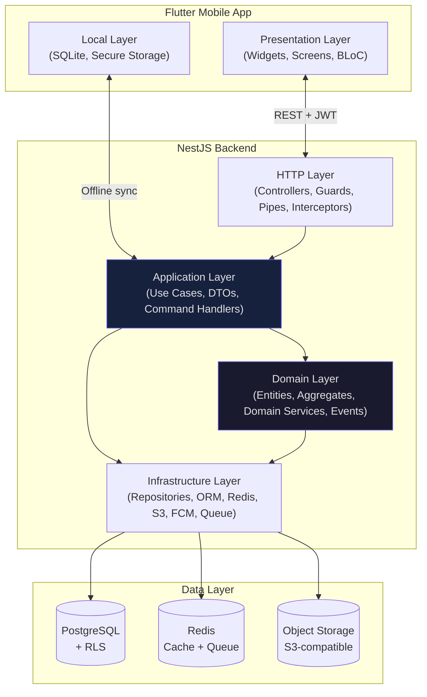
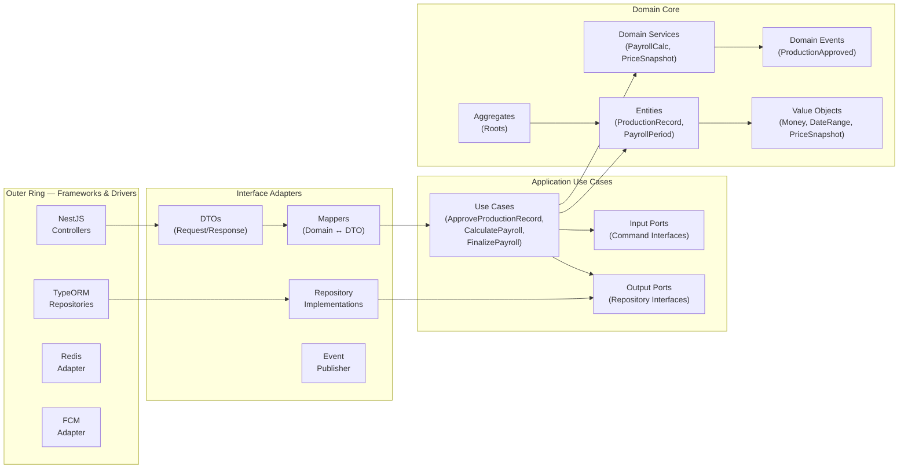
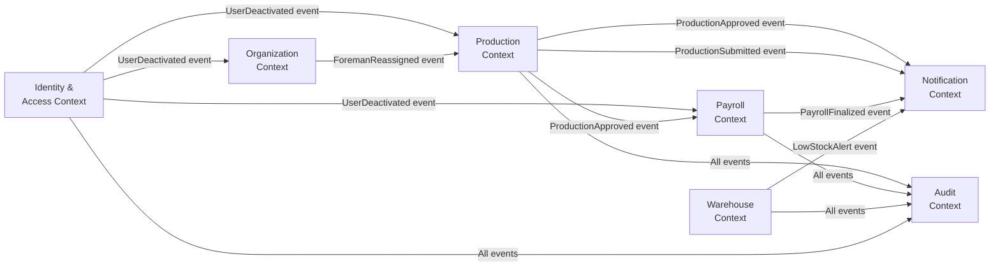
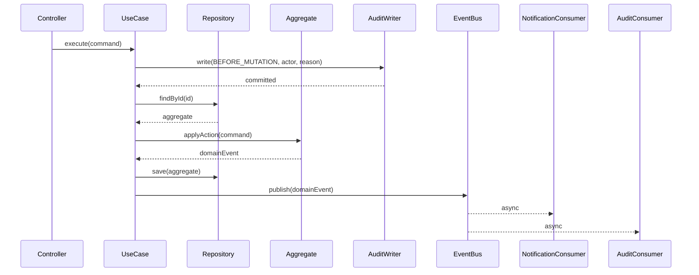
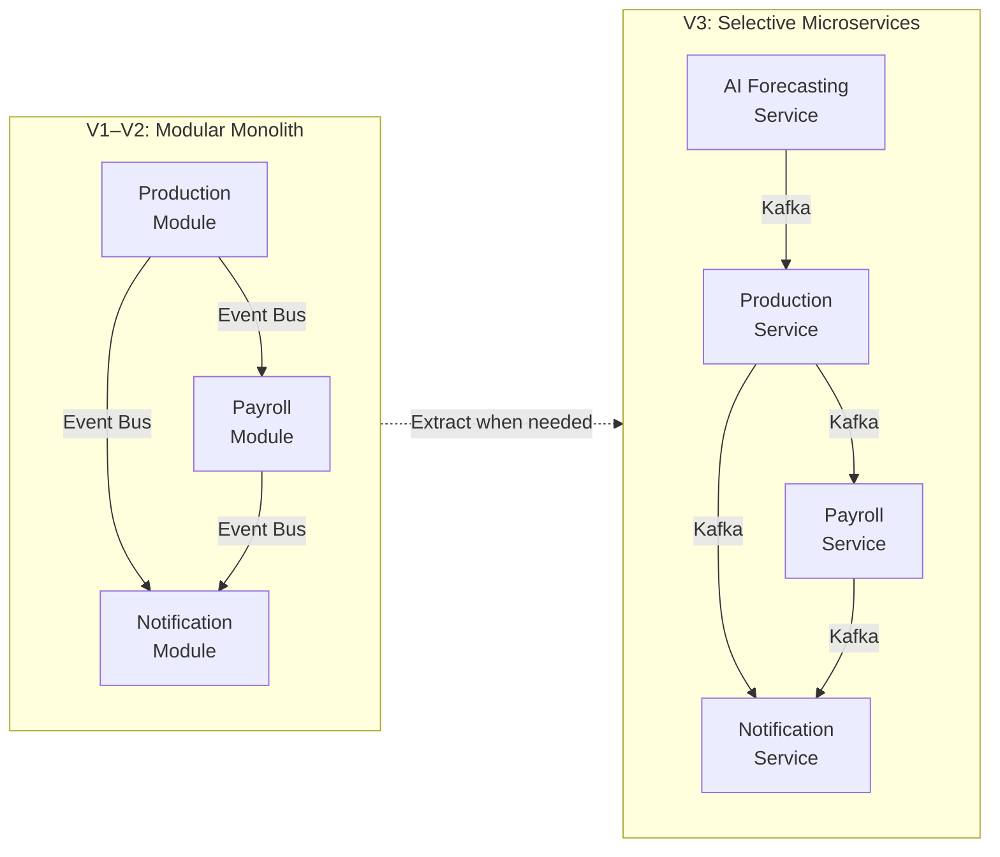
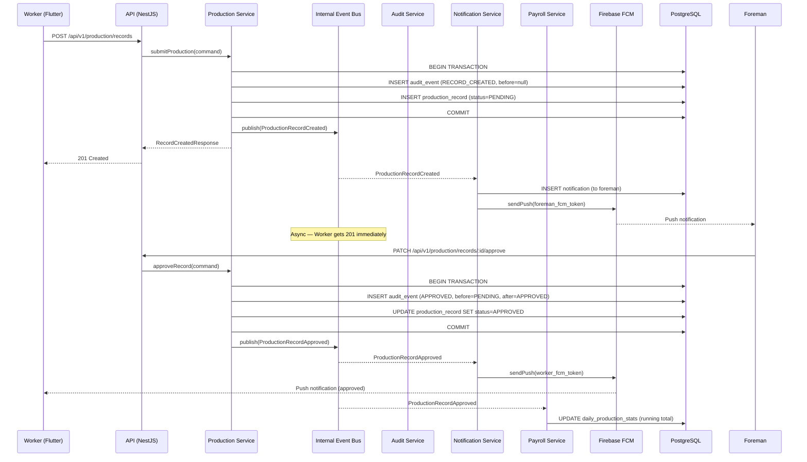
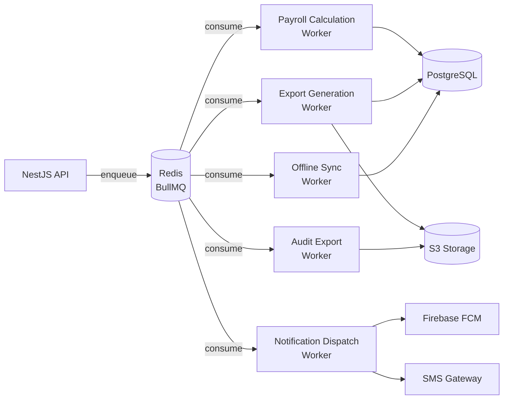
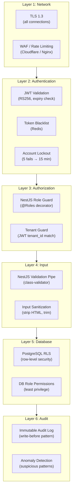
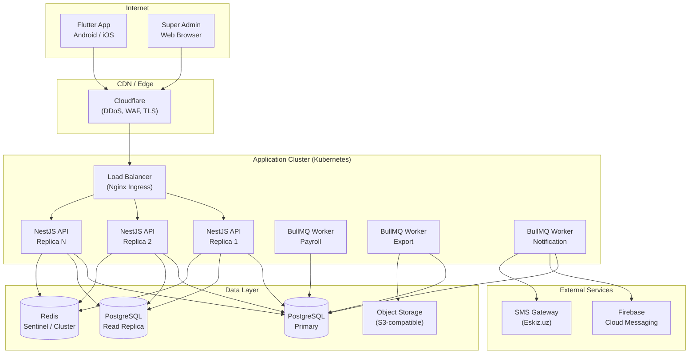
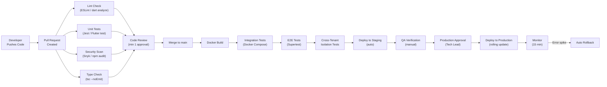

# Architecture Blueprint
# TexERP — Mobile-First Multi-Tenant Textile ERP

---

**Document Version:** 1.0.0  
**Status:** Approved — This is the official architecture reference  
**Created:** 2026-07-16  
**Author:** Architecture Team  
**Audience:** All Engineers, Tech Lead, QA Lead  

> **This document is the constitution of the codebase.**  
> Every line of code written for TexERP must conform to the principles and boundaries defined here.  
> When in doubt, consult this document. When this document is wrong, update it via ADR — not by silent deviation.

---

## Table of Contents

1. [Architecture Principles](#1-architecture-principles)
2. [Layered Architecture](#2-layered-architecture)
3. [Clean Architecture](#3-clean-architecture)
4. [DDD Architecture](#4-ddd-architecture)
5. [Modular Monolith — The Chosen Approach](#5-modular-monolith--the-chosen-approach)
6. [Folder Structure](#6-folder-structure)
7. [Module Boundaries](#7-module-boundaries)
8. [Dependency Rules](#8-dependency-rules)
9. [Event Flow](#9-event-flow)
10. [Background Jobs](#10-background-jobs)
11. [Caching Strategy](#11-caching-strategy)
12. [Offline Sync Strategy](#12-offline-sync-strategy)
13. [Conflict Resolution Strategy](#13-conflict-resolution-strategy)
14. [File Storage Strategy](#14-file-storage-strategy)
15. [Logging Strategy](#15-logging-strategy)
16. [Monitoring](#16-monitoring)
17. [Security Layers](#17-security-layers)
18. [Error Handling](#18-error-handling)
19. [Validation Strategy](#19-validation-strategy)
20. [API Versioning](#20-api-versioning)
21. [Deployment Strategy](#21-deployment-strategy)
22. [CI/CD Pipeline](#22-cicd-pipeline)
23. [Disaster Recovery](#23-disaster-recovery)
24. [Backup Strategy](#24-backup-strategy)
25. [Scalability Roadmap](#25-scalability-roadmap)
26. [Coding Standards](#26-coding-standards)
27. [Architecture Decision Records Index](#27-architecture-decision-records-index)
28. [Technology Risks](#28-technology-risks)
29. [Performance Targets](#29-performance-targets)
30. [Future Migration Strategy](#30-future-migration-strategy)

---

## 1. Architecture Principles

These are non-negotiable. Every architectural and implementation decision is evaluated against these principles.

### P-01 — Tenant Isolation is Sacred
No code path, query, or data structure may allow cross-tenant data access. Tenant isolation is enforced at three independent layers: JWT claim validation (application), NestJS guard (service), and PostgreSQL RLS (database). Failure at any one layer must still be caught by the others.

### P-02 — The Domain is the Heart
Business logic lives in the domain layer. It does not depend on frameworks, databases, or HTTP. Domain services can be tested in isolation without starting a server or connecting to a database.

### P-03 — Explicit Over Implicit
No magic. No hidden behaviors. No global state mutations. Every behavior must be traceable: where it starts, what it does, where it ends. Decorators are acceptable for cross-cutting concerns (auth, logging, validation) but must be documented.

### P-04 — Audit Everything That Matters
Every state change to a financial or identity entity writes an immutable audit entry BEFORE the mutation. There is no exception to this rule. Audit is not a feature — it is infrastructure.

### P-05 — Fail Loudly, Recover Gracefully
Errors are never silently swallowed. Every exception is logged with full context. User-facing errors are clear and actionable. Background jobs retry with exponential backoff and have dead-letter queues for manual investigation.

### P-06 — Design for the Offline Worker
The mobile application assumes intermittent connectivity. Every feature that a factory floor worker uses must function offline. Sync happens opportunistically. Conflict resolution is deterministic and documented.

### P-07 — Snapshots Preserve Truth
Financial data (prices, names, quantities) is snapshotted at the time of the business event. Retroactive changes to catalog data must never silently affect historical records. (See ADR-006)

### P-08 — Modules Communicate via Events, Not Direct Calls
Cross-module communication in the backend uses domain events published to the internal event bus. A module never directly imports another module's service (except shared utilities). This keeps modules independently deployable.

### P-09 — Configuration is Externalized
No hardcoded values in source code. Environment variables for all configuration. Secrets are never committed to source control — ever.

### P-10 — Performance is a Feature
The system is measured against documented performance targets (Section 29). Every new query must have an execution plan reviewed for index usage. "It works" is not good enough — "it performs within target" is the standard.

### P-11 — Security is Defense in Depth
Authentication, authorization, input validation, and output sanitization each operate independently. The system is secure even if one layer fails. OWASP Top 10 compliance is mandatory before any production release.

### P-12 — The Mobile App is a Thin Client
The Flutter app contains UI logic and local persistence only. All business logic lives in the backend. The app should not make business decisions — it displays data and sends commands.

---

## 2. Layered Architecture



### Layer Responsibilities

| Layer | Location | Responsibility | May Depend On |
|-------|----------|---------------|---------------|
| **Presentation** | Flutter widgets | Render UI, manage widget state, handle user events | Application (via BLoC) |
| **BLoC / State** | Flutter BLoC/Cubit | Business state for UI; maps domain events to UI states | Application Services (via Repositories) |
| **Local** | Flutter SQLite | Offline queue, cached data, secure local storage | Nothing (pure local) |
| **HTTP / Controllers** | NestJS | Parse HTTP requests, validate with Pipes, authorize with Guards, delegate to Application | Application layer only |
| **Application** | NestJS services | Orchestrate use cases; no business logic — delegates to domain; calls repositories | Domain, Infrastructure |
| **Domain** | NestJS domain/ | All business logic, domain events, invariant enforcement | Nothing (pure domain) |
| **Infrastructure** | NestJS infra/ | Database (TypeORM), Redis, S3, FCM, Queue adapters | Domain interfaces |

**The Dependency Rule:** Dependencies always point inward. Domain depends on nothing. Infrastructure depends on Domain interfaces. Application depends on Domain and Infrastructure interfaces. HTTP depends on Application.

---

## 3. Clean Architecture



### Use Case Pattern

Every business operation is a **Use Case** (Command Handler):

```
class ApproveProductionRecordUseCase {
  constructor(
    private readonly repo: IProductionRecordRepository,   // output port
    private readonly auditWriter: IAuditWriter,           // output port
    private readonly eventPublisher: IDomainEventPublisher // output port
  ) {}

  async execute(command: ApproveRecordCommand): Promise<void> {
    // 1. Load aggregate
    // 2. Enforce domain invariants
    // 3. Write audit BEFORE mutation
    // 4. Persist state change
    // 5. Publish domain event
  }
}
```

**Rules:**
- Use Cases receive Commands (input DTOs) and return either void or Result DTOs
- Use Cases never throw HTTP exceptions — they throw domain exceptions (mapped to HTTP by exception filter)
- All Use Cases are independently unit-testable (inject mock ports)

---

## 4. DDD Architecture

> Full domain model is defined in `03_Database/DatabaseArchitecture.md`. This section defines the DDD application patterns.

### Bounded Context Communication



**Rule:** Contexts communicate ONLY via domain events on the internal event bus. Context A never directly calls Context B's service or queries Context B's repository. The only exception is read-only cross-context queries for reporting (via dedicated read models).

### Aggregate Lifecycle Pattern



---

## 5. Modular Monolith — The Chosen Approach

### Decision

**TexERP V1 and V2 use a Modular Monolith architecture.**

### What Is a Modular Monolith?

A Modular Monolith is a single deployable NestJS application divided into strict, independently-bounded modules that:
- Share no direct code dependencies (only via interfaces and events)
- Have their own controllers, services, repositories, and domain logic
- Communicate only via the internal event bus (not direct service calls)
- Can be extracted into microservices without changing their internal logic

### Why Not Microservices Now?

| Concern | Microservices | Modular Monolith |
|---------|:------------:|:----------------:|
| Operational complexity | Very High (50+ tenants × service count) | Low (1 deployment) |
| Team size needed | 8–12 engineers (dedicated per service) | 3–5 engineers |
| Distributed transaction handling | Required (Saga pattern) | Not needed (single DB) |
| Development velocity | Slow (service contracts, network) | Fast (local function calls) |
| Network latency (payroll calc) | Each step = network hop | Zero (same process) |
| Debugging difficulty | Very High | Standard |
| Infrastructure cost | $2,000+/month (10 services) | $200–500/month |
| **MVP timeline impact** | +3–4 months | No impact |

**The Payroll Calculation argument:** Payroll calculation aggregates production records, adjustments, and advances — data from multiple "services." In a microservices architecture, this requires either a dedicated aggregation service or multiple round-trip calls. In a modular monolith, it's a single database query.

### Microservices Migration Path (V3)

The modular monolith is designed to be extractable. Each NestJS module:
- Has a clear public API (interfaces, not implementations)
- Communicates via event bus (already async-ready)
- Has no direct DB access to other modules' tables

When extracting to a microservice:
1. Replace the internal event bus with an external message broker (Redis Streams → Kafka)
2. Replace direct repository calls with REST/gRPC calls
3. Deploy the module as a separate container
4. No internal business logic changes required



---

## 6. Folder Structure

### 6.1 NestJS Backend — Complete Structure

```
texerp-backend/
├── src/
│   ├── main.ts                          ← App bootstrap
│   ├── app.module.ts                    ← Root module
│   │
│   ├── shared/                          ← Cross-cutting utilities (no domain logic)
│   │   ├── config/
│   │   │   ├── app.config.ts
│   │   │   ├── database.config.ts
│   │   │   ├── redis.config.ts
│   │   │   └── jwt.config.ts
│   │   ├── decorators/
│   │   │   ├── current-tenant.decorator.ts
│   │   │   ├── current-user.decorator.ts
│   │   │   └── roles.decorator.ts
│   │   ├── exceptions/
│   │   │   ├── domain.exception.ts
│   │   │   ├── tenant-not-found.exception.ts
│   │   │   └── global-exception.filter.ts
│   │   ├── guards/
│   │   │   ├── jwt-auth.guard.ts
│   │   │   ├── roles.guard.ts
│   │   │   └── tenant.guard.ts
│   │   ├── interceptors/
│   │   │   ├── tenant-context.interceptor.ts
│   │   │   ├── logging.interceptor.ts
│   │   │   └── response-transform.interceptor.ts
│   │   ├── pipes/
│   │   │   └── validation.pipe.ts
│   │   ├── types/
│   │   │   ├── tenant-context.type.ts
│   │   │   └── paginated-result.type.ts
│   │   └── utils/
│   │       ├── uuid.util.ts             ← UUIDv7 generation
│   │       ├── money.util.ts
│   │       └── date.util.ts
│   │
│   ├── infrastructure/                  ← Framework adapters
│   │   ├── database/
│   │   │   ├── database.module.ts
│   │   │   ├── rls.middleware.ts        ← Sets app.current_tenant_id per request
│   │   │   └── migrations/              ← Versioned migration files
│   │   ├── redis/
│   │   │   ├── redis.module.ts
│   │   │   └── redis.service.ts
│   │   ├── storage/
│   │   │   ├── storage.module.ts
│   │   │   └── storage.service.ts       ← S3-compatible adapter
│   │   ├── fcm/
│   │   │   ├── fcm.module.ts
│   │   │   └── fcm.service.ts
│   │   ├── sms/
│   │   │   ├── sms.module.ts
│   │   │   └── sms.service.ts           ← Eskiz.uz / Playmobile adapter
│   │   └── queue/
│   │       ├── queue.module.ts
│   │       └── queues/
│   │           ├── payroll.queue.ts
│   │           ├── export.queue.ts
│   │           └── notification.queue.ts
│   │
│   ├── modules/                         ← Business modules (bounded contexts)
│   │   │
│   │   ├── platform/                    ← Super Admin context
│   │   │   ├── platform.module.ts
│   │   │   ├── domain/
│   │   │   │   ├── tenant.entity.ts
│   │   │   │   ├── subscription-plan.entity.ts
│   │   │   │   └── events/
│   │   │   │       ├── tenant-created.event.ts
│   │   │   │       └── tenant-suspended.event.ts
│   │   │   ├── application/
│   │   │   │   ├── use-cases/
│   │   │   │   │   ├── create-tenant.use-case.ts
│   │   │   │   │   └── suspend-tenant.use-case.ts
│   │   │   │   └── dtos/
│   │   │   │       ├── create-tenant.dto.ts
│   │   │   │       └── tenant-response.dto.ts
│   │   │   ├── infrastructure/
│   │   │   │   └── repositories/
│   │   │   │       └── tenant.repository.ts
│   │   │   └── presentation/
│   │   │       └── controllers/
│   │   │           └── tenant.controller.ts
│   │   │
│   │   ├── iam/                         ← Identity & Access context
│   │   │   ├── iam.module.ts
│   │   │   ├── domain/
│   │   │   │   ├── user.entity.ts
│   │   │   │   ├── value-objects/
│   │   │   │   │   ├── phone-number.vo.ts
│   │   │   │   │   └── pin.vo.ts
│   │   │   │   └── events/
│   │   │   │       ├── user-created.event.ts
│   │   │   │       └── user-deactivated.event.ts
│   │   │   ├── application/
│   │   │   │   ├── use-cases/
│   │   │   │   │   ├── login.use-case.ts
│   │   │   │   │   ├── request-otp.use-case.ts
│   │   │   │   │   └── reset-pin.use-case.ts
│   │   │   │   └── dtos/
│   │   │   ├── infrastructure/
│   │   │   │   └── repositories/
│   │   │   └── presentation/
│   │   │       └── controllers/
│   │   │           ├── auth.controller.ts
│   │   │           └── users.controller.ts
│   │   │
│   │   ├── organization/                ← Workers, teams, assignments
│   │   │   └── [same internal structure]
│   │   │
│   │   ├── production/                  ← Production records & operations
│   │   │   ├── production.module.ts
│   │   │   ├── domain/
│   │   │   │   ├── production-record.aggregate.ts
│   │   │   │   ├── operation.entity.ts
│   │   │   │   ├── operation-category.entity.ts
│   │   │   │   ├── services/
│   │   │   │   │   ├── price-snapshot.service.ts
│   │   │   │   │   ├── duplicate-detection.service.ts
│   │   │   │   │   └── anomaly-detection.service.ts
│   │   │   │   ├── value-objects/
│   │   │   │   │   ├── price-snapshot.vo.ts
│   │   │   │   │   ├── rejection-reason.vo.ts
│   │   │   │   │   └── record-status.vo.ts
│   │   │   │   └── events/
│   │   │   │       ├── production-submitted.event.ts
│   │   │   │       ├── production-approved.event.ts
│   │   │   │       ├── production-rejected.event.ts
│   │   │   │       └── production-corrected.event.ts
│   │   │   ├── application/
│   │   │   │   ├── use-cases/
│   │   │   │   │   ├── submit-production.use-case.ts
│   │   │   │   │   ├── approve-record.use-case.ts
│   │   │   │   │   ├── reject-record.use-case.ts
│   │   │   │   │   ├── correct-and-approve.use-case.ts
│   │   │   │   │   ├── bulk-approve.use-case.ts
│   │   │   │   │   └── director-override.use-case.ts
│   │   │   │   ├── queries/
│   │   │   │   │   ├── get-pending-records.query.ts
│   │   │   │   │   ├── get-worker-history.query.ts
│   │   │   │   │   └── get-production-report.query.ts
│   │   │   │   └── dtos/
│   │   │   ├── infrastructure/
│   │   │   │   └── repositories/
│   │   │   │       ├── production-record.repository.ts
│   │   │   │       └── operation.repository.ts
│   │   │   └── presentation/
│   │   │       └── controllers/
│   │   │           ├── production-records.controller.ts
│   │   │           └── operations.controller.ts
│   │   │
│   │   ├── payroll/                     ← Payroll periods & calculation
│   │   │   └── [same internal structure]
│   │   │
│   │   ├── warehouse/                   ← Materials & inventory
│   │   │   └── [same internal structure]
│   │   │
│   │   ├── notifications/               ← Push & in-app notifications
│   │   │   └── [same internal structure]
│   │   │
│   │   ├── reports/                     ← Reporting & dashboards
│   │   │   └── [same internal structure]
│   │   │
│   │   ├── audit/                       ← Audit log writer & reader
│   │   │   └── [same internal structure]
│   │   │
│   │   └── settings/                    ← Tenant settings & operations catalog
│   │       └── [same internal structure]
│   │
│   └── workers/                         ← BullMQ background job workers
│       ├── payroll-calculation.worker.ts
│       ├── payroll-export.worker.ts
│       └── notification-dispatch.worker.ts
│
├── test/
│   ├── unit/
│   ├── integration/
│   ├── e2e/
│   └── security/
│       └── cross-tenant-isolation.spec.ts   ← MANDATORY security test
│
├── .env.example
├── .env.test
├── docker-compose.yml
├── Dockerfile
├── nest-cli.json
└── package.json
```

---

### 6.2 Flutter Mobile App — Complete Structure

```
texerp-flutter/
├── lib/
│   ├── main.dart
│   ├── app.dart                         ← MaterialApp + routing root
│   │
│   ├── core/                            ← Framework-agnostic core
│   │   ├── di/
│   │   │   └── injection_container.dart ← get_it dependency injection setup
│   │   ├── network/
│   │   │   ├── api_client.dart          ← Dio configuration + interceptors
│   │   │   ├── auth_interceptor.dart    ← Attach JWT + refresh logic
│   │   │   ├── tenant_interceptor.dart  ← Attach tenant context
│   │   │   └── retry_interceptor.dart   ← Retry on network error
│   │   ├── storage/
│   │   │   ├── secure_storage.dart      ← flutter_secure_storage (PIN, token)
│   │   │   ├── local_db.dart            ← SQLite (sqflite) setup
│   │   │   └── offline_queue.dart       ← Offline submission queue manager
│   │   ├── sync/
│   │   │   ├── sync_manager.dart        ← Orchestrates offline → online sync
│   │   │   └── conflict_resolver.dart   ← Handles sync conflicts
│   │   ├── theme/
│   │   │   ├── app_theme.dart           ← Light / dark theme definitions
│   │   │   ├── app_colors.dart          ← Color palette constants
│   │   │   ├── app_typography.dart      ← Text style definitions
│   │   │   └── app_spacing.dart         ← Spacing constants
│   │   ├── l10n/
│   │   │   ├── app_uz.arb               ← Uzbek strings
│   │   │   ├── app_ru.arb               ← Russian strings
│   │   │   └── l10n.dart                ← Generated localizations
│   │   ├── router/
│   │   │   ├── app_router.dart          ← GoRouter configuration
│   │   │   └── route_guards.dart        ← Auth + role-based guards
│   │   ├── error/
│   │   │   ├── failures.dart            ← Failure types (NetworkFailure, etc.)
│   │   │   └── exceptions.dart
│   │   └── utils/
│   │       ├── date_utils.dart
│   │       ├── money_formatter.dart
│   │       └── validators.dart
│   │
│   ├── features/                        ← Feature modules (one per bounded context)
│   │   │
│   │   ├── auth/
│   │   │   ├── data/
│   │   │   │   ├── datasources/
│   │   │   │   │   ├── auth_remote_datasource.dart
│   │   │   │   │   └── auth_local_datasource.dart
│   │   │   │   ├── models/
│   │   │   │   │   └── user_model.dart
│   │   │   │   └── repositories/
│   │   │   │       └── auth_repository_impl.dart
│   │   │   ├── domain/
│   │   │   │   ├── entities/
│   │   │   │   │   └── user.dart
│   │   │   │   ├── repositories/
│   │   │   │   │   └── i_auth_repository.dart
│   │   │   │   └── usecases/
│   │   │   │       ├── login_usecase.dart
│   │   │   │       └── logout_usecase.dart
│   │   │   └── presentation/
│   │   │       ├── bloc/
│   │   │       │   ├── auth_bloc.dart
│   │   │       │   ├── auth_event.dart
│   │   │       │   └── auth_state.dart
│   │   │       └── screens/
│   │   │           ├── login_screen.dart
│   │   │           └── pin_reset_screen.dart
│   │   │
│   │   ├── production/
│   │   │   ├── data/
│   │   │   │   ├── datasources/
│   │   │   │   │   ├── production_remote_datasource.dart
│   │   │   │   │   └── production_local_datasource.dart ← SQLite offline queue
│   │   │   │   ├── models/
│   │   │   │   │   └── production_record_model.dart
│   │   │   │   └── repositories/
│   │   │   │       └── production_repository_impl.dart
│   │   │   ├── domain/
│   │   │   │   ├── entities/
│   │   │   │   │   └── production_record.dart
│   │   │   │   ├── repositories/
│   │   │   │   │   └── i_production_repository.dart
│   │   │   │   └── usecases/
│   │   │   │       ├── submit_production_usecase.dart
│   │   │   │       ├── get_worker_history_usecase.dart
│   │   │   │       └── approve_record_usecase.dart
│   │   │   └── presentation/
│   │   │       ├── bloc/
│   │   │       │   ├── submit_production_bloc.dart
│   │   │       │   ├── approval_queue_bloc.dart
│   │   │       │   └── worker_history_bloc.dart
│   │   │       ├── screens/
│   │   │       │   ├── worker/
│   │   │       │   │   ├── worker_home_screen.dart
│   │   │       │   │   ├── submit_production_screen.dart
│   │   │       │   │   └── worker_history_screen.dart
│   │   │       │   └── foreman/
│   │   │       │       ├── foreman_home_screen.dart
│   │   │       │       ├── approval_queue_screen.dart
│   │   │       │       └── record_detail_screen.dart
│   │   │       └── widgets/
│   │   │           ├── operation_selector.dart
│   │   │           ├── quantity_input.dart
│   │   │           ├── record_status_badge.dart
│   │   │           └── approval_action_sheet.dart
│   │   │
│   │   ├── payroll/
│   │   ├── warehouse/
│   │   ├── reports/
│   │   ├── notifications/
│   │   └── settings/
│   │
│   └── shared/                          ← Shared UI components
│       ├── widgets/
│       │   ├── app_bar.dart
│       │   ├── loading_indicator.dart
│       │   ├── error_view.dart
│       │   ├── empty_state.dart
│       │   ├── offline_banner.dart
│       │   ├── confirmation_dialog.dart
│       │   └── money_display.dart
│       └── extensions/
│           ├── context_extensions.dart
│           ├── string_extensions.dart
│           └── date_extensions.dart
│
├── test/
│   ├── unit/
│   ├── widget/
│   └── integration/
│
├── assets/
│   ├── images/
│   ├── icons/
│   └── fonts/
│
└── pubspec.yaml
```

---

## 7. Module Boundaries

### Module Catalog

| Module | NestJS Path | Responsibility | Public API |
|--------|------------|---------------|-----------|
| **Platform** | `modules/platform` | Tenant & subscription lifecycle | `TenantService` interface |
| **IAM** | `modules/iam` | Auth, sessions, RBAC, OTP | `IamService`, `AuthGuard` |
| **Organization** | `modules/organization` | Workers, foremen, assignments | `OrganizationService` |
| **Production** | `modules/production` | Operations, records, approvals | `ProductionService` |
| **Payroll** | `modules/payroll` | Periods, calculation, finalization | `PayrollService` |
| **Warehouse** | `modules/warehouse` | Materials, inventory movements | `WarehouseService` |
| **Notifications** | `modules/notifications` | Push, in-app, preferences | `NotificationService` |
| **Reports** | `modules/reports` | Read models, dashboards, exports | `ReportService` (read-only) |
| **Audit** | `modules/audit` | Immutable event log writer | `AuditWriter` interface |
| **Settings** | `modules/settings` | Operation catalog, tenant config | `SettingsService` |
| **Subscription** | `modules/subscription` | Plan limits, feature flags | `SubscriptionService` |

### Module Boundary Rules

1. **Production** may consume events from **IAM** (UserDeactivated) and **Organization** (ForemanReassigned)
2. **Payroll** may consume events from **Production** (ProductionApproved, ProductionRejected)
3. **Notifications** consumes events from ALL production/payroll/warehouse modules
4. **Audit** consumes events from ALL modules — it is a passive sink
5. **Reports** reads from multiple modules' READ MODELS (not their repositories)
6. **Subscription** is consulted by ALL modules via `SubscriptionService.isFeatureEnabled()`

---

## 8. Dependency Rules

### Module Communication Matrix

```
Legend: ✅ Allowed  ❌ Forbidden  🔔 Via Events Only  📖 Read Model Only
```

| From \ To | Platform | IAM | Org | Production | Payroll | Warehouse | Notif | Reports | Audit | Settings | Subscription |
|-----------|:-------:|:---:|:---:|:----------:|:-------:|:---------:|:-----:|:-------:|:-----:|:--------:|:------------:|
| **Platform** | — | ✅ | ❌ | ❌ | ❌ | ❌ | 🔔 | ❌ | 🔔 | ❌ | ✅ |
| **IAM** | ❌ | — | ❌ | ❌ | ❌ | ❌ | 🔔 | ❌ | 🔔 | ❌ | ✅ |
| **Organization** | ❌ | ✅ | — | ❌ | ❌ | ❌ | 🔔 | ❌ | 🔔 | ❌ | ✅ |
| **Production** | ❌ | ✅ | ✅ | — | ❌ | ❌ | 🔔 | ❌ | 🔔 | ✅ | ✅ |
| **Payroll** | ❌ | ✅ | ✅ | 📖 | — | ❌ | 🔔 | ❌ | 🔔 | ✅ | ✅ |
| **Warehouse** | ❌ | ✅ | ❌ | ❌ | ❌ | — | 🔔 | ❌ | 🔔 | ✅ | ✅ |
| **Notifications** | ❌ | ✅ | ❌ | ❌ | ❌ | ❌ | — | ❌ | 🔔 | ❌ | ✅ |
| **Reports** | ❌ | ✅ | 📖 | 📖 | 📖 | 📖 | ❌ | — | 📖 | ❌ | ✅ |
| **Audit** | ❌ | ❌ | ❌ | ❌ | ❌ | ❌ | ❌ | ❌ | — | ❌ | ❌ |
| **Settings** | ❌ | ✅ | ❌ | ❌ | ❌ | ❌ | ❌ | ❌ | 🔔 | — | ✅ |
| **Subscription** | ✅ | ❌ | ❌ | ❌ | ❌ | ❌ | ❌ | ❌ | 🔔 | ❌ | — |

**Hard Rules:**
- `Audit` module is WRITE-ONLY from all other modules. No module reads from `Audit` except Reports (read-only for audit trail UI).
- `Production` NEVER directly queries `payroll_periods` or `payroll_calculations` tables
- `Payroll` reads production records via a **read model** (a dedicated query object), not by importing `ProductionService`
- `Subscription` is a pure utility — it answers "is this feature enabled?" and nothing else

---

## 9. Event Flow



---

## 10. Background Jobs

### Job Queue Architecture



### Job Definitions

| Queue | Job | Trigger | Timeout | Retry | DLQ |
|-------|-----|---------|---------|-------|-----|
| `payroll` | `calculate-payroll` | Accountant triggers | 120s | 3× | Yes |
| `exports` | `generate-excel` | Accountant requests export | 60s | 3× | Yes |
| `exports` | `generate-pdf` | Accountant requests export | 60s | 3× | Yes |
| `notifications` | `send-push` | Any domain event | 10s | 3× exp backoff | Yes |
| `notifications` | `send-sms-otp` | PIN reset request | 10s | 3× | Yes |
| `audit` | `export-audit-to-s3` | Nightly cron (02:00 UTC) | 300s | 1× | Yes |
| `maintenance` | `archive-old-notifications` | Nightly cron | 60s | 1× | Yes |
| `maintenance` | `cleanup-expired-sessions` | Hourly cron | 30s | 1× | No |

### Job Design Rules

1. **All jobs MUST be idempotent** — safe to run twice without creating duplicates
2. **All jobs MUST be resumable** — if a job dies mid-run, restarting it must not corrupt data
3. **DLQ monitoring** — failed jobs in the Dead Letter Queue trigger an alert within 5 minutes
4. **Job progress tracking** — long jobs (payroll calculation) report progress: "Processing worker 47/200"
5. **Job result storage** — job result ID stored in `payroll_exports.status` so the client can poll

---

## 11. Caching Strategy

### What Is Cached and Why

| Cache Key Pattern | TTL | Invalidation | Purpose |
|------------------|-----|-------------|---------|
| `tenant:{id}:config` | 5 min | On tenant update | Avoid DB lookup per request for tenant config |
| `tenant:{id}:features` | 1 min | On feature flag change | Feature flag lookup per request |
| `user:{id}:session` | JWT expiry | On logout/deactivation | Revoked token blacklist check |
| `tenant:{id}:operation_catalog` | 10 min | On operation create/update/deactivate | Worker's operation list (frequently read, rarely changes) |
| `tenant:{id}:dashboard` | 60 sec | On new approved record | Director dashboard data |
| `otp:{phone}:attempts` | 15 min | On OTP use | Rate limit OTP requests |
| `login:{phone}:failures` | 15 min | On successful login | Login attempt counter |
| `ratelimit:{user_id}` | 1 min sliding | Per request | API rate limiting |

### Cache Design Rules

1. **Cache is never the source of truth** — always readable from DB if cache is cold
2. **Write-through on mutations** — when a cached entity changes, update cache immediately after DB commit
3. **TTL as safety net** — even if invalidation fails, TTL ensures eventual consistency
4. **Never cache PII** — phone numbers, names, PIN hashes are never stored in Redis
5. **Cache key includes tenant_id** — prevents cross-tenant cache pollution

### Redis Data Structures

| Use Case | Redis Structure | Reason |
|----------|----------------|--------|
| Token blacklist | `SET` with EXPIRY | Fast O(1) lookup; auto-expires |
| Feature flags | `HASH` per tenant | All features in one key; atomic update |
| Dashboard stats | `STRING` (serialized JSON) | Simple TTL-based cache |
| Rate limiting | `INCR` + `EXPIRE` | Atomic counter increment |
| Job queues | BullMQ (uses Redis Sorted Sets/Lists) | BullMQ manages structure |
| OTP codes | `STRING` with EXPIRY | 5-minute expiry; consumed on use |

---

## 12. Offline Sync Strategy

### Architecture

```mermaid
graph TB
    subgraph DEVICE["Flutter Device"]
        UI[User Action]
        REPO[Repository\n(decides online/offline)]
        REMOTE[Remote Datasource\n(API calls)]
        LOCAL[Local Datasource\n(SQLite)]
        QUEUE[(Offline Queue\nSQLite table)]
        SYNC[Sync Manager\n(background)]
    end

    subgraph SERVER["NestJS Server"]
        API[Sync API\nPOST /sync/bulk]
        CONFLICT[Conflict\nDetector]
        DB[(PostgreSQL)]
    end

    UI --> REPO
    REPO -->|Online| REMOTE
    REPO -->|Offline| LOCAL
    LOCAL --> QUEUE
    SYNC -->|On connectivity restored| API
    REMOTE --> API
    API --> CONFLICT
    CONFLICT --> DB
    CONFLICT -->|Conflicts| SYNC
    SYNC -->|Notify user| UI
```

### Offline Queue Schema (SQLite)

```
offline_queue (
  local_id     TEXT PRIMARY KEY,    -- local UUIDv7
  entity_type  TEXT,                -- 'production_record'
  operation    TEXT,                -- 'CREATE'
  payload      TEXT,                -- JSON string
  created_at   TEXT,                -- ISO 8601 device time
  sync_status  TEXT,                -- PENDING | SYNCING | SYNCED | FAILED
  error_msg    TEXT,                -- if FAILED
  retry_count  INTEGER DEFAULT 0
)
```

### Sync Protocol

1. **Detection:** `ConnectivityMonitor` watches for network status changes
2. **Batch collection:** Sync Manager collects all `PENDING` rows from `offline_queue`
3. **Deduplication:** Client deduplicates by `local_id` before sending
4. **Bulk request:** `POST /api/v1/sync/bulk` with array of pending operations
5. **Server processing:** Each item processed sequentially; errors collected, not halted
6. **Response:** Server returns per-item results: `{ local_id, status, server_id?, error? }`
7. **Queue update:** Sync Manager marks items: `SYNCED` or `FAILED`
8. **UI update:** BLoC notified; UI shows sync results

### What Can Be Done Offline

| Feature | Offline? | Sync Direction | Conflict Possible? |
|---------|:--------:|---------------|:-----------------:|
| Submit production record | ✅ | Device → Server | Yes (duplicate) |
| View own history | ✅ (cached) | Server → Device | No |
| View own payroll | ✅ (cached) | Server → Device | No |
| Approve records (Foreman) | ⚠️ Queued | Device → Server | Yes (already approved) |
| View pending queue (Foreman) | ✅ (cached) | Server → Device | No |
| View inventory (Warehouse) | ✅ (cached) | Server → Device | No |
| Record receipt/issuance | ❌ V1 | — | — |
| Director dashboard | ✅ (stale) | Server → Device | No |

---

## 13. Conflict Resolution Strategy

### Conflict Types and Resolution

| Conflict | Detection | Resolution |
|----------|-----------|-----------|
| **Duplicate submission** (same operation + date already exists) | Server checks during sync | REJECT offline record; notify user; mark FAILED in queue |
| **Record already approved** (foreman approves offline → already approved by Director) | Server checks current status | SKIP (idempotent approve); return SUCCESS |
| **Record already rejected** | Same as above | SKIP if same action; ERROR if conflicting action |
| **Date window expired** (submitted offline; back-date window passed by sync time) | Server validates `record_date` vs current date + tenant window | REJECT; notify user |
| **Worker deactivated** (deactivated between offline submission and sync) | Server checks worker status | REJECT all records; force re-auth |
| **Operation deactivated** | Server checks operation status | ALLOW (operation was active at offline submission time; snapshot already captured) |
| **Price changed** | N/A | No conflict — price was snapshotted at local creation time |

### Resolution Principle: **Server Clock Is Authoritative**

The server's timestamp is always authoritative for business logic. Device timestamps are stored for audit purposes only (`offline_created_at`) but are never used for business rule validation.

---

## 14. File Storage Strategy

### Architecture

```
S3-Compatible Object Storage (MinIO local / AWS S3 production)

Bucket Structure:
  texerp-{environment}/
    ├── tenants/
    │   └── {tenant_id}/
    │       ├── exports/
    │       │   ├── payroll/
    │       │   │   └── {period_id}/{timestamp}-payroll.xlsx
    │       │   └── reports/
    │       │       └── {date}-production-report.xlsx
    │       ├── avatars/
    │       │   └── {user_id}/avatar.webp
    │       └── warehouse/
    │           └── receipts/
    │               └── {movement_id}/
    │                   └── photo-{n}.webp
    └── audit-exports/              ← Platform level; separate access policy
        └── {year}/{month}/
            └── audit-events-{date}.parquet
```

### File Access Control

| File Type | Access | URL Type | Expiry |
|-----------|--------|---------|--------|
| Payroll exports | Authenticated tenant user only | Pre-signed URL | 1 hour |
| Report exports | Authenticated tenant user only | Pre-signed URL | 1 hour |
| User avatars | Any authenticated tenant user | Pre-signed URL | 24 hours |
| Warehouse photos | Warehouse + Accountant + Director | Pre-signed URL | 24 hours |
| Audit exports | Super Admin only | Pre-signed URL | 30 minutes |

### File Processing Rules

1. **No public URLs** — all files accessed via time-limited pre-signed URLs
2. **File size limits:** Avatar: 5 MB; Warehouse photo: 10 MB per file; 5 photos per receipt
3. **Image processing:** Avatars resized to 256×256 WebP on upload (via Sharp in NestJS)
4. **Retention:** Exports expire after 30 days; S3 lifecycle policy auto-deletes
5. **Tenant isolation:** All file paths include `tenant_id`; S3 bucket policy enforces path-level access

---

## 15. Logging Strategy

### Log Levels and Usage

| Level | When | Example |
|-------|------|---------|
| `ERROR` | Exceptions, job failures, DB errors | "Payroll calculation job failed: NULL price on op XYZ" |
| `WARN` | Business warnings, soft violations | "Rate limit approaching for user ABC" |
| `INFO` | Significant business events | "PayrollFinalized: period=XYZ, workers=47, total=12.5M UZS" |
| `DEBUG` | Development tracing | "Executing query: SELECT..." (disabled in production) |
| `VERBOSE` | Detailed flow tracing | (never in production) |

### Structured Log Format

Every log entry is structured JSON:
```json
{
  "level": "info",
  "timestamp": "2026-07-16T04:30:00.000Z",
  "service": "texerp-api",
  "module": "production",
  "traceId": "abc123",
  "tenantId": "tenant-uuid",
  "userId": "user-uuid",
  "userRole": "FOREMAN",
  "action": "record.approved",
  "recordId": "record-uuid",
  "duration_ms": 47,
  "message": "Production record approved"
}
```

### Log Routing

```
Application Logs → stdout → Docker log driver → Loki/ELK
Access Logs (Nginx) → stdout → Loki
Database Query Logs (slow queries > 100ms) → PostgreSQL log → Loki
Background Job Logs → BullMQ events → Loki
Security Events → Separate security log stream → Alerting
```

### What Is NEVER Logged

- PIN values (even hashed)
- JWT token content
- OTP codes
- Phone numbers (replace with `phone:XXX-XXXX-XXXX` masked format)
- Full names in ERROR logs (use user_id)

---

## 16. Monitoring

### Metrics Stack

```
Prometheus (metrics collection)
  └── Grafana (dashboards + alerting)

Sentry (error tracking + performance)

Loki (log aggregation)

Uptime monitoring: BetterUptime or similar
```

### Critical Alerts (PagerDuty / Telegram)

| Alert | Threshold | Severity |
|-------|-----------|----------|
| API error rate > 1% (5-min window) | P95 errors/requests | CRITICAL |
| API P95 response > 2s | 5-min rolling | HIGH |
| Payroll job failed | Any failure | CRITICAL |
| Cross-tenant data leak attempt detected | Any attempt | CRITICAL |
| Database connections > 80% pool | Sustained 5 min | HIGH |
| Redis memory > 80% | — | HIGH |
| DLQ (Dead Letter Queue) > 5 jobs | — | HIGH |
| Disk usage > 80% | — | HIGH |
| S3 storage > 80% tenant quota | Per tenant | MEDIUM |
| Certificate expiry < 14 days | — | MEDIUM |

### Business Metrics Dashboard (Grafana)

| Metric | Refresh |
|--------|---------|
| Active tenants | Real-time |
| Daily Active Workers (DAW) | Real-time |
| Production records submitted/hour | Real-time |
| Records approved/hour | Real-time |
| Pending approval count (platform-wide) | Real-time |
| Payroll jobs running / completed today | Real-time |
| Average approval time per foreman | Hourly |

---

## 17. Security Layers



### Security Checklist (Pre-Release)

- [ ] OWASP Top 10 review completed
- [ ] Cross-tenant isolation automated tests passing
- [ ] Penetration test completed by external party
- [ ] SQL injection impossible (ORM + parameterized queries only)
- [ ] JWT RS256 private key stored in secret manager (not in code)
- [ ] All PII fields encrypted at field level (V2: bcrypt for PIN, AES-256 for name/phone)
- [ ] Rate limiting on all public endpoints
- [ ] No secrets in git history
- [ ] Security headers (Helmet.js) on all responses
- [ ] CORS whitelist configured for production domains only

---

## 18. Error Handling

### Error Hierarchy

```
BaseException
  ├── DomainException                     ← Business rule violations
  │   ├── InvalidQuantityException
  │   ├── RecordAlreadyApprovedException
  │   ├── PayrollPeriodOverlapException
  │   ├── InsufficientStockException
  │   └── UnauthorizedTenantAccessException
  ├── ApplicationException                ← Use case failures
  │   ├── EntityNotFoundException
  │   └── DuplicateRecordException
  └── InfrastructureException             ← Technical failures
      ├── DatabaseConnectionException
      ├── StorageException
      └── ExternalServiceException
```

### HTTP Error Mapping

| Exception Type | HTTP Status | Response Format |
|---------------|------------|----------------|
| `EntityNotFoundException` | 404 | `{ type, title, status, detail }` (RFC 7807) |
| `DomainException` | 422 | RFC 7807 + `violations[]` array |
| `UnauthorizedTenantAccessException` | 403 | RFC 7807 |
| `InvalidQuantityException` | 400 | RFC 7807 + field details |
| `DatabaseConnectionException` | 503 | RFC 7807 (generic, no internal detail) |
| `Unauthenticated` | 401 | RFC 7807 |
| Any unhandled exception | 500 | RFC 7807 (no stack trace in production) |

### RFC 7807 Response Format

```json
{
  "type": "https://texerp.com/errors/invalid-quantity",
  "title": "Invalid Quantity",
  "status": 422,
  "detail": "Quantity must be between 1 and 9999",
  "instance": "/api/v1/production/records",
  "traceId": "abc-123-def"
}
```

### Global Exception Filter (NestJS)

- Catches ALL exceptions (typed + untyped)
- Maps to appropriate HTTP status
- Logs error with full context (trace ID, user, tenant)
- NEVER exposes stack traces or internal details to clients in production
- Returns all errors in RFC 7807 format

---

## 19. Validation Strategy

### Three-Layer Validation

| Layer | Tool | Validates |
|-------|------|---------|
| **Client (Flutter)** | Form validators + custom validators | Basic field validation; UX feedback |
| **API (NestJS Pipe)** | `class-validator` + `class-transformer` | Schema validation; type coercion; format checks |
| **Domain (NestJS Service)** | Domain invariants in use cases | Business rule validation |

**Rule:** Never trust client validation. Every request must pass server-side validation. Client validation is UX only.

### Validation Examples

```
Field: quantity
  Flutter: must be numeric, non-empty → real-time feedback
  API Pipe: @IsInt() @Min(1) @Max(9999) → HTTP 400 if invalid
  Domain: operation must be ACTIVE; date within window → HTTP 422 if violated

Field: record_date
  Flutter: date picker; no future dates shown
  API Pipe: @IsDateString() → HTTP 400 if invalid format
  Domain: date <= today; date >= (today - back_date_window) → HTTP 422 if violated
```

### Validation Response (Pipe errors)

```json
{
  "type": "https://texerp.com/errors/validation-error",
  "title": "Validation Error",
  "status": 400,
  "violations": [
    { "field": "quantity", "message": "must be a positive integer", "value": -5 },
    { "field": "record_date", "message": "date is in the future" }
  ]
}
```

---

## 20. API Versioning

### Strategy: URL Path Versioning

```
/api/v1/production/records
/api/v1/payroll/periods
/api/v2/production/records   ← Breaking change in V2
```

### Versioning Rules

1. **New endpoints default to the current version** — no extra work for non-breaking additions
2. **Breaking changes MUST increment the version** — breaking = removing fields, changing types, changing behavior
3. **Old versions supported for 12 months** after new version release
4. **Version header returned** on every response: `X-API-Version: 1.0.3`
5. **App version check** — if the mobile app calls a deprecated API, the server returns `X-Deprecation-Warning` header
6. **Forced upgrade** — when a version is sunset, the server returns `410 Gone` with a message to update the app

### Version Compatibility Matrix (Maintained in CHANGELOG.md)

| API Version | Min App Version | Sunset Date |
|------------|----------------|-------------|
| v1 | 1.0.0 | TBD (after V2 stable) |
| v2 | 2.0.0 | TBD |

---

## 21. Deployment Strategy

### Environments

| Environment | Purpose | Auto-Deploy? | Data |
|-------------|---------|:------------:|------|
| `local` | Developer machine (Docker Compose) | — | Seed data |
| `staging` | QA, UAT, demo | ✅ (on main branch push) | Anonymized copy of prod |
| `production` | Live tenants | ❌ (manual approval) | Real tenant data |

### Infrastructure Topology



### Zero-Downtime Deployment

1. New Docker image built and pushed to registry
2. Kubernetes rolling update: replace one pod at a time
3. Health check must pass before old pod is removed
4. Database migrations run BEFORE pod rollout (backward-compatible migrations only)
5. If rollout fails: automatic rollback to previous image

**Migration safety rule:** All database migrations must be backward-compatible with the previous API version. No column removals, no renaming, no type changes in a single migration. Two-phase migrations (add new → deploy → remove old) for breaking schema changes.

---

## 22. CI/CD Pipeline



### CI Rules

- **No merge without passing CI** — all checks mandatory
- **Cross-tenant isolation test is blocking** — if it fails, merge is blocked regardless of other tests
- **Test coverage gate** — backend: min 70%; critical paths (payroll calculation, approval flow): 90%
- **Secret scanning** — git-secrets pre-commit hook + CI scan

---

## 23. Disaster Recovery

### RTO and RPO Targets

| Scenario | RTO | RPO |
|---------|-----|-----|
| Single pod failure | < 30 seconds (Kubernetes restarts) | 0 (no data loss) |
| Database primary failure | < 2 minutes (replica promotion) | < 1 minute |
| Full region outage | < 4 hours (restore from backup) | < 1 hour |
| Accidental data deletion | < 2 hours (point-in-time restore) | Point of deletion |
| Ransomware / corruption | < 8 hours (clean restore from backup) | < 6 hours |

### Recovery Runbooks

| Scenario | Runbook |
|---------|---------|
| Pod crash | Kubernetes auto-restart; no action needed |
| DB primary failure | `09_Docs/Runbooks/db-failover.md` |
| Redis failure | `09_Docs/Runbooks/redis-failover.md` |
| Full restore from backup | `09_Docs/Runbooks/full-restore.md` |
| Accidental tenant data deletion | `09_Docs/Runbooks/tenant-restore.md` |

---

## 24. Backup Strategy

| Data | Frequency | Retention | Storage | Encrypted |
|------|-----------|-----------|---------|-----------|
| PostgreSQL full backup | Daily (02:00 UTC) | 30 days | S3 | Yes |
| PostgreSQL incremental (WAL) | Continuous | 7 days | S3 | Yes |
| PostgreSQL point-in-time | Continuous (WAL archiving) | 7 days | S3 | Yes |
| Redis snapshot (RDB) | Every 6 hours | 7 days | S3 | Yes |
| S3 objects (files) | S3 cross-region replication | Permanent | S3 (secondary region) | Yes |
| Audit logs (S3 export) | Nightly | 7 years | S3 Glacier | Yes |

### Backup Verification

- **Monthly:** Automated restore test from backup to a test environment
- **Quarterly:** Full DR drill — restore production to isolated environment, verify data integrity
- **Backup integrity:** SHA-256 checksum stored alongside every backup file

---

## 25. Scalability Roadmap

| Phase | Tenants | Workers | Strategy |
|-------|---------|---------|---------|
| **MVP** | 1–50 | Up to 500/tenant | Single PostgreSQL + Redis; 2–3 API replicas |
| **V2 Growth** | 50–500 | Up to 1000/tenant | Read replica for reports; PgBouncer; Redis Sentinel |
| **V3 Scale** | 500–2000 | Up to 5000/tenant | Table partitioning active; large tenants → separate schema; Kafka for events |
| **V4 Enterprise** | 2000+ | Unlimited | Horizontal PostgreSQL sharding; dedicated clusters per region |

### Scalability Principles

1. **Scale API horizontally** — stateless design means adding pods is trivial
2. **Scale workers independently** — Payroll workers and Export workers have different load profiles
3. **Database is the bottleneck** — optimize queries before scaling hardware
4. **Cache aggressively** — reduce DB read load; dashboard cache is the highest-impact cache
5. **Partition early** — monthly partition setup on `production_records` from day 1; archiving automated from day 1

---

## 26. Coding Standards

### NestJS / TypeScript

```
- Strict TypeScript: tsconfig "strict": true
- No `any` type (enforced by ESLint: @typescript-eslint/no-explicit-any: error)
- No unused variables (tsconfig "noUnusedLocals": true)
- Immutable Value Objects: Object.freeze() or readonly properties
- Repository pattern: all DB access via Repository classes; no raw queries in services
- Use Cases: one class per use case; one public method (execute)
- No circular imports: enforced by dependency-cruiser in CI
- NestJS Modules: each module explicitly declares imports, exports, providers
- Async/Await: always; no .then() chains
- Error handling: never catch-and-swallow; always re-throw or handle with Result type
```

### Flutter / Dart

```
- Dart strict mode: analysis_options.yaml with all recommended lints
- No dynamic types
- BLoC pattern: all state management via Bloc/Cubit; no setState in features (only in micro-widgets)
- Repository pattern: identical to backend
- UI Components: pure StatelessWidget preferred; StatefulWidget only when local state is needed
- Localization: zero hardcoded strings in UI; all strings via AppLocalizations
- Assets: all images, icons registered in pubspec.yaml; no runtime path construction
- No logic in Widget build() methods; logic belongs in BLoC
```

### Git Conventions

```
Branch naming:
  feature/{ticket-id}-short-description
  fix/{ticket-id}-short-description
  chore/{ticket-id}-short-description

Commit messages (Conventional Commits):
  feat(production): add bulk approval endpoint
  fix(payroll): correct advance carry-forward calculation
  docs(architecture): update module dependency matrix
  test(security): add cross-tenant isolation test
  chore(deps): upgrade nestjs to 10.3.0

PR rules:
  - Title matches conventional commit format
  - Description links to ticket
  - Min 1 reviewer approval
  - All CI checks passing
  - Cross-tenant test passing
```

### Code Review Checklist

- [ ] No business logic in controllers
- [ ] All mutations write audit log first
- [ ] All DB queries include `tenant_id` filter
- [ ] No hardcoded strings (backend: use constants; flutter: use l10n)
- [ ] New endpoint has corresponding test
- [ ] New domain event has corresponding consumer (or documented "no consumer needed")
- [ ] Error messages are user-friendly (not "TypeError: cannot read property of undefined")

---

## 27. Architecture Decision Records Index

| ADR | Title | Status |
|-----|-------|--------|
| [ADR-001](./ADR/ADR-001-Flutter-vs-ReactNative.md) | Flutter vs React Native | ACCEPTED |
| [ADR-002](./ADR/ADR-002-PostgreSQL-vs-MongoDB.md) | PostgreSQL vs MongoDB | ACCEPTED |
| [ADR-003](./ADR/ADR-003-NestJS-vs-Go.md) | NestJS vs Go | ACCEPTED |
| [ADR-004](./ADR/ADR-004-MultiTenant-SharedSchema.md) | Shared Database, Shared Schema | ACCEPTED |
| [ADR-005](./ADR/ADR-005-UUIDv7-PrimaryKeys.md) | UUIDv7 Primary Keys | ACCEPTED |
| [ADR-006](./ADR/ADR-006-PriceSnapshot-Payroll.md) | Price Snapshot for Payroll | ACCEPTED |
| [ADR-007](./ADR/ADR-007-AuditLogStrategy.md) | Dual-Layer Audit Architecture | ACCEPTED |
| [ADR-008](./ADR/ADR-008-SoftDeleteStrategy.md) | Soft Delete — No Hard Deletes | ACCEPTED |
| ADR-009 | Modular Monolith vs Microservices | ACCEPTED (see Section 5) |
| ADR-010 | BullMQ vs RabbitMQ for Job Queue | PROPOSED |
| ADR-011 | GoRouter vs Navigator 2.0 (Flutter) | PROPOSED |

---

## 28. Technology Risks

| Risk | Probability | Impact | Mitigation |
|------|-------------|--------|------------|
| PostgreSQL RLS misconfiguration → cross-tenant leak | Low | Critical | Mandatory automated cross-tenant tests in CI |
| BullMQ Redis job loss on Redis restart | Medium | High | Redis persistence (AOF + RDB); job retry logic |
| FCM delivery failure at scale | Medium | Medium | Retry with backoff; in-app notification as fallback |
| NestJS memory leak under load | Medium | High | Load testing before launch; memory profiling |
| UUIDv7 library bugs | Low | Medium | Use well-maintained library; write UUID format validation tests |
| PostgreSQL partitioning complexity | Medium | Medium | Use pg_partman; test partition pruning with EXPLAIN |
| Flutter SQLite corruption on app kill | Low | High | WAL mode SQLite; atomic writes; sync verification |
| S3-compatible storage API differences | Low | Medium | Abstract behind `StorageService` interface; swap provider without code change |
| Eskiz.uz SMS gateway downtime | Medium | Medium | Secondary SMS provider as fallback; graceful OTP retry UI |
| TypeORM N+1 queries | High | Medium | Mandatory EXPLAIN ANALYZE review for all new queries |

---

## 29. Performance Targets

### API Response Times

| Endpoint | P50 | P95 | P99 |
|---------|-----|-----|-----|
| POST /production/records (online) | < 100ms | < 300ms | < 500ms |
| GET /production/records?status=PENDING (foreman queue) | < 150ms | < 400ms | < 800ms |
| PATCH /production/records/:id/approve | < 100ms | < 300ms | < 500ms |
| POST /payroll/periods/:id/calculate (trigger) | < 200ms | < 500ms | — (async job) |
| GET /reports/dashboard | < 200ms | < 500ms | < 1000ms |
| POST /sync/bulk (offline sync) | < 500ms | < 1500ms | < 3000ms |

### Background Job Performance

| Job | P50 | P95 |
|-----|-----|-----|
| Payroll calculation (100 workers) | < 5s | < 15s |
| Payroll calculation (500 workers) | < 30s | < 60s |
| Excel export (500 workers) | < 15s | < 30s |
| Push notification dispatch (500 workers) | < 10s | < 30s |

### Mobile App Performance

| Metric | Target |
|--------|--------|
| Cold start (mid-range Android) | < 2.5 seconds |
| Production submission (3 taps to done) | < 5 seconds total |
| Approval queue load (50 items) | < 1.5 seconds |
| Dashboard render | < 2 seconds |
| Offline record save | < 100ms (SQLite) |

### Database Query Performance

| Query Type | Target |
|-----------|--------|
| Single record fetch by ID | < 5ms |
| Pending approval list (tenant, foreman, 50 rows) | < 50ms |
| Worker history (1 month, 500 records) | < 100ms |
| Payroll calculation aggregate | < 30s for 50,000 records |
| Dashboard total (today's production) | < 100ms (cached) |

---

## 30. Future Migration Strategy

### V1 → V2 (Modular Monolith stays; features added)

- Add Orders, Planning, Attendance, HR modules inside the existing NestJS application
- Add new Flutter feature modules
- Database: add new tables; no changes to existing tables
- Existing APIs unchanged; new `/api/v1/orders/...` endpoints added
- No architectural migration needed

### V2 → V3 (Extract compute-intensive services)

**Candidates for extraction:**
1. `Payroll Calculation` → standalone Python/Pandas service (better performance for large calculations)
2. `AI Forecasting` → standalone Python/PyTorch service
3. `Report Generation` → standalone export service (isolates heavy computation)

**Migration pattern for each extraction:**
```
Phase 1: Strangler Fig — new service runs in parallel; internal event bus routes to both
Phase 2: Traffic shift — 100% traffic to new service; old internal code disabled
Phase 3: Remove old internal code; module deleted from monolith
```

**Event bus migration:** Internal NestJS EventEmitter → Redis Streams → Kafka (as volume demands)

### V3 → V4 (Database sharding)

- Large tenants migrate to dedicated PostgreSQL schema (per ADR-004 V3 plan)
- Eventual database sharding by `tenant_id` hash
- Each shard handles a set of tenants; connection router determines correct shard
- Application code: zero changes (routing is infrastructure-level)

---

*End of Architecture Blueprint — Version 1.0.0*  
*This document is the official architecture reference for all TexERP development.*  
*Changes to this document require a new ADR and Tech Lead approval.*
