# Database Architecture Document
# TexERP — Multi-Tenant Textile ERP

---

**Document Version:** 1.0.0  
**Status:** Draft — Pending Architectural Audit  
**Created:** 2026-07-16  
**Author:** Architecture Team  
**Audience:** Backend Engineers, Database Engineers, Tech Lead  
**References:** PRD.md v1.0.0 | BusinessAnalysis.md v1.0.0

---

## Table of Contents

1. [Domain Driven Design (DDD)](#1-domain-driven-design-ddd)
2. [Domain Model — Complete Entity Catalog](#2-domain-model--complete-entity-catalog)
3. [ER Diagram](#3-er-diagram)
4. [Database Normalization Strategy](#4-database-normalization-strategy)
5. [Multi-Tenant Strategy](#5-multi-tenant-strategy)
6. [Audit Strategy](#6-audit-strategy)
7. [Event Model](#7-event-model)
8. [Database Constraints](#8-database-constraints)
9. [Scalability](#9-scalability)
10. [Security](#10-security)
11. [Naming Conventions](#11-naming-conventions)
12. [Future-Proofing](#12-future-proofing)

---

## 1. Domain Driven Design (DDD)

### 1.1 Bounded Contexts

The system is divided into 8 bounded contexts. Each context is independent in its domain logic, communicates via events, and maps to a distinct module in the application.

```
┌─────────────────────────────────────────────────────────────────┐
│                        TexERP Platform                          │
│                                                                 │
│  ┌────────────┐  ┌─────────────┐  ┌────────────────────────┐  │
│  │  Platform  │  │  Identity & │  │     Organization       │  │
│  │  (SaaS)    │  │  Access     │  │  (Workers, Teams)      │  │
│  └─────┬──────┘  └──────┬──────┘  └───────────┬────────────┘  │
│        │                │                       │               │
│  ┌─────▼──────┐  ┌──────▼──────┐  ┌────────────▼────────────┐  │
│  │ Production │  │   Payroll   │  │      Warehouse          │  │
│  │            │◄─┤             │  │   (Inventory)           │  │
│  └─────┬──────┘  └──────┬──────┘  └────────────┬────────────┘  │
│        │                │                       │               │
│  ┌─────▼──────┐  ┌──────▼──────┐  ┌────────────▼────────────┐  │
│  │   Audit    │  │ Notification│  │      Analytics          │  │
│  │  (Immut.)  │  │             │  │   (Future V3)           │  │
│  └────────────┘  └─────────────┘  └─────────────────────────┘  │
└─────────────────────────────────────────────────────────────────┘
```

| Bounded Context | Responsibility | Key Aggregates |
|----------------|---------------|----------------|
| **Platform** | Tenant lifecycle, subscriptions, plans, feature flags | `Tenant`, `SubscriptionPlan` |
| **Identity & Access** | Authentication, authorization, sessions, RBAC | `User`, `Session` |
| **Organization** | Workers, foremen, team assignments | `Worker`, `ForemanAssignment` |
| **Production** | Operation catalog, production records, approval workflow | `ProductionRecord`, `Operation` |
| **Payroll** | Payroll periods, calculation, adjustments, finalization | `PayrollPeriod`, `PayrollCalculation` |
| **Warehouse** | Material catalog, stock receipts, issuances, balance | `Material`, `StockMovement` |
| **Audit** | Immutable append-only event log for all mutations | `AuditEvent` |
| **Notification** | Push and in-app notification delivery and preferences | `Notification` |

---

### 1.2 Aggregates

> An **Aggregate Root** is the entry point for a cluster of related entities. External contexts may only reference the root — never internal entities directly.

| Aggregate Root | Internal Entities | Invariants Enforced |
|---------------|------------------|---------------------|
| `Tenant` | `TenantSubscription`, `TenantFeatureFlag` | One active subscription at a time; feature flags per tenant |
| `User` | `DeviceToken`, `UserSession` | One role; phone globally unique in MVP (ADR-009) |
| `ForemanAssignment` | — | Worker assigned to exactly one foreman at a time |
| `Operation` | `OperationPriceHistory` | Active/inactive state; price history immutable |
| `ProductionRecord` | `ProductionRecordAuditEntry` | Status transitions are strictly ordered; price snapshot captured on creation |
| `PayrollPeriod` | `PayrollCalculation`, `PayrollAdjustment`, `AdvancePayment` | No overlapping periods per tenant; calculation uses only APPROVED records |
| `Material` | — | Code unique per tenant; unit of measure immutable after first movement |
| `StockMovement` | — | Balance never negative (hard-block); movements immutable after creation |
| `Notification` | — | Read/unread state; 90-day retention |

---

### 1.3 Value Objects

> **Value Objects** have no identity of their own. They are defined by their attributes and are immutable once created.

| Value Object | Used In | Attributes |
|-------------|---------|------------|
| `Money` | Operations, Payroll | `amount: Decimal`, `currency: CurrencyCode` |
| `CurrencyCode` | Money | ISO 4217 code: `UZS`, `KZT`, `USD` |
| `DateRange` | PayrollPeriod | `start_date: Date`, `end_date: Date` — with overlap validation |
| `PhoneNumber` | User | E.164 format string, validated on creation |
| `PriceSnapshot` | ProductionRecord | `operation_id`, `operation_name`, `unit_price`, `currency`, `captured_at` — immutable |
| `RejectionReason` | ProductionRecord | `reason_code: Enum`, `reason_text: String` |
| `AuditActor` | AuditEvent | `user_id`, `user_role`, `tenant_id`, `ip_address` |
| `RecordStatus` | ProductionRecord | Enum: `PENDING`, `APPROVED`, `REJECTED`, `SUSPICIOUS` |
| `PeriodStatus` | PayrollPeriod | Enum: `DRAFT`, `CALCULATED`, `FINALIZED` |
| `TenantStatus` | Tenant | Enum: `ONBOARDING`, `ACTIVE`, `SUSPENDED`, `TERMINATION_GRACE`, `TERMINATED` |
| `UserStatus` | User | Enum: `ACTIVE`, `DEACTIVATED` |
| `MovementType` | StockMovement | Enum: `RECEIPT`, `ISSUANCE`, `CORRECTION_POSITIVE`, `CORRECTION_NEGATIVE` |

---

### 1.4 Domain Services

> **Domain Services** encapsulate business logic that doesn't naturally belong to a single entity.

| Service | Responsibility |
|---------|---------------|
| `PayrollCalculationService` | Aggregates approved records in a period; applies adjustments; computes final_pay per worker |
| `DuplicateDetectionService` | Checks for same worker + operation + date combinations |
| `TenantIsolationService` | Enforces tenant_id scoping on all queries (supplements RLS) |
| `PriceSnapshotService` | Captures operation price at time of record creation |
| `StockBalanceService` | Computes real-time inventory balance from movement history |
| `NotificationDispatchService` | Queues and dispatches FCM push + in-app notifications |
| `AuditWriterService` | Writes immutable audit entries; called before any mutation |
| `OfflineSyncService` | Resolves conflicts when offline records are synced from device |
| `ExportGenerationService` | Generates Excel/PDF for payroll and reports (async, via queue) |
| `AnomalyDetectionService` | Flags suspicious patterns: rubber-stamp approvals, high-volume fast submissions |

---

### 1.5 Domain Events

> See Section 7 for the complete event catalog.

---

## 2. Domain Model — Complete Entity Catalog

### 2.1 Platform Context

---

#### Entity: `tenants`
| Attribute | Type | Notes |
|-----------|------|-------|
| `id` | UUIDv7 | PK |
| `name` | varchar(255) | Company display name |
| `legal_name` | varchar(255) | Official registered name |
| `subdomain` | varchar(100) | Unique; optional (e.g., "acmefactory") |
| `contact_email` | varchar(255) | Primary contact |
| `contact_phone` | varchar(30) | E.164 format |
| `country` | varchar(10) | ISO 3166-1 alpha-2 |
| `timezone` | varchar(50) | IANA timezone (e.g., "Asia/Tashkent") |
| `language` | varchar(10) | "uz" or "ru" |
| `status` | enum | ONBOARDING / ACTIVE / SUSPENDED / TERMINATION_GRACE / TERMINATED |
| `terminated_at` | timestamptz | When termination was initiated |
| `deletion_scheduled_at` | timestamptz | 30 days after termination |
| `created_at` | timestamptz | |
| `updated_at` | timestamptz | |

**Lifecycle:** Created by Super Admin → ONBOARDING → ACTIVE → (SUSPENDED ↔ ACTIVE) → TERMINATION_GRACE → TERMINATED  
**Ownership:** Platform  
**Relationships:** Has many Users, Operations, ProductionRecords, PayrollPeriods, Materials, Notifications  
**Never deleted:** Data preserved for 30 days after termination; audit logs forever

---

#### Entity: `subscription_plans`
| Attribute | Type | Notes |
|-----------|------|-------|
| `id` | UUIDv7 | PK |
| `name` | varchar(100) | "Starter", "Professional", "Enterprise" |
| `description` | text | |
| `price_monthly` | decimal(12,2) | In USD |
| `price_annual` | decimal(12,2) | In USD |
| `user_limit` | integer | Max users per tenant; NULL = unlimited |
| `storage_quota_gb` | integer | Storage limit |
| `is_active` | boolean | Can new tenants subscribe? |
| `created_at` | timestamptz | |
| `updated_at` | timestamptz | |

**Ownership:** Platform (Super Admin only)

---

#### Entity: `tenant_subscriptions`
| Attribute | Type | Notes |
|-----------|------|-------|
| `id` | UUIDv7 | PK |
| `tenant_id` | UUIDv7 | FK → tenants |
| `plan_id` | UUIDv7 | FK → subscription_plans |
| `billing_cycle` | enum | MONTHLY / ANNUAL |
| `status` | enum | ACTIVE / SUSPENDED / CANCELLED |
| `started_at` | timestamptz | |
| `ends_at` | timestamptz | NULL = ongoing |
| `created_by` | UUIDv7 | Super Admin user ID |
| `created_at` | timestamptz | |

**Constraint:** At most one ACTIVE subscription per tenant at any time (partial unique index)  
**Soft delete:** status change, not row deletion

---

#### Entity: `tenant_feature_flags`
| Attribute | Type | Notes |
|-----------|------|-------|
| `id` | UUIDv7 | PK |
| `tenant_id` | UUIDv7 | FK → tenants |
| `feature_key` | varchar(100) | e.g., "module.warehouse", "module.orders" |
| `is_enabled` | boolean | |
| `enabled_at` | timestamptz | |
| `enabled_by` | UUIDv7 | Super Admin ID |

**Constraint:** UNIQUE (tenant_id, feature_key)

---

### 2.2 Identity & Access Context

---

#### Entity: `users`
| Attribute | Type | Notes |
|-----------|------|-------|
| `id` | UUIDv7 | PK |
| `tenant_id` | UUIDv7 | FK → tenants; NULL for Super Admin |
| `worker_code` | varchar(20) | Auto-generated (e.g., "W-0042"); unique per tenant |
| `full_name` | varchar(255) | |
| `phone` | varchar(30) | E.164; globally unique in MVP |
| `role` | enum | WORKER / FOREMAN / ACCOUNTANT / WAREHOUSE / DIRECTOR / SUPER_ADMIN |
| `status` | enum | ACTIVE / DEACTIVATED |
| `language` | varchar(10) | "uz" / "ru" |
| `pin_hash` | varchar(255) | Bcrypt hash; NULL for Super Admin (uses email+password) |
| `email` | varchar(255) | Super Admin only; NULL for factory users |
| `email_password_hash` | varchar(255) | Super Admin only |
| `totp_secret` | varchar(255) | Super Admin 2FA; encrypted at field level |
| `avatar_url` | varchar(500) | S3 URL |
| `date_of_birth` | date | Optional |
| `job_title` | varchar(100) | Optional |
| `failed_login_attempts` | integer | Default 0 |
| `locked_until` | timestamptz | NULL if not locked |
| `last_login_at` | timestamptz | |
| `deactivated_at` | timestamptz | |
| `deactivated_by` | UUIDv7 | FK → users |
| `created_by` | UUIDv7 | FK → users |
| `created_at` | timestamptz | |
| `updated_at` | timestamptz | |

**Constraints:**
- UNIQUE (phone) — phone globally identifies one MVP user (ADR-009)
- UNIQUE (tenant_id, worker_code)
- CHECK: if role = SUPER_ADMIN then tenant_id IS NULL
- CHECK: if role != SUPER_ADMIN then tenant_id IS NOT NULL

**Lifecycle:** ACTIVE → DEACTIVATED (soft delete only; no hard deletes)  
**PII Fields:** full_name, phone, date_of_birth, email — encrypted at field level (V2)

---

#### Entity: `user_sessions`
| Attribute | Type | Notes |
|-----------|------|-------|
| `id` | UUIDv7 | PK |
| `user_id` | UUIDv7 | FK → users |
| `tenant_id` | UUIDv7 | FK → tenants; NULL for Super Admin |
| `access_token_jti` | varchar(100) | JWT ID; used for token blacklisting |
| `refresh_token_hash` | varchar(255) | Hashed refresh token |
| `device_fingerprint` | varchar(255) | Device model + OS version |
| `ip_address` | inet | |
| `user_agent` | varchar(500) | |
| `expires_at` | timestamptz | Refresh token expiry |
| `revoked_at` | timestamptz | NULL if active |
| `revoked_reason` | varchar(100) | LOGOUT / DEACTIVATED / SUSPENDED / EXPIRED |
| `created_at` | timestamptz | |

**Note:** Access tokens are stateless JWT; only refresh tokens are stored. Token blacklist managed via Redis for active revocations.

---

#### Entity: `device_tokens`
| Attribute | Type | Notes |
|-----------|------|-------|
| `id` | UUIDv7 | PK |
| `user_id` | UUIDv7 | FK → users |
| `tenant_id` | UUIDv7 | FK → tenants |
| `fcm_token` | varchar(500) | Firebase Cloud Messaging token |
| `platform` | enum | ANDROID / IOS |
| `is_active` | boolean | |
| `registered_at` | timestamptz | |
| `last_used_at` | timestamptz | |

**Constraint:** One active FCM token per user per platform (soft replace on re-registration)

---

### 2.3 Organization Context

---

#### Entity: `foreman_assignments`
| Attribute | Type | Notes |
|-----------|------|-------|
| `id` | UUIDv7 | PK |
| `tenant_id` | UUIDv7 | FK → tenants |
| `worker_id` | UUIDv7 | FK → users (role = WORKER) |
| `foreman_id` | UUIDv7 | FK → users (role = FOREMAN) |
| `assigned_at` | timestamptz | When this assignment began |
| `unassigned_at` | timestamptz | NULL = currently active assignment |
| `assigned_by` | UUIDv7 | FK → users (Director who made the change) |

**Design Decision:** History table — never updated, only new rows inserted.  
**Constraint:** UNIQUE (worker_id) WHERE unassigned_at IS NULL — only one active assignment  
**Partial unique index:** enforces single active assignment per worker at DB level

---

### 2.4 Production Context

---

#### Entity: `operations`
| Attribute | Type | Notes |
|-----------|------|-------|
| `id` | UUIDv7 | PK |
| `tenant_id` | UUIDv7 | FK → tenants |
| `code` | varchar(50) | Short code (e.g., "COL-SEW"); unique per tenant |
| `name` | varchar(255) | Display name |
| `description` | text | Optional |
| `unit` | enum | PIECES / METERS / KG |
| `unit_price` | decimal(12,2) | Current piece rate |
| `currency` | varchar(10) | ISO 4217 (e.g., "UZS") |
| `category` | varchar(100) | Optional grouping (e.g., "Collar Operations") |
| `is_active` | boolean | Inactive = hidden from workers |
| `max_quantity_per_record` | integer | Configurable cap; default 9999 |
| `created_by` | UUIDv7 | FK → users |
| `created_at` | timestamptz | |
| `updated_at` | timestamptz | |

**Constraint:** UNIQUE (tenant_id, code)  
**Soft delete:** is_active = false (never hard deleted; referenced by historical records)

---

#### Entity: `operation_price_history`
| Attribute | Type | Notes |
|-----------|------|-------|
| `id` | UUIDv7 | PK |
| `operation_id` | UUIDv7 | FK → operations |
| `tenant_id` | UUIDv7 | FK → tenants |
| `unit_price` | decimal(12,2) | Price that was active during this period |
| `currency` | varchar(10) | |
| `effective_from` | timestamptz | When this price became effective |
| `effective_to` | timestamptz | NULL = still active |
| `changed_by` | UUIDv7 | FK → users |
| `created_at` | timestamptz | |

**Purpose:** Full price history for every operation. When a production record is created, the `PriceSnapshotService` reads the current price and stores a snapshot directly on the `production_records` table. This table is the audit source; the snapshot on the record is the authoritative value for payroll.

---

#### Entity: `production_records`
> This is the most critical entity in the system. Every design decision here has payroll consequences.

| Attribute | Type | Notes |
|-----------|------|-------|
| `id` | UUIDv7 | PK |
| `tenant_id` | UUIDv7 | FK → tenants |
| `worker_id` | UUIDv7 | FK → users (role = WORKER) |
| `foreman_id` | UUIDv7 | Snapshot: foreman at time of submission (FK → users) |
| `operation_id` | UUIDv7 | FK → operations |
| `operation_name_snapshot` | varchar(255) | Snapshot: name at submission time |
| `operation_code_snapshot` | varchar(50) | Snapshot: code at submission time |
| `unit_price_snapshot` | decimal(12,2) | **CRITICAL** — price at submission time; used in payroll |
| `currency_snapshot` | varchar(10) | Currency at submission time |
| `quantity_submitted` | integer | Original worker entry; immutable |
| `quantity_approved` | integer | Final approved quantity (=submitted if not corrected) |
| `record_date` | date | The working date the worker is submitting for |
| `status` | enum | PENDING / APPROVED / REJECTED / SUSPICIOUS |
| `is_duplicate_confirmed` | boolean | Worker explicitly confirmed duplicate |
| `worker_note` | varchar(280) | Optional worker note |
| `submitted_at` | timestamptz | Server receipt time |
| `offline_created_at` | timestamptz | Device time (if submitted offline); NULL if online |
| `approved_at` | timestamptz | |
| `approved_by` | UUIDv7 | FK → users (Foreman or Director) |
| `rejected_at` | timestamptz | |
| `rejected_by` | UUIDv7 | FK → users |
| `rejection_reason_code` | varchar(50) | Predefined enum code |
| `rejection_reason_text` | varchar(500) | Free text |
| `correction_comment` | varchar(500) | Mandatory if quantity corrected |
| `corrected_by` | UUIDv7 | FK → users (Foreman who corrected) |
| `corrected_at` | timestamptz | |
| `director_override_reason` | varchar(1000) | If Director changed status |
| `director_override_by` | UUIDv7 | FK → users |
| `director_override_at` | timestamptz | |
| `payroll_period_id` | UUIDv7 | FK → payroll_periods; NULL until included in payroll |
| `sync_status` | enum | ONLINE / SYNCED_FROM_OFFLINE / SYNC_FAILED |
| `created_at` | timestamptz | |
| `updated_at` | timestamptz | |

**Indexes:**
- `(tenant_id, worker_id, record_date)` — worker history queries
- `(tenant_id, foreman_id, status, record_date)` — foreman approval queue
- `(tenant_id, status, payroll_period_id)` — payroll calculation
- `(tenant_id, record_date)` — director dashboard / reporting
- Partial index: `(tenant_id, worker_id, operation_id, record_date) WHERE status = 'PENDING'` — duplicate detection

**Partitioning Strategy:** Range partition by `record_date` (monthly partitions). This keeps recent data hot and archived data cold.

---

#### Entity: `production_record_audit_log`
| Attribute | Type | Notes |
|-----------|------|-------|
| `id` | UUIDv7 | PK |
| `tenant_id` | UUIDv7 | FK → tenants |
| `record_id` | UUIDv7 | FK → production_records |
| `action` | varchar(100) | CREATED / APPROVED / REJECTED / CORRECTED / DIRECTOR_OVERRIDE / SYNCED |
| `actor_id` | UUIDv7 | FK → users |
| `actor_role` | varchar(50) | Role at time of action |
| `old_status` | varchar(50) | |
| `new_status` | varchar(50) | |
| `old_quantity` | integer | |
| `new_quantity` | integer | |
| `reason` | text | |
| `metadata` | jsonb | Additional context (e.g., IP, device) |
| `occurred_at` | timestamptz | |

**Immutability:** NO UPDATE / DELETE permissions granted to the application role. INSERT only.  
**Retention:** 7 years minimum. Survives tenant termination.

---

### 2.5 Payroll Context

---

#### Entity: `payroll_periods`
| Attribute | Type | Notes |
|-----------|------|-------|
| `id` | UUIDv7 | PK |
| `tenant_id` | UUIDv7 | FK → tenants |
| `name` | varchar(255) | e.g., "July 2026 — 1st Half" |
| `start_date` | date | Inclusive |
| `end_date` | date | Inclusive |
| `status` | enum | DRAFT / CALCULATED / FINALIZED |
| `total_workers` | integer | Populated after calculation |
| `total_amount` | decimal(14,2) | Total payroll amount; populated after calculation |
| `currency` | varchar(10) | |
| `finalized_at` | timestamptz | |
| `finalized_by` | UUIDv7 | FK → users (Accountant) |
| `reopened_at` | timestamptz | |
| `reopened_by` | UUIDv7 | FK → users (Director) |
| `reopen_reason` | text | |
| `created_by` | UUIDv7 | FK → users |
| `created_at` | timestamptz | |
| `updated_at` | timestamptz | |

**Constraint:** No overlapping date ranges per tenant — enforced by exclusion constraint or application-level check  
**Soft delete:** Only DRAFT periods can be deleted; status change to CANCELLED instead of hard delete

---

#### Entity: `payroll_calculations`
| Attribute | Type | Notes |
|-----------|------|-------|
| `id` | UUIDv7 | PK |
| `tenant_id` | UUIDv7 | FK → tenants |
| `payroll_period_id` | UUIDv7 | FK → payroll_periods |
| `worker_id` | UUIDv7 | FK → users |
| `worker_name_snapshot` | varchar(255) | Name at calculation time |
| `worker_code_snapshot` | varchar(20) | |
| `total_records` | integer | Count of approved records included |
| `gross_earnings` | decimal(14,2) | Before adjustments |
| `total_bonuses` | decimal(14,2) | |
| `total_deductions` | decimal(14,2) | |
| `total_advances` | decimal(14,2) | Advances in this period |
| `advance_carryforward` | decimal(14,2) | Shortfall carried from previous period |
| `final_pay` | decimal(14,2) | Net amount; min 0 |
| `currency` | varchar(10) | |
| `calculation_version` | integer | Increments on each recalculation |
| `calculated_at` | timestamptz | |
| `calculated_by` | UUIDv7 | FK → users (Accountant who triggered) |

**Constraint:** UNIQUE (payroll_period_id, worker_id)  
**Design:** This table is a materialized result of the calculation. It is recreated on each recalculation (overwrite by version increment, not delete-insert).

---

#### Entity: `payroll_adjustments`
| Attribute | Type | Notes |
|-----------|------|-------|
| `id` | UUIDv7 | PK |
| `tenant_id` | UUIDv7 | FK → tenants |
| `payroll_period_id` | UUIDv7 | FK → payroll_periods |
| `worker_id` | UUIDv7 | FK → users |
| `type` | enum | BONUS / DEDUCTION |
| `amount` | decimal(12,2) | Always positive |
| `currency` | varchar(10) | |
| `reason` | text | Mandatory |
| `created_by` | UUIDv7 | FK → users (Accountant) |
| `created_at` | timestamptz | |
| `updated_at` | timestamptz | |
| `deleted_at` | timestamptz | Soft delete; cannot delete if period is FINALIZED |

---

#### Entity: `advance_payments`
| Attribute | Type | Notes |
|-----------|------|-------|
| `id` | UUIDv7 | PK |
| `tenant_id` | UUIDv7 | FK → tenants |
| `worker_id` | UUIDv7 | FK → users |
| `payroll_period_id` | UUIDv7 | FK → payroll_periods |
| `amount` | decimal(12,2) | Positive |
| `currency` | varchar(10) | |
| `advance_date` | date | Date given to worker |
| `note` | text | Optional |
| `created_by` | UUIDv7 | FK → users (Accountant) |
| `created_at` | timestamptz | |
| `deleted_at` | timestamptz | Soft delete if period not finalized |

---

#### Entity: `payroll_exports`
| Attribute | Type | Notes |
|-----------|------|-------|
| `id` | UUIDv7 | PK |
| `tenant_id` | UUIDv7 | FK → tenants |
| `payroll_period_id` | UUIDv7 | FK → payroll_periods |
| `format` | enum | EXCEL / PDF_ALL / PDF_PER_WORKER |
| `status` | enum | QUEUED / GENERATING / READY / FAILED |
| `file_url` | varchar(500) | S3 URL; time-limited signed URL generated on download |
| `file_size_bytes` | bigint | |
| `generated_at` | timestamptz | |
| `expires_at` | timestamptz | 24h after generation |
| `requested_by` | UUIDv7 | FK → users |
| `created_at` | timestamptz | |

---

### 2.6 Warehouse Context

---

#### Entity: `materials`
| Attribute | Type | Notes |
|-----------|------|-------|
| `id` | UUIDv7 | PK |
| `tenant_id` | UUIDv7 | FK → tenants |
| `code` | varchar(50) | Unique per tenant (case-insensitive) |
| `name` | varchar(255) | |
| `category` | varchar(100) | e.g., "Fabric", "Thread", "Trim" |
| `unit` | enum | METERS / KG / ROLLS / PIECES |
| `low_stock_threshold` | decimal(12,3) | NULL = no threshold |
| `is_active` | boolean | |
| `created_by` | UUIDv7 | FK → users |
| `created_at` | timestamptz | |
| `updated_at` | timestamptz | |

**Constraint:** UNIQUE (tenant_id, LOWER(code)) — case-insensitive uniqueness via functional unique index

---

#### Entity: `stock_movements`
| Attribute | Type | Notes |
|-----------|------|-------|
| `id` | UUIDv7 | PK |
| `tenant_id` | UUIDv7 | FK → tenants |
| `material_id` | UUIDv7 | FK → materials |
| `type` | enum | RECEIPT / ISSUANCE / CORRECTION_POSITIVE / CORRECTION_NEGATIVE |
| `quantity` | decimal(12,3) | Always positive; sign implied by type |
| `unit` | varchar(20) | Snapshot from material at time of movement |
| `balance_after` | decimal(14,3) | Running balance after this movement |
| `supplier_name` | varchar(255) | RECEIPT only; optional |
| `destination` | varchar(255) | ISSUANCE only; production section/line |
| `movement_date` | date | |
| `note` | text | Optional |
| `photo_urls` | jsonb | Array of S3 URLs (max 5 photos) |
| `references_movement_id` | UUIDv7 | CORRECTION type: references the original movement |
| `correction_reason` | text | CORRECTION type: mandatory |
| `is_flagged` | boolean | Flagged if issuance exceeded stock (warning mode) |
| `recorded_by` | UUIDv7 | FK → users (Warehouse role) |
| `created_at` | timestamptz | |

**Immutability:** NO UPDATE / DELETE on this table. Corrections use CORRECTION movement types.  
**Denormalization:** `balance_after` is stored (not computed on read) for performance — maintained by trigger or application layer on each insert.

---

### 2.7 Notification Context

---

#### Entity: `notifications`
| Attribute | Type | Notes |
|-----------|------|-------|
| `id` | UUIDv7 | PK |
| `tenant_id` | UUIDv7 | FK → tenants |
| `recipient_id` | UUIDv7 | FK → users |
| `type` | varchar(100) | PRODUCTION_SUBMITTED / PRODUCTION_APPROVED / PAYROLL_FINALIZED / etc. |
| `title_uz` | varchar(255) | Uzbek title |
| `title_ru` | varchar(255) | Russian title |
| `body_uz` | text | Uzbek body |
| `body_ru` | text | Russian body |
| `data` | jsonb | Contextual data for deep linking (e.g., record_id, period_id) |
| `channel` | enum | PUSH / IN_APP / BOTH |
| `push_status` | enum | PENDING / SENT / DELIVERED / FAILED |
| `push_sent_at` | timestamptz | |
| `push_attempts` | integer | Default 0 |
| `is_read` | boolean | In-app read status |
| `read_at` | timestamptz | |
| `archived_at` | timestamptz | After 90 days |
| `created_at` | timestamptz | |

**Partitioning:** Range partition by `created_at` (monthly) for efficient archiving and purging.

---

#### Entity: `notification_preferences`
| Attribute | Type | Notes |
|-----------|------|-------|
| `id` | UUIDv7 | PK |
| `user_id` | UUIDv7 | FK → users |
| `tenant_id` | UUIDv7 | FK → tenants |
| `notification_type` | varchar(100) | Maps to notifications.type |
| `is_enabled` | boolean | |
| `updated_at` | timestamptz | |

**Constraint:** UNIQUE (user_id, notification_type)

---

### 2.8 Audit Context

---

#### Entity: `audit_events`
> The global, immutable audit log for all data mutations across all bounded contexts.

| Attribute | Type | Notes |
|-----------|------|-------|
| `id` | UUIDv7 | PK (sequential for partition efficiency) |
| `tenant_id` | UUIDv7 | FK → tenants; NULL for platform events |
| `aggregate_type` | varchar(100) | PRODUCTION_RECORD / PAYROLL_PERIOD / USER / MATERIAL / TENANT |
| `aggregate_id` | UUIDv7 | ID of the affected entity |
| `action` | varchar(100) | CREATED / UPDATED / APPROVED / REJECTED / FINALIZED / OVERRIDE / etc. |
| `actor_id` | UUIDv7 | User who performed the action |
| `actor_role` | varchar(50) | Role at time of action |
| `actor_tenant_id` | UUIDv7 | Tenant of the actor (Super Admin = NULL) |
| `before_state` | jsonb | State before change (selective fields, not full row) |
| `after_state` | jsonb | State after change |
| `reason` | text | Mandatory for override/correction actions |
| `ip_address` | inet | |
| `user_agent` | varchar(500) | |
| `occurred_at` | timestamptz | |

**Partitioning:** Range partition by `occurred_at` (monthly).  
**Permissions:** INSERT only for application role. No UPDATE or DELETE ever.  
**Retention:** 7 years minimum (legal requirement). Survives tenant deletion.  
**Index:** `(tenant_id, aggregate_type, aggregate_id)` — to retrieve history of a specific entity

---

## 3. ER Diagram

```mermaid
erDiagram

    %% ── PLATFORM ─────────────────────────────────────────────
    tenants {
        uuid id PK
        varchar name
        varchar legal_name
        varchar subdomain
        varchar contact_email
        varchar contact_phone
        varchar country
        varchar timezone
        varchar language
        varchar status
        timestamptz terminated_at
        timestamptz deletion_scheduled_at
        timestamptz created_at
    }

    subscription_plans {
        uuid id PK
        varchar name
        decimal price_monthly
        decimal price_annual
        int user_limit
        int storage_quota_gb
        boolean is_active
    }

    tenant_subscriptions {
        uuid id PK
        uuid tenant_id FK
        uuid plan_id FK
        varchar billing_cycle
        varchar status
        timestamptz started_at
        timestamptz ends_at
    }

    tenant_feature_flags {
        uuid id PK
        uuid tenant_id FK
        varchar feature_key
        boolean is_enabled
    }

    %% ── IDENTITY ─────────────────────────────────────────────
    users {
        uuid id PK
        uuid tenant_id FK
        varchar worker_code
        varchar full_name
        varchar phone
        varchar role
        varchar status
        varchar pin_hash
        varchar email
        int failed_login_attempts
        timestamptz locked_until
        timestamptz created_at
    }

    user_sessions {
        uuid id PK
        uuid user_id FK
        varchar access_token_jti
        varchar refresh_token_hash
        timestamptz expires_at
        timestamptz revoked_at
    }

    device_tokens {
        uuid id PK
        uuid user_id FK
        uuid tenant_id FK
        varchar fcm_token
        varchar platform
        boolean is_active
    }

    %% ── ORGANIZATION ─────────────────────────────────────────
    foreman_assignments {
        uuid id PK
        uuid tenant_id FK
        uuid worker_id FK
        uuid foreman_id FK
        timestamptz assigned_at
        timestamptz unassigned_at
        uuid assigned_by FK
    }

    %% ── PRODUCTION ───────────────────────────────────────────
    operations {
        uuid id PK
        uuid tenant_id FK
        varchar code
        varchar name
        varchar unit
        decimal unit_price
        varchar currency
        boolean is_active
        timestamptz created_at
    }

    operation_price_history {
        uuid id PK
        uuid operation_id FK
        uuid tenant_id FK
        decimal unit_price
        timestamptz effective_from
        timestamptz effective_to
    }

    production_records {
        uuid id PK
        uuid tenant_id FK
        uuid worker_id FK
        uuid foreman_id FK
        uuid operation_id FK
        varchar operation_name_snapshot
        decimal unit_price_snapshot
        int quantity_submitted
        int quantity_approved
        date record_date
        varchar status
        boolean is_duplicate_confirmed
        varchar worker_note
        timestamptz submitted_at
        timestamptz approved_at
        uuid approved_by FK
        timestamptz rejected_at
        uuid rejected_by FK
        varchar rejection_reason_code
        varchar correction_comment
        uuid corrected_by FK
        uuid director_override_by FK
        uuid payroll_period_id FK
        timestamptz created_at
    }

    production_record_audit_log {
        uuid id PK
        uuid tenant_id FK
        uuid record_id FK
        varchar action
        uuid actor_id FK
        varchar old_status
        varchar new_status
        int old_quantity
        int new_quantity
        text reason
        timestamptz occurred_at
    }

    %% ── PAYROLL ──────────────────────────────────────────────
    payroll_periods {
        uuid id PK
        uuid tenant_id FK
        varchar name
        date start_date
        date end_date
        varchar status
        decimal total_amount
        timestamptz finalized_at
        uuid finalized_by FK
    }

    payroll_calculations {
        uuid id PK
        uuid tenant_id FK
        uuid payroll_period_id FK
        uuid worker_id FK
        varchar worker_name_snapshot
        decimal gross_earnings
        decimal total_bonuses
        decimal total_deductions
        decimal total_advances
        decimal final_pay
        int calculation_version
        timestamptz calculated_at
    }

    payroll_adjustments {
        uuid id PK
        uuid tenant_id FK
        uuid payroll_period_id FK
        uuid worker_id FK
        varchar type
        decimal amount
        text reason
        uuid created_by FK
        timestamptz created_at
    }

    advance_payments {
        uuid id PK
        uuid tenant_id FK
        uuid worker_id FK
        uuid payroll_period_id FK
        decimal amount
        date advance_date
        uuid created_by FK
    }

    payroll_exports {
        uuid id PK
        uuid tenant_id FK
        uuid payroll_period_id FK
        varchar format
        varchar status
        varchar file_url
        timestamptz generated_at
    }

    %% ── WAREHOUSE ────────────────────────────────────────────
    materials {
        uuid id PK
        uuid tenant_id FK
        varchar code
        varchar name
        varchar unit
        decimal low_stock_threshold
        boolean is_active
    }

    stock_movements {
        uuid id PK
        uuid tenant_id FK
        uuid material_id FK
        varchar type
        decimal quantity
        decimal balance_after
        varchar supplier_name
        date movement_date
        uuid recorded_by FK
        timestamptz created_at
    }

    %% ── NOTIFICATION ─────────────────────────────────────────
    notifications {
        uuid id PK
        uuid tenant_id FK
        uuid recipient_id FK
        varchar type
        varchar push_status
        boolean is_read
        timestamptz created_at
    }

    notification_preferences {
        uuid id PK
        uuid user_id FK
        uuid tenant_id FK
        varchar notification_type
        boolean is_enabled
    }

    %% ── AUDIT ────────────────────────────────────────────────
    audit_events {
        uuid id PK
        uuid tenant_id FK
        varchar aggregate_type
        uuid aggregate_id
        varchar action
        uuid actor_id FK
        jsonb before_state
        jsonb after_state
        timestamptz occurred_at
    }

    %% ── RELATIONSHIPS ────────────────────────────────────────
    tenants ||--o{ tenant_subscriptions : "has"
    tenants ||--o{ tenant_feature_flags : "has"
    tenants ||--o{ users : "has"
    tenants ||--o{ operations : "has"
    tenants ||--o{ production_records : "has"
    tenants ||--o{ payroll_periods : "has"
    tenants ||--o{ materials : "has"
    tenants ||--o{ notifications : "has"
    tenants ||--o{ audit_events : "has"

    subscription_plans ||--o{ tenant_subscriptions : "used by"

    users ||--o{ user_sessions : "has"
    users ||--o{ device_tokens : "has"
    users ||--o{ foreman_assignments : "worker in"
    users ||--o{ foreman_assignments : "foreman in"
    users ||--o{ production_records : "submits"
    users ||--o{ production_record_audit_log : "acts on"
    users ||--o{ payroll_calculations : "calculated for"
    users ||--o{ payroll_adjustments : "receives"
    users ||--o{ advance_payments : "receives"
    users ||--o{ notifications : "receives"
    users ||--o{ stock_movements : "records"

    operations ||--o{ operation_price_history : "has"
    operations ||--o{ production_records : "referenced by"

    production_records ||--o{ production_record_audit_log : "has"
    production_records }o--|| payroll_periods : "grouped into"

    payroll_periods ||--o{ payroll_calculations : "has"
    payroll_periods ||--o{ payroll_adjustments : "has"
    payroll_periods ||--o{ advance_payments : "has"
    payroll_periods ||--o{ payroll_exports : "exported as"

    materials ||--o{ stock_movements : "tracked by"

    audit_events }o--|| users : "actor"
```



---

## 4. Database Normalization Strategy

### 4.1 Normalization Approach

The database targets **3NF (Third Normal Form)** as the baseline, with deliberate, documented denormalizations where performance or auditability requires it.

**3NF satisfied by:**
- All non-key attributes depend only on the primary key
- No transitive dependencies between non-key columns
- Separate tables for each distinct entity (operations are not embedded in records)

### 4.2 Deliberate Denormalizations

| Entity | Denormalized Field | Reason | Risk |
|--------|-------------------|--------|------|
| `production_records` | `operation_name_snapshot`, `unit_price_snapshot`, `operation_code_snapshot` | **Legal/payroll correctness** — operation name or price could change; snapshot ensures payroll is calculated on what the worker submitted against | Name/price mismatch between snapshot and current operation — expected behavior, not a bug |
| `production_records` | `foreman_id` snapshot | Foreman may be reassigned; snapshot captures who was responsible at submission time | Foreman reassignment does not affect historical accountability |
| `payroll_calculations` | `worker_name_snapshot`, `worker_code_snapshot` | Worker name could be corrected; payslip should reflect name at calculation time | Name inconsistency with current `users` table |
| `stock_movements` | `balance_after` | Computing running balance from all movements is O(n); storing it makes balance lookup O(1) | Balance must be maintained consistently on every insert (trigger or application) |
| `payroll_calculations` | Aggregated fields (`gross_earnings`, `total_bonuses`, etc.) | Avoids re-aggregating on every payroll view | Must be recalculated when adjustments change |
| `audit_events` | `actor_role` | Role could change; role at time of action is what matters for audit | Intentional; correct behavior |

### 4.3 Where Normalization Was NOT Applied (and Why)

- **Notifications:** Bilingual content (`title_uz`, `title_ru`) is stored on the record itself rather than a translations table. Rationale: notification content is event-specific and low-volume; a translations join adds complexity with minimal benefit.
- **`production_records.payroll_period_id`:** This creates a soft link from production records to payroll periods. Strictly speaking, this relationship could be a join table. However, for query performance on "find all records in a period" this denormalization is acceptable. Records can belong to at most one period (after finalization).

---

## 5. Multi-Tenant Strategy

### 5.1 Decision: Shared Database, Shared Schema

> **See ADR-004 for the full architectural decision record.**

**Chosen approach:** Single PostgreSQL database, single schema, `tenant_id` column on every tenant-scoped table, enforced by PostgreSQL Row-Level Security (RLS).

### 5.2 Implementation

```
Every tenant-scoped table has:
  - tenant_id UUID NOT NULL
  - An RLS policy: USING (tenant_id = current_setting('app.current_tenant_id')::uuid)

NestJS middleware:
  - On every authenticated request, reads tenant_id from JWT claims
  - Sets PostgreSQL session variable: SET app.current_tenant_id = '<uuid>'
  - All subsequent queries in that connection are automatically scoped by RLS
```

### 5.3 Tables That Are NOT Tenant-Scoped

| Table | Reason |
|-------|--------|
| `subscription_plans` | Platform-level; Super Admin managed |
| `audit_events` | Platform-level; needs cross-tenant access for Super Admin |
| `users` (Super Admin rows) | tenant_id IS NULL for Super Admin |

### 5.4 RLS Policy Design

```
Policy: tenant_isolation
  FOR ALL
  USING (tenant_id = current_setting('app.current_tenant_id', true)::uuid)

Super Admin bypass policy (separate role):
  FOR ALL
  USING (true)  -- Super Admin DB role bypasses RLS
```

### 5.5 Trade-offs

| Consideration | Shared Schema | Separate Schema | Separate DB |
|---------------|:------------:|:---------------:|:-----------:|
| Isolation strength | Medium | High | Very High |
| Ops complexity | Low | Medium | High |
| Cost at 100 tenants | Low | Medium | Very High |
| Cross-tenant reporting (Super Admin) | Easy | Harder | Very Hard |
| Tenant data migration | Easy | Medium | Hard |
| RLS bug risk | Exists (mitigated by tests) | Low | None |
| **Winner** | **✅ V1–V2** | V3 Enterprise | Out of scope |

### 5.6 Migration Path to Separate Schema (V3)

For very large enterprise tenants (e.g., 10,000+ workers), a schema migration path will be supported in V3:
1. Tenant flagged as `isolation_level = SCHEMA`
2. Migration job copies tenant data to a dedicated schema
3. Application routes to correct schema based on tenant config
4. RLS policies no longer needed for that tenant (schema-level isolation)

---

## 6. Audit Strategy

### 6.1 Tables Requiring Full History

| Table | History Mechanism | Retention |
|-------|------------------|-----------|
| `production_records` | `production_record_audit_log` (domain-specific) + `audit_events` (global) | 5 years |
| `payroll_periods` | `audit_events` | 7 years |
| `payroll_calculations` | `calculation_version` increment + `audit_events` | 7 years |
| `payroll_adjustments` | `audit_events` on create/edit/delete | 7 years |
| `advance_payments` | `audit_events` | 7 years |
| `users` | `audit_events` (role changes, deactivations) | 5 years |
| `foreman_assignments` | History table (every change = new row) | 5 years |
| `operation_price_history` | Dedicated history table | 5 years |
| `stock_movements` | Immutable; no edit/delete ever | 5 years |
| `tenant_subscriptions` | `audit_events` | Platform-level forever |

### 6.2 Soft Delete Strategy

All deletes in TexERP are soft deletes. No entity is ever hard-deleted by the application in normal operation.

| Entity | Soft Delete Column | Hard Delete? |
|--------|--------------------|-------------|
| `users` | `status = DEACTIVATED`, `deactivated_at` | Never |
| `operations` | `is_active = false` | Never |
| `materials` | `is_active = false` | Never |
| `payroll_adjustments` | `deleted_at` timestamp | Never |
| `advance_payments` | `deleted_at` timestamp | Never |
| `notifications` | `archived_at` timestamp | After 90 days → archive table |
| `tenants` | `status = TERMINATION_GRACE` → `TERMINATED` | After 30-day grace only |
| `payroll_periods` | `status = CANCELLED` (DRAFT periods) | Never |
| `production_records` | No delete; status transitions only | Never |
| `stock_movements` | No delete; CORRECTION movements used | Never |
| `audit_events` | Never deleted | 7+ years |

### 6.3 Versioning Strategy

| Scenario | Versioning Approach |
|----------|-------------------|
| Operation price changes | `operation_price_history` table with effective_from / effective_to; snapshot on production_record at submission |
| Payroll recalculation | `payroll_calculations.calculation_version` incremented; old drafts overwritten (not versioned — only FINALIZED state is audited) |
| Worker name correction | `before_state` / `after_state` in `audit_events` |
| Production record quantity correction | `quantity_submitted` preserved; `quantity_approved` updated; audit log captures both |
| API versioning | URL-level (/api/v1/, /api/v2/); database schema is forward-compatible |

### 6.4 The Dual Audit Architecture

**Why two audit mechanisms?**

| Layer | Table | Purpose |
|-------|-------|---------|
| Domain-specific | `production_record_audit_log` | Fast, queryable audit trail for production records specifically; used in the UI |
| Global | `audit_events` | Comprehensive platform-wide audit; used for compliance, Super Admin, and anomaly detection |

This is intentional duplication. The domain log is optimized for user-facing queries ("show me who approved this record"); the global log is optimized for compliance and cross-aggregate analytics.

---

## 7. Event Model

### 7.1 Domain Events Catalog

> Events are the language of the system. Every state change publishes an event. Consumers (notification service, audit service, analytics) react asynchronously.

| Event Name | Trigger | Publisher | Consumers |
|-----------|---------|-----------|-----------|
| `ProductionRecordCreated` | Worker submits record | Production BC | Notification, Audit, AnomalyDetection |
| `ProductionRecordApproved` | Foreman approves | Production BC | Notification, Audit, Payroll (stats update) |
| `ProductionRecordRejected` | Foreman rejects | Production BC | Notification, Audit |
| `ProductionRecordCorrected` | Foreman corrects quantity | Production BC | Notification, Audit |
| `ProductionRecordOverridden` | Director overrides | Production BC | Notification, Audit |
| `ProductionRecordSuspicious` | Rate-limit flag triggered | Production BC | Audit, AnomalyDetection |
| `ProductionRecordSyncedFromOffline` | Offline record synced | Production BC | Audit |
| `ProductionRecordSyncFailed` | Offline sync conflict | Production BC | Notification (to worker) |
| `PayrollPeriodCreated` | Accountant creates period | Payroll BC | Audit |
| `PayrollCalculationStarted` | Accountant triggers calculation | Payroll BC | Audit |
| `PayrollCalculationCompleted` | Background job finishes | Payroll BC | Notification (to Accountant), Audit |
| `PayrollCalculationFailed` | Job error | Payroll BC | Notification (to Accountant), Audit |
| `PayrollAdjustmentAdded` | Accountant adds bonus/deduction | Payroll BC | Audit |
| `PayrollFinalized` | Accountant finalizes | Payroll BC | Notification (to all workers), Audit, Analytics |
| `PayrollPeriodReopened` | Director re-opens | Payroll BC | Notification (to workers + Accountant), Audit |
| `PayrollExportRequested` | Accountant requests export | Payroll BC | ExportService |
| `PayrollExportReady` | Export generation complete | ExportService | Notification (to Accountant) |
| `MaterialReceived` | Warehouse records receipt | Warehouse BC | Audit, StockBalanceService |
| `MaterialIssued` | Warehouse issues materials | Warehouse BC | Audit, StockBalanceService |
| `LowStockAlertTriggered` | Balance drops below threshold | StockBalanceService | Notification (Warehouse + Director) |
| `StockCorrectionCreated` | Warehouse corrects movement | Warehouse BC | Audit |
| `UserCreated` | Director registers user | IAM BC | Notification (PIN via SMS), Audit |
| `UserDeactivated` | Director deactivates user | IAM BC | SessionRevocation, Audit |
| `UserReactivated` | Director reactivates user | IAM BC | Audit |
| `ForemanAssigned` | Director assigns foreman | Organization BC | Audit |
| `ForemanReassigned` | Director changes foreman | Organization BC | Audit |
| `LoginFailed` | Wrong PIN entry | IAM BC | Audit, RateLimiter |
| `AccountLocked` | 5 failed attempts | IAM BC | Notification (to Director), Audit |
| `PINReset` | OTP-verified PIN change | IAM BC | Audit |
| `TenantCreated` | Super Admin creates tenant | Platform BC | Notification (Director welcome email), Audit |
| `TenantSuspended` | Super Admin suspends | Platform BC | SessionRevocation (all tenant users), Audit |
| `TenantActivated` | Super Admin reactivates | Platform BC | Notification (to Director), Audit |
| `TenantTerminated` | Super Admin terminates | Platform BC | DeletionScheduler, Audit |
| `TenantDataDeleted` | 30-day grace expired | Platform BC | Audit (retained) |
| `SubscriptionPlanChanged` | Super Admin changes plan | Platform BC | Audit |
| `FeatureFlagChanged` | Super Admin toggles feature | Platform BC | Audit |
| `ImpersonationSessionStarted` | Super Admin impersonates | Platform BC | Audit |
| `ImpersonationSessionEnded` | Impersonation ends | Platform BC | Audit |
| `AnomalyDetected` | Suspicious pattern found | AnomalyDetection | Notification (to Director), Audit |
| `OperationCreated` | Director/Accountant creates operation | Production BC | Audit |
| `OperationPriceChanged` | Price updated | Production BC | OperationPriceHistory, Audit |
| `OperationDeactivated` | Operation disabled | Production BC | Audit |

### 7.2 Event Structure (Standard)

Every domain event carries:
```
{
  event_id: UUIDv7,
  event_type: string,
  aggregate_type: string,
  aggregate_id: UUID,
  tenant_id: UUID | null,
  actor_id: UUID,
  actor_role: string,
  occurred_at: ISO 8601 timestamp,
  payload: { ... event-specific data ... },
  metadata: {
    correlation_id: UUID,
    causation_id: UUID,
    ip_address: string,
    user_agent: string
  }
}
```

### 7.3 Event Transport

| Phase | Transport | Rationale |
|-------|-----------|-----------|
| V1 MVP | Redis Streams (via BullMQ) | Simple, no infrastructure overhead, sufficient for 50 tenants |
| V2 | Managed Redis (Upstash) or RabbitMQ | Improved durability and routing |
| V3 | Kafka or AWS SQS + SNS | Full event sourcing at scale |

---

## 8. Database Constraints

### 8.1 Unique Constraints

| Table | Columns | Type | Notes |
|-------|---------|------|-------|
| `tenants` | `subdomain` | UNIQUE (partial, WHERE subdomain IS NOT NULL) | |
| `users` | `(tenant_id, phone)` | UNIQUE | Phone unique within tenant |
| `users` | `(tenant_id, worker_code)` | UNIQUE | Auto-generated code unique per tenant |
| `users` | `email` | UNIQUE (partial, WHERE email IS NOT NULL) | Super Admin emails globally unique |
| `tenant_feature_flags` | `(tenant_id, feature_key)` | UNIQUE | |
| `operations` | `(tenant_id, code)` | UNIQUE | |
| `materials` | `(tenant_id, LOWER(code))` | UNIQUE (functional index) | Case-insensitive |
| `foreman_assignments` | `(worker_id) WHERE unassigned_at IS NULL` | UNIQUE (partial) | Only one active assignment per worker |
| `payroll_calculations` | `(payroll_period_id, worker_id)` | UNIQUE | |
| `notification_preferences` | `(user_id, notification_type)` | UNIQUE | |
| `tenant_subscriptions` | `(tenant_id) WHERE status = 'ACTIVE'` | UNIQUE (partial) | One active subscription per tenant |

### 8.2 Foreign Key Constraints

All FKs use: `ON DELETE RESTRICT` (preventing orphaned records) with the exception of soft-delete scenarios.

Key relationships:
- `production_records.worker_id → users.id`
- `production_records.operation_id → operations.id`
- `production_records.payroll_period_id → payroll_periods.id` (nullable)
- `payroll_calculations.payroll_period_id → payroll_periods.id`
- `stock_movements.material_id → materials.id`
- `foreman_assignments.worker_id → users.id`
- `foreman_assignments.foreman_id → users.id`

### 8.3 Check Constraints

| Table | Constraint | Rule |
|-------|-----------|------|
| `production_records` | `quantity_submitted > 0` | Positive integer |
| `production_records` | `quantity_approved >= 0` | Approved can be 0 in edge cases |
| `production_records` | `quantity_submitted <= 9999` | Max cap |
| `production_records` | `record_date <= CURRENT_DATE` | No future dates |
| `payroll_calculations` | `final_pay >= 0` | Cannot be negative |
| `payroll_calculations` | `gross_earnings >= 0` | |
| `payroll_adjustments` | `amount > 0` | Always positive |
| `advance_payments` | `amount > 0` | |
| `stock_movements` | `quantity > 0` | Always positive; sign from type |
| `stock_movements` | `balance_after >= 0` | Cannot go negative (hard-block mode) |
| `payroll_periods` | `start_date < end_date` | Period must have duration |
| `users` | `role IN (valid_enum_values)` | DB-level enum check |
| `operations` | `unit_price > 0` | Price must be positive |

### 8.4 Indexes

#### Primary Indexes (B-tree, all PKs)
All `id` columns are indexed automatically as PKs.

#### Foreign Key Indexes
All FK columns are indexed (PostgreSQL does not auto-index FKs).

#### Composite Indexes (Performance-critical)

| Table | Index Columns | Query It Serves |
|-------|--------------|----------------|
| `production_records` | `(tenant_id, status, record_date)` | Dashboard pending count; date range reports |
| `production_records` | `(tenant_id, worker_id, record_date DESC)` | Worker history view |
| `production_records` | `(tenant_id, foreman_id, status)` | Foreman approval queue |
| `production_records` | `(tenant_id, payroll_period_id, status)` | Payroll calculation |
| `payroll_calculations` | `(payroll_period_id, worker_id)` | Payroll review per worker |
| `stock_movements` | `(tenant_id, material_id, created_at DESC)` | Inventory history |
| `audit_events` | `(tenant_id, aggregate_type, aggregate_id)` | Entity audit trail lookup |
| `audit_events` | `(tenant_id, occurred_at DESC)` | Tenant audit log view |
| `notifications` | `(recipient_id, is_read, created_at DESC)` | Notification center |
| `foreman_assignments` | `(worker_id) WHERE unassigned_at IS NULL` | Current assignment lookup |
| `foreman_assignments` | `(foreman_id) WHERE unassigned_at IS NULL` | Foreman's current team |

#### Partial Indexes

| Table | Condition | Purpose |
|-------|-----------|---------|
| `production_records` | `WHERE status = 'PENDING'` | Fast pending approval queries |
| `production_records` | `WHERE sync_status = 'SYNCED_FROM_OFFLINE'` | Offline sync monitoring |
| `users` | `WHERE status = 'ACTIVE'` | Active user lookups |
| `operations` | `WHERE is_active = true` | Worker operation selection list |
| `materials` | `WHERE is_active = true` | Warehouse active material list |
| `notifications` | `WHERE is_read = false` | Unread notification count |
| `tenant_subscriptions` | `WHERE status = 'ACTIVE'` | Active subscription check |

---

## 9. Scalability

### 9.1 Database Size Estimates

**Assumptions per factory (tenant):**
- Average: 100 workers
- Average: 150 production records per worker per day
- Working days: 26/month
- Payroll: 2 periods/month
- Notifications: ~5/worker/day
- Stock movements: ~50/day

**Per tenant per month:**

| Table | Rows/month | Row size (est.) | MB/month |
|-------|-----------|-----------------|---------|
| `production_records` | 390,000 | 512 bytes | 200 MB |
| `production_record_audit_log` | 780,000 | 256 bytes | 200 MB |
| `audit_events` | 500,000 | 512 bytes | 256 MB |
| `notifications` | 13,000 | 256 bytes | 3 MB |
| `payroll_calculations` | 200 | 512 bytes | < 1 MB |
| `payroll_adjustments` | 50 | 256 bytes | < 1 MB |
| `stock_movements` | 1,300 | 256 bytes | < 1 MB |
| **Total** | | | **~660 MB/tenant/month** |

**Scaled estimates:**

| Tenants | Monthly Data | Annual Data | 5-Year Data |
|---------|-------------|-------------|-------------|
| 10 | 6.6 GB | 79 GB | 396 GB |
| 100 | 66 GB | 792 GB | 3.96 TB |
| 1,000 | 660 GB | 7.9 TB | 39.6 TB |

> **Note:** At 1,000 tenants, vertical scaling alone is insufficient. Horizontal sharding or per-tenant schema isolation becomes necessary (V3 architecture decision).

### 9.2 Partitioning Strategy

| Table | Partition Type | Partition Key | Strategy |
|-------|--------------|--------------|---------|
| `production_records` | RANGE | `record_date` | Monthly partitions; automated via pg_partman |
| `audit_events` | RANGE | `occurred_at` | Monthly partitions |
| `notifications` | RANGE | `created_at` | Monthly partitions |
| `stock_movements` | RANGE | `created_at` | Quarterly partitions (lower volume) |
| `production_record_audit_log` | RANGE | `occurred_at` | Monthly partitions |

**Partition naming convention:** `production_records_2026_07`, `production_records_2026_08`, etc.

### 9.3 Archiving Strategy

| Phase | When | Action |
|-------|------|--------|
| Active | 0–6 months old | Hot storage (SSD); all indexes active |
| Warm | 6–24 months old | Partition detached; compressed tablespace; key indexes only |
| Cold | 2–5 years old | Exported to Parquet on S3; partition dropped from PostgreSQL |
| Legal hold | 5–7 years | S3 Glacier / cold storage; queryable via Athena or similar |
| Deletion | 7 years+ | Scheduled deletion except audit logs |

### 9.4 Connection Pooling

- **Tool:** PgBouncer (transaction-mode pooling)
- **Reason:** Each API server creates many short-lived connections; PgBouncer reduces PostgreSQL connection overhead
- **Config:** 1 pool per tenant group (V1: shared pool; V2: per-tenant pools for large tenants)

---

## 10. Security

### 10.1 Tenant Isolation

| Layer | Mechanism |
|-------|----------|
| Application | JWT claims include `tenant_id`; middleware validates |
| API | Every controller/service reads `tenant_id` from request context |
| Database | RLS policies enforce `tenant_id` on every query |
| Testing | Automated cross-tenant penetration tests run on every CI build |

### 10.2 PII Handling

| PII Field | Location | Protection |
|-----------|---------|------------|
| `users.full_name` | `users` table | Encrypted at field level (AES-256 via pgcrypto) in V2; V1: encrypted at app layer |
| `users.phone` | `users` table | Encrypted at field level |
| `users.date_of_birth` | `users` table | Encrypted at field level |
| `users.email` | `users` table | Encrypted at field level (Super Admin only) |
| `users.totp_secret` | `users` table | Encrypted at field level |
| `users.pin_hash` | `users` table | Bcrypt hash (cost factor 12); not reversible |
| Worker name in snapshots | `payroll_calculations`, `production_records` | Retained for legal payroll purposes; access controlled by RBAC |

**Right to erasure (GDPR):**  
On user deactivation after 2 years: anonymize PII fields (replace with "Anonymous Worker #ID"). Keep all production and payroll records (legal requirement). This is implemented as a scheduled job.

### 10.3 Encryption

| Scope | Mechanism |
|-------|----------|
| Data in transit | TLS 1.3 enforced on all API connections |
| Data at rest | Database storage encrypted (cloud provider disk encryption) |
| Field-level encryption | AES-256 via application-layer encryption for PII fields (V2) |
| Backups | Encrypted at rest in S3 |
| Secrets (DB passwords, JWT keys) | Stored in environment variables / secret manager (AWS Secrets Manager or Vault) |
| JWT signing | RS256 (asymmetric); private key never exposed to application |

### 10.4 Database Permissions Model

| DB Role | Tables Accessible | Permissions |
|---------|-----------------|------------|
| `app_readwrite` | All tenant tables | SELECT, INSERT, UPDATE |
| `app_audit_writer` | `audit_events`, `production_record_audit_log` | INSERT only |
| `app_readonly` | All tables | SELECT only (used for reports, impersonation) |
| `superadmin_role` | All tables | ALL (bypasses RLS) |
| `migration_role` | All tables | DDL (schema changes only; disabled in production after deploy) |

**The application uses `app_readwrite` for normal operations and `app_audit_writer` for audit log writes.** The application NEVER uses `superadmin_role` — that is reserved for the DBA.

---

## 11. Naming Conventions

### 11.1 Table Naming
- **Pattern:** `snake_case`, plural nouns
- **Examples:** `production_records`, `payroll_periods`, `stock_movements`
- **No prefixes:** Do not prefix with module name (e.g., NOT `prod_production_records`)
- **Junction tables:** `{entity_a}_{entity_b}` alphabetically ordered

### 11.2 Column Naming
- **Pattern:** `snake_case`
- **Primary key:** always `id`
- **Foreign keys:** `{referenced_table_singular}_id` (e.g., `worker_id`, `tenant_id`)
- **Booleans:** prefix with `is_` or `has_` (e.g., `is_active`, `is_read`)
- **Timestamps:** suffix with `_at` (e.g., `created_at`, `approved_at`, `deleted_at`)
- **Actors (FK to users):** suffix with `_by` (e.g., `created_by`, `approved_by`)
- **Snapshots:** suffix with `_snapshot` (e.g., `operation_name_snapshot`)
- **Enum columns:** no prefix/suffix; use the concept name directly (e.g., `status`, `type`, `role`)

### 11.3 Primary Key Strategy

**Using UUIDv7 for all primary keys.**

> See ADR-005 for the full decision.

| Property | UUIDv7 | UUIDv4 | Auto-increment |
|----------|--------|--------|---------------|
| Globally unique | Yes | Yes | No |
| Time-ordered | Yes (ms precision) | No | Yes |
| Index fragmentation | Low | High | Very Low |
| Exposes creation time | Yes | No | Indirectly |
| Safe to expose to client | Yes | Yes | No (enumerable) |
| **Choice** | **✅** | | |

### 11.4 Timestamp Strategy
- **All timestamps:** `timestamptz` (timestamp with time zone) — stored in UTC
- **Date-only fields:** `date` type (e.g., `record_date`, `start_date`) — no time component
- **Standard columns on all mutable tables:** `created_at timestamptz NOT NULL DEFAULT now()`, `updated_at timestamptz NOT NULL DEFAULT now()`
- **Trigger for `updated_at`:** Auto-updated via PostgreSQL trigger or ORM hook

### 11.5 Enum Strategy
- **PostgreSQL native enums** are used for stable, small enum sets: `user_role`, `record_status`, `period_status`, `tenant_status`, `movement_type`
- **VARCHAR with CHECK constraint** for enums that may expand frequently: `notification_type`, `feature_key`
- **Rationale:** Native enums are faster but require migration to add values; VARCHAR+CHECK is more flexible

---

## 12. Future-Proofing

### 12.1 Reserved Columns

Every core entity includes a `metadata jsonb` column (nullable) to absorb unforeseen attributes without schema migrations. This column is indexed with a GIN index for JSON key lookups.

### 12.2 Module Expansion Path

| Future Module | Tables Needed | Impact on Existing Schema |
|--------------|--------------|--------------------------|
| **Orders** | `customer_orders`, `order_lines` | `production_records` gains optional FK `order_id` |
| **Planning** | `production_plans`, `plan_lines` | `production_records` gains optional FK `plan_id` |
| **Attendance** | `attendance_records`, `shift_schedules` | References `users`; no changes to existing tables |
| **Quality Control** | `qc_inspections`, `defects`, `rework_records` | References `production_records.id` optionally |
| **Machine Management** | `machines`, `maintenance_records`, `downtime_events` | Independent; no existing table changes |
| **AI Forecasting** | `forecast_models`, `forecast_outputs` | Read-only access to production and order history |
| **HR Module** | `contracts`, `leave_requests`, `departments` | References `users`; no changes to existing tables |

### 12.3 The `metadata` JSONB Pattern

```
Every table that may need future custom fields includes:
  metadata JSONB DEFAULT '{}'::jsonb

This allows:
  - Tenant-specific custom fields (V2 feature)
  - Module-specific data without schema migration
  - A/B test data
  - Integration metadata (e.g., 1C export references)
```

### 12.4 Event Sourcing Readiness

The current architecture writes domain events to the audit_events table and to the job queue. If full event sourcing is required in V3:
1. `audit_events` already contains `before_state`/`after_state` JSONB — this is an event log
2. Adding an `event_store` table that is the authoritative source (instead of CRUD tables) would require a migration but the event model is already designed
3. The transition from CRUD + audit log → full event sourcing is planned as a V3 architecture option

### 12.5 Multi-Currency Support

The `Money` value object and `currency` columns on all monetary fields are already designed for multi-currency. In V2:
- A `exchange_rates` table will store daily rates
- Payroll can be calculated in native currency and displayed in a secondary currency
- No schema migration required — the foundation is already correct

---

*End of Database Architecture Document — Version 1.0.0*  
*Status: Draft — Pending Architectural Audit*  
*Next: ADRs (Architecture Decision Records)*
